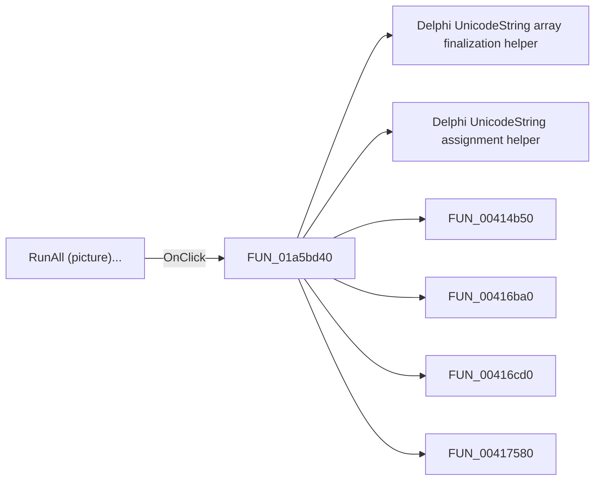

# RunAll (picture)...

> Analysis status: Pending individual source review.

## Control

| Property | Recovered value |
| --- | --- |
| Form | LocalLLMForm |
| Component path | LocalLLMForm.MainMenu1.mnTools.mnRunAll |
| Control class | TMenuItem |
| Caption | RunAll (picture)... |
| Hint | Not present in the recovered resource. |
| Text | Not present in the recovered resource. |
| Handler name | mnRunAllClick |
| Handler address | 01a5bd40 |
| Graph node | `resource:dfm:LocalLLMForm/LocalLLMForm.MainMenu1.mnTools.mnRunAll` |
| Handler node | `function:01a5bd40` |
| Graph layer | UI |

## What happens when clicked

Pending individual analysis. An agent must read the recovered handler source and its relevant callees before it replaces this text.

## Click flow

## Handler evidence

- Source: [DecompiledSources/Tina16/functions/0000000001A5BD40__FUN_01a5bd40.c](../../../DecompiledSources/Tina16/functions/0000000001A5BD40__FUN_01a5bd40.c)
- Recovered role: Not present in the recovered resource.
- Current graph summary: Handles 1 Delphi UI event: LocalLLMForm.MainMenu1.mnTools.mnRunAll.OnClick.
- Current graph behavior: Not present in the recovered resource.
- Current graph evidence: Not present in the recovered resource.
- Complexity: complex
- Distinct outgoing calls: 16

## Direct calls

- `function:00414560` — Delphi UnicodeString array finalization helper
- `function:00414ad0` — Delphi UnicodeString assignment helper
- `function:00414b50` — FUN_00414b50
- `function:00416ba0` — FUN_00416ba0
- `function:00416cd0` — FUN_00416cd0
- `function:00417580` — FUN_00417580
- `function:00417740` — FUN_00417740
- `function:0043e1a0` — FUN_0043e1a0
- `function:00441230` — FUN_00441230
- `function:00441290` — FUN_00441290
- `function:004412c0` — FUN_004412c0
- `function:004414c0` — FUN_004414c0
- `function:0080cc70` — FUN_0080cc70
- `function:01a5b280` — FUN_01a5b280
- `function:01a5bad0` — Handles 1 Delphi UI event: LocalLLMForm.MainMenu1.mnTools.mnImportFromPicture.OnClick.
- `function:01c681b0` — FUN_01c681b0

## Resource evidence

- Kind: Not present in the recovered resource.
- Modal result: Not present in the recovered resource.
- Checked state: Not present in the recovered resource.
- List items: Not present in the recovered resource.
- Image reference: Not present in the recovered resource.
- Extracted glyph: None.

## Nearby label candidates

Nearby labels are layout candidates only. They are not proof of behavior.

- No same-parent label candidate is available.

## Analysis limits

- Do not infer behavior from the control class, caption, hint, glyph, or nearby label alone.
- Do not replace the pending status until the handler source and relevant call path provide enough evidence.
