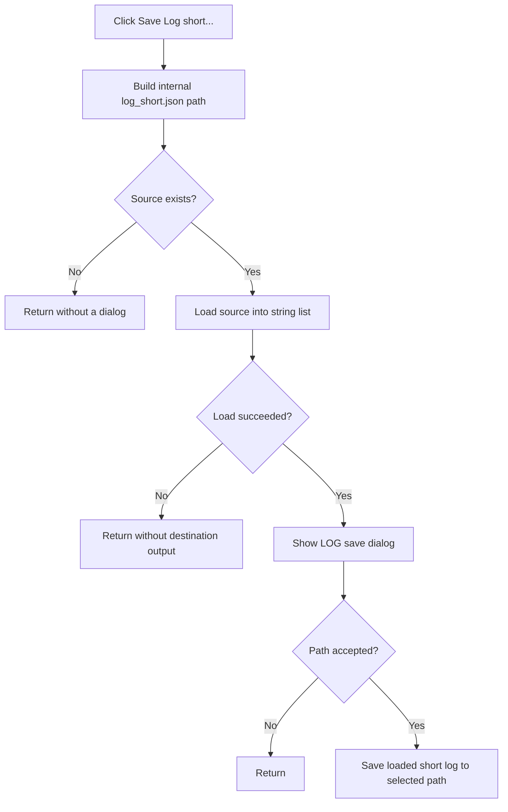

# Save Log short...

> Analysis status: Complete. The recovered source-file check, string-list load, save dialog, and file write establish short-log export.

## Control

| Property | Recovered value |
| --- | --- |
| Form | LocalLLMForm |
| Component path | LocalLLMForm.MainMenu1.File1.mnSaveLogShort |
| Control class | TMenuItem |
| Caption | Save Log short... |
| Hint | Not present in the recovered resource. |
| Text | Not present in the recovered resource. |
| Handler name | mnSaveLogShortClick |
| Handler address | 01a54d10 |
| Graph node | `resource:dfm:LocalLLMForm/LocalLLMForm.MainMenu1.File1.mnSaveLogShort` |
| Handler node | `function:01a54d10` |
| Graph layer | UI |

## What happens when clicked

`FUN_01a54d10` is the short-log counterpart of the full-log command. It constructs the internal `log_short.json` path and checks whether the file exists. An absent file returns without a message or dialog. If present, the handler loads it into a temporary string list. A failed load also stops before path selection.

After a successful load, it configures the save dialog for `Log file|*.log` and proposes `file.log`. Canceling is a no-op. Accepting saves the loaded short-log content to the selected path with the recovered encoding object. The source log is not changed or deleted, and there is no recovered success message or local exception handler.

## Click flow

## Handler evidence

- Source: [DecompiledSources/Tina16/functions/0000000001A54D10__FUN_01a54d10.c](../../../DecompiledSources/Tina16/functions/0000000001A54D10__FUN_01a54d10.c)
- Recovered role: Exports the short local-LLM JSON log to a selected log file.
- Current graph summary: Handles 1 Delphi UI event: LocalLLMForm.MainMenu1.File1.mnSaveLogShort.OnClick.
- Current graph behavior: Not present in the recovered resource.
- Current graph evidence: Not present in the recovered resource.
- Complexity: complex
- Distinct outgoing calls: 10

## Direct calls

- `function:00410f20` — Nil-safe Delphi object destruction helper
- `function:00414480` — Delphi UnicodeString clear and finalization helper
- `function:00414ad0` — Delphi UnicodeString assignment helper
- `function:00416cd0` — FUN_00416cd0
- `function:00440a20` — FUN_00440a20
- `function:0045ae90` — FUN_0045ae90
- `function:004b6930` — FUN_004b6930
- `function:00724270` — FUN_00724270
- `function:00724380` — FUN_00724380
- `function:013b7920` — FUN_013b7920

## Resource evidence

- Kind: Not present in the recovered resource.
- Modal result: Not present in the recovered resource.
- Checked state: Not present in the recovered resource.
- List items: Not present in the recovered resource.
- Image reference: Not present in the recovered resource.
- Extracted glyph: None.

## Nearby label candidates

Nearby labels are layout candidates only. They are not proof of behavior.

- No same-parent label candidate is available.

## Analysis limits

- The runner object's Delphi field name and the exact path separator constant are not recovered.
- The exact encoding class and exception presentation for load or save failures are not named.
