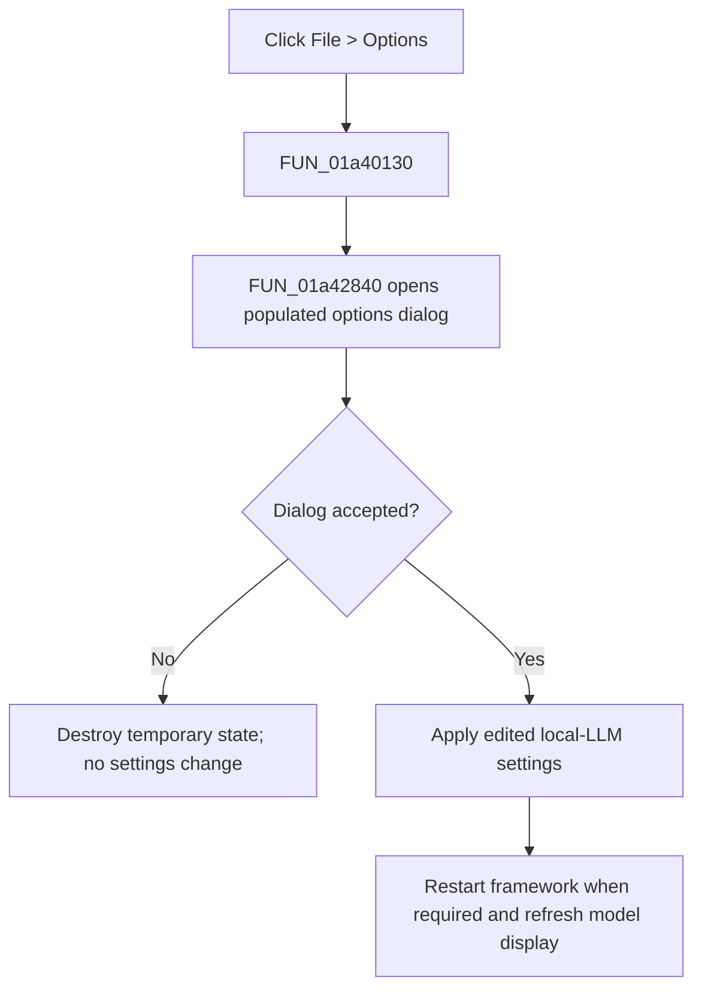

# Options

> Analysis status: Complete. The recovered wrapper and shared options handler establish the modal settings path and its cancellation behavior.

## Control

| Property | Recovered value |
| --- | --- |
| Form | LocalLLMForm |
| Component path | LocalLLMForm.MainMenu1.File1.Options1 |
| Control class | TMenuItem |
| Caption | Options |
| Hint | Not present in the recovered resource. |
| Text | Not present in the recovered resource. |
| Handler name | Options1Click |
| Handler address | 01a40130 |
| Graph node | `resource:dfm:LocalLLMForm/LocalLLMForm.MainMenu1.File1.Options1` |
| Handler node | `function:01a40130` |
| Graph layer | UI |

## What happens when clicked

`FUN_01a40130` delegates directly to `FUN_01a42840`, the same handler used by the toolbar Options button. It opens the local-LLM options dialog after copying the current framework, model, language, voice, and related settings into a temporary record. If the user cancels the dialog, the handler destroys the temporary objects and makes no settings change.

If the user accepts the dialog, the shared handler copies the edited values back to the form settings. A framework or model-preparation change can stop the prior framework, show wait messages, refresh the model list, and update the displayed model. The wrapper does not use `Sender` and adds no separate decision or error path.

## Click flow

## Handler evidence

- Source: [DecompiledSources/Tina16/functions/0000000001A40130__FUN_01a40130.c](../../../DecompiledSources/Tina16/functions/0000000001A40130__FUN_01a40130.c)
- Recovered role: LocalLLM menu options command wrapper.
- Current graph summary: Handles 1 Delphi UI event: LocalLLMForm.MainMenu1.File1.Options1.OnClick.
- Current graph behavior: Not present in the recovered resource.
- Current graph evidence: Not present in the recovered resource.
- Complexity: simple
- Distinct outgoing calls: 1

## Direct calls

- `function:01a42840` — Handles 1 Delphi UI event: LocalLLMForm.Panel1.sbOptions.OnClick.

## Resource evidence

- Kind: Not present in the recovered resource.
- Modal result: Not present in the recovered resource.
- Checked state: Not present in the recovered resource.
- List items: Not present in the recovered resource.
- Image reference: Not present in the recovered resource.
- Extracted glyph: None.

## Nearby label candidates

Nearby labels are layout candidates only. They are not proof of behavior.

- No same-parent label candidate is available.

## Analysis limits

- The wrapper proves that this menu item uses the shared options path. Detailed setting effects come from `FUN_01a42840` and its data-flow callees.
- The recovered code does not name every settings field or the exact exception behavior of framework startup and model refresh operations.
