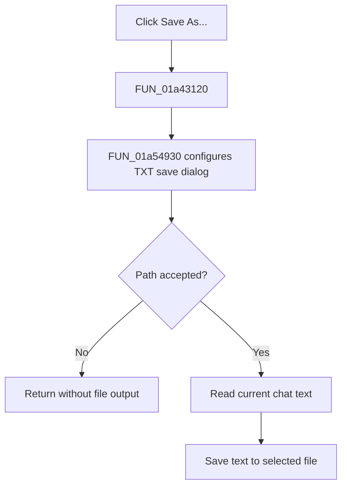

# Save As...

> Analysis status: Complete. The recovered wrapper and shared chat-save handler establish the text export and cancel path.

## Control

| Property | Recovered value |
| --- | --- |
| Form | LocalLLMForm |
| Component path | LocalLLMForm.MainMenu1.File1.SaveAs1 |
| Control class | TMenuItem |
| Caption | Save As... |
| Hint | Not present in the recovered resource. |
| Text | Not present in the recovered resource. |
| Handler name | SaveAs1Click |
| Handler address | 01a43120 |
| Graph node | `resource:dfm:LocalLLMForm/LocalLLMForm.MainMenu1.File1.SaveAs1` |
| Handler node | `function:01a43120` |
| Graph layer | UI |

## What happens when clicked

`FUN_01a43120` delegates directly to `FUN_01a54930`, the same handler used by the Save Chat toolbar button. The shared handler configures a save dialog for `Text file|*.txt`, proposes `file.txt`, and waits for the user to select a path.

If the user cancels, the handler returns without reading the chat or writing a file. If the user accepts, it reads the current chat control text, places that text in a temporary string list, and saves the list to the selected path with the recovered encoding object. The wrapper does not add a separate overwrite, validation, or error branch.

## Click flow

## Handler evidence

- Source: [DecompiledSources/Tina16/functions/0000000001A43120__FUN_01a43120.c](../../../DecompiledSources/Tina16/functions/0000000001A43120__FUN_01a43120.c)
- Recovered role: Save-chat menu command wrapper.
- Current graph summary: Handles 1 Delphi UI event: LocalLLMForm.MainMenu1.File1.SaveAs1.OnClick.
- Current graph behavior: Not present in the recovered resource.
- Current graph evidence: Not present in the recovered resource.
- Complexity: simple
- Distinct outgoing calls: 1

## Direct calls

- `function:01a54930` — Handles 1 Delphi UI event: LocalLLMForm.Panel1.sbSave.OnClick.

## Resource evidence

- Kind: Not present in the recovered resource.
- Modal result: Not present in the recovered resource.
- Checked state: Not present in the recovered resource.
- List items: Not present in the recovered resource.
- Image reference: Not present in the recovered resource.
- Extracted glyph: None.

## Nearby label candidates

Nearby labels are layout candidates only. They are not proof of behavior.

- No same-parent label candidate is available.

## Analysis limits

- The wrapper proves that this command uses the same export path as the Save Chat toolbar button.
- The exact encoding type and exception presentation for a failed write are not named in the recovered source.
