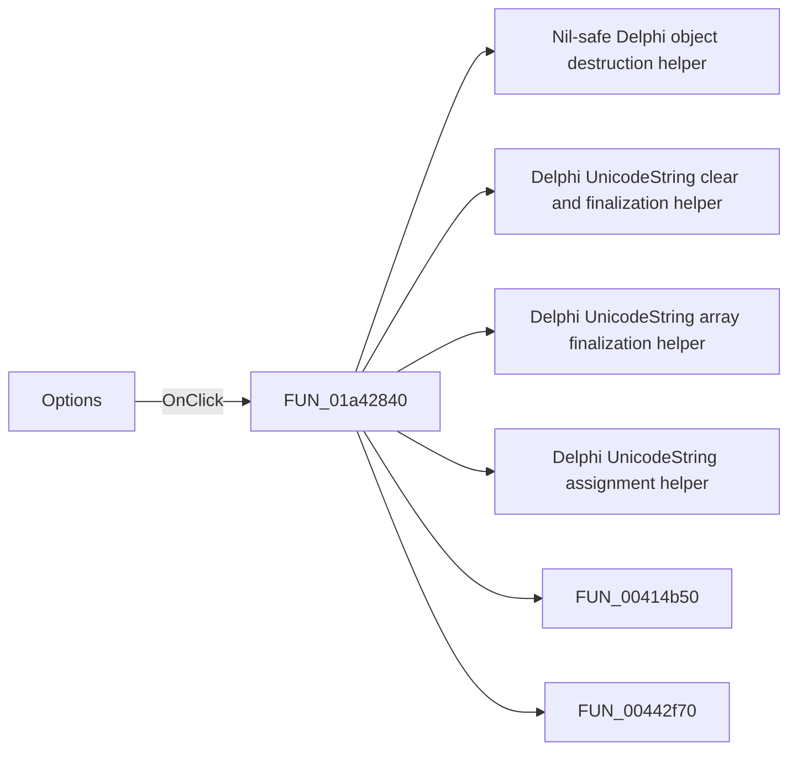

# Options

> Analysis status: Pending individual source review.

## Control

| Property | Recovered value |
| --- | --- |
| Form | LocalLLMForm |
| Component path | LocalLLMForm.Panel1.sbOptions |
| Control class | TSpeedButton |
| Caption | Not present in the recovered resource. |
| Hint | Options |
| Text | Not present in the recovered resource. |
| Handler name | sbOptionsClick |
| Handler address | 01a42840 |
| Graph node | `resource:dfm:LocalLLMForm/LocalLLMForm.Panel1.sbOptions` |
| Handler node | `function:01a42840` |
| Graph layer | UI |

## What happens when clicked

Pending individual analysis. An agent must read the recovered handler source and its relevant callees before it replaces this text.

## Click flow

## Handler evidence

- Source: [DecompiledSources/Tina16/functions/0000000001A42840__FUN_01a42840.c](../../../DecompiledSources/Tina16/functions/0000000001A42840__FUN_01a42840.c)
- Recovered role: Not present in the recovered resource.
- Current graph summary: Handles 1 Delphi UI event: LocalLLMForm.Panel1.sbOptions.OnClick.
- Current graph behavior: Not present in the recovered resource.
- Current graph evidence: Not present in the recovered resource.
- Complexity: complex
- Distinct outgoing calls: 21

## Direct calls

- `function:00410f20` — Nil-safe Delphi object destruction helper
- `function:00414480` — Delphi UnicodeString clear and finalization helper
- `function:00414560` — Delphi UnicodeString array finalization helper
- `function:00414ad0` — Delphi UnicodeString assignment helper
- `function:00414b50` — FUN_00414b50
- `function:00442f70` — FUN_00442f70
- `function:004b37d0` — FUN_004b37d0
- `function:0072d440` — FUN_0072d440
- `function:007fc180` — FUN_007fc180
- `function:0147b0e0` — FUN_0147b0e0
- `function:019d9750` — FUN_019d9750
- `function:01a3f000` — FUN_01a3f000
- `function:01a40a60` — FUN_01a40a60
- `function:01a421f0` — FUN_01a421f0
- `function:01a42430` — FUN_01a42430
- `function:01a42710` — FUN_01a42710
- `function:01a537c0` — FUN_01a537c0
- `function:01a54070` — FUN_01a54070
- `function:01a54900` — FUN_01a54900
- `function:01a5a9d0` — FUN_01a5a9d0
- `function:01a5b1c0` — FUN_01a5b1c0

## Resource evidence

- Kind: Not present in the recovered resource.
- Modal result: Not present in the recovered resource.
- Checked state: Not present in the recovered resource.
- List items: Not present in the recovered resource.
- Image reference: Not present in the recovered resource.
- Extracted glyph: [`0235_LocalLLMForm_LocalLLMForm_Panel1_sbOptions_Glyph_Data.png`](../../../glyph/0235_LocalLLMForm_LocalLLMForm_Panel1_sbOptions_Glyph_Data.png)

## Nearby label candidates

Nearby labels are layout candidates only. They are not proof of behavior.

- Rank 1: Model: at distance 92.

## Analysis limits

- Do not infer behavior from the control class, caption, hint, glyph, or nearby label alone.
- Do not replace the pending status until the handler source and relevant call path provide enough evidence.
