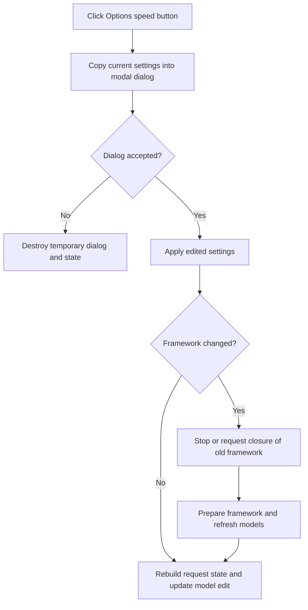

# Options

> Analysis status: Complete. The recovered handler, options-dialog initializer, settings copier, and model-refresh path establish the modal edit workflow.

## Control

| Property | Recovered value |
| --- | --- |
| Form | LocalLLMForm |
| Component path | LocalLLMForm.Panel1.sbOptions |
| Control class | TSpeedButton |
| Caption | Not present in the recovered resource. |
| Hint | Options |
| Text | Not present in the recovered resource. |
| Handler name | sbOptionsClick |
| Handler address | 01a42840 |
| Graph node | `resource:dfm:LocalLLMForm/LocalLLMForm.Panel1.sbOptions` |
| Handler node | `function:01a42840` |
| Graph layer | UI |

## What happens when clicked

`FUN_01a42840` creates a temporary local-LLM settings record and an options dialog. `FUN_01a537c0` copies the current framework, model, language, voice, flags, and related values into that record. `FUN_019d9750` populates the dialog controls. The handler also supplies three model-name variants before it shows the dialog modally.

Canceling the dialog destroys the dialog and temporary record without applying them. On acceptance, the handler applies the edited settings through `FUN_01a421f0`. It compares the old and new framework selections and handles a change separately. For an active recovered framework-2 process it requests a stop. For the other old frameworks it tells the user to close the named program on the Windows taskbar. It then shows wait messages, rebuilds framework-dependent model names, refreshes the model list, reports successful preparation, stores the selected model text, rebuilds request state, and updates the model edit.

The voice or related option at settings offset `+0x60` has an extra update path when its value changes and the guard in `FUN_01a40a60` permits it. The handler has no rollback after the dialog is accepted. Message-box acknowledgements do not cancel the apply path, and the recovered source has no local exception handler around framework or model preparation.

## Click flow

## Handler evidence

- Source: [DecompiledSources/Tina16/functions/0000000001A42840__FUN_01a42840.c](../../../DecompiledSources/Tina16/functions/0000000001A42840__FUN_01a42840.c)
- Recovered role: Local-LLM modal options and framework-apply handler.
- Current graph summary: Handles 1 Delphi UI event: LocalLLMForm.Panel1.sbOptions.OnClick.
- Current graph behavior: Not present in the recovered resource.
- Current graph evidence: Not present in the recovered resource.
- Complexity: complex
- Distinct outgoing calls: 21

## Direct calls

- `function:00410f20` — Nil-safe Delphi object destruction helper
- `function:00414480` — Delphi UnicodeString clear and finalization helper
- `function:00414560` — Delphi UnicodeString array finalization helper
- `function:00414ad0` — Delphi UnicodeString assignment helper
- `function:00414b50` — FUN_00414b50
- `function:00442f70` — FUN_00442f70
- `function:004b37d0` — FUN_004b37d0
- `function:0072d440` — FUN_0072d440
- `function:007fc180` — FUN_007fc180
- `function:0147b0e0` — FUN_0147b0e0
- `function:019d9750` — FUN_019d9750
- `function:01a3f000` — FUN_01a3f000
- `function:01a40a60` — FUN_01a40a60
- `function:01a421f0` — FUN_01a421f0
- `function:01a42430` — FUN_01a42430
- `function:01a42710` — FUN_01a42710
- `function:01a537c0` — FUN_01a537c0
- `function:01a54070` — FUN_01a54070
- `function:01a54900` — FUN_01a54900
- `function:01a5a9d0` — FUN_01a5a9d0
- `function:01a5b1c0` — FUN_01a5b1c0

## Resource evidence

- Kind: Not present in the recovered resource.
- Modal result: Not present in the recovered resource.
- Checked state: Not present in the recovered resource.
- List items: Not present in the recovered resource.
- Image reference: Not present in the recovered resource.
- Extracted glyph: [`0235_LocalLLMForm_LocalLLMForm_Panel1_sbOptions_Glyph_Data.png`](../../../glyph/0235_LocalLLMForm_LocalLLMForm_Panel1_sbOptions_Glyph_Data.png)

## Nearby label candidates

Nearby labels are layout candidates only. They are not proof of behavior.

- Rank 1: Model: at distance 92.

## Analysis limits

- The gear glyph and `Options` hint agree with the proven dialog path but are not the basis for the behavior claim.
- Several record fields and the exact external-framework startup implementation do not have recovered Delphi names.
- The source shows preparation messages and model refresh calls. It does not prove that every external framework has started successfully when the success message appears.
