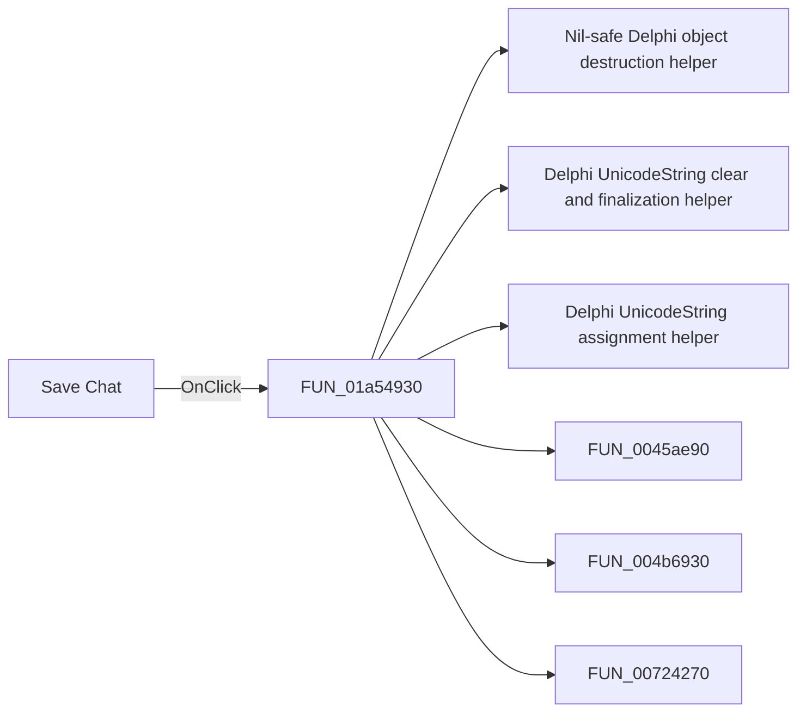

# Save Chat

> Analysis status: Pending individual source review.

## Control

| Property | Recovered value |
| --- | --- |
| Form | LocalLLMForm |
| Component path | LocalLLMForm.Panel1.sbSave |
| Control class | TSpeedButton |
| Caption | Not present in the recovered resource. |
| Hint | Save Chat |
| Text | Not present in the recovered resource. |
| Handler name | sbSaveClick |
| Handler address | 01a54930 |
| Graph node | `resource:dfm:LocalLLMForm/LocalLLMForm.Panel1.sbSave` |
| Handler node | `function:01a54930` |
| Graph layer | UI |

## What happens when clicked

Pending individual analysis. An agent must read the recovered handler source and its relevant callees before it replaces this text.

## Click flow

## Handler evidence

- Source: [DecompiledSources/Tina16/functions/0000000001A54930__FUN_01a54930.c](../../../DecompiledSources/Tina16/functions/0000000001A54930__FUN_01a54930.c)
- Recovered role: Not present in the recovered resource.
- Current graph summary: Handles 1 Delphi UI event: LocalLLMForm.Panel1.sbSave.OnClick.
- Current graph behavior: Not present in the recovered resource.
- Current graph evidence: Not present in the recovered resource.
- Complexity: complex
- Distinct outgoing calls: 7

## Direct calls

- `function:00410f20` — Nil-safe Delphi object destruction helper
- `function:00414480` — Delphi UnicodeString clear and finalization helper
- `function:00414ad0` — Delphi UnicodeString assignment helper
- `function:0045ae90` — FUN_0045ae90
- `function:004b6930` — FUN_004b6930
- `function:00724270` — FUN_00724270
- `function:00724380` — FUN_00724380

## Resource evidence

- Kind: Not present in the recovered resource.
- Modal result: Not present in the recovered resource.
- Checked state: Not present in the recovered resource.
- List items: Not present in the recovered resource.
- Image reference: Not present in the recovered resource.
- Extracted glyph: [`0236_LocalLLMForm_LocalLLMForm_Panel1_sbSave_Glyph_Data.png`](../../../glyph/0236_LocalLLMForm_LocalLLMForm_Panel1_sbSave_Glyph_Data.png)

## Nearby label candidates

Nearby labels are layout candidates only. They are not proof of behavior.

- Rank 1: Model: at distance 142.

## Analysis limits

- Do not infer behavior from the control class, caption, hint, glyph, or nearby label alone.
- Do not replace the pending status until the handler source and relevant call path provide enough evidence.
