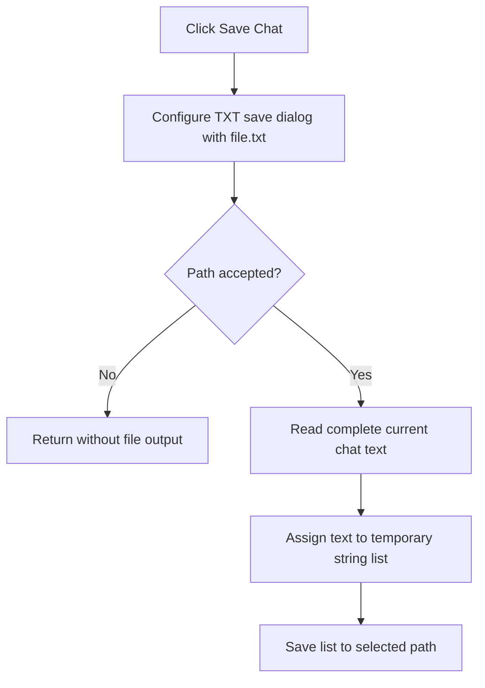

# Save Chat

> Analysis status: Complete. The recovered save-dialog, chat-text read, and string-list write establish the chat export path.

## Control

| Property | Recovered value |
| --- | --- |
| Form | LocalLLMForm |
| Component path | LocalLLMForm.Panel1.sbSave |
| Control class | TSpeedButton |
| Caption | Not present in the recovered resource. |
| Hint | Save Chat |
| Text | Not present in the recovered resource. |
| Handler name | sbSaveClick |
| Handler address | 01a54930 |
| Graph node | `resource:dfm:LocalLLMForm/LocalLLMForm.Panel1.sbSave` |
| Handler node | `function:01a54930` |
| Graph layer | UI |

## What happens when clicked

`FUN_01a54930` configures the form's save dialog for `Text file|*.txt` and proposes `file.txt`. It does not write until the dialog reports acceptance.

On acceptance, the handler reads the complete current chat text from the chat control, creates a temporary string list, assigns the text to that list, obtains the selected file name, and saves the list with the recovered encoding object. Canceling the dialog is a no-op for the chat and file system. An empty chat is still passed to the save path if the user accepts. The handler has no recovered success message, overwrite decision, retry, or local exception handler.

## Click flow

## Handler evidence

- Source: [DecompiledSources/Tina16/functions/0000000001A54930__FUN_01a54930.c](../../../DecompiledSources/Tina16/functions/0000000001A54930__FUN_01a54930.c)
- Recovered role: Exports the current local-LLM chat to a selected text file.
- Current graph summary: Handles 1 Delphi UI event: LocalLLMForm.Panel1.sbSave.OnClick.
- Current graph behavior: Not present in the recovered resource.
- Current graph evidence: Not present in the recovered resource.
- Complexity: complex
- Distinct outgoing calls: 7

## Direct calls

- `function:00410f20` — Nil-safe Delphi object destruction helper
- `function:00414480` — Delphi UnicodeString clear and finalization helper
- `function:00414ad0` — Delphi UnicodeString assignment helper
- `function:0045ae90` — FUN_0045ae90
- `function:004b6930` — FUN_004b6930
- `function:00724270` — FUN_00724270
- `function:00724380` — FUN_00724380

## Resource evidence

- Kind: Not present in the recovered resource.
- Modal result: Not present in the recovered resource.
- Checked state: Not present in the recovered resource.
- List items: Not present in the recovered resource.
- Image reference: Not present in the recovered resource.
- Extracted glyph: [`0236_LocalLLMForm_LocalLLMForm_Panel1_sbSave_Glyph_Data.png`](../../../glyph/0236_LocalLLMForm_LocalLLMForm_Panel1_sbSave_Glyph_Data.png)

## Nearby label candidates

Nearby labels are layout candidates only. They are not proof of behavior.

- Rank 1: Model: at distance 142.

## Analysis limits

- The two-state floppy-disk glyph agrees with save intent. The source establishes the actual text export.
- The exact encoding class and failed-write exception presentation are not named in the recovered source.
