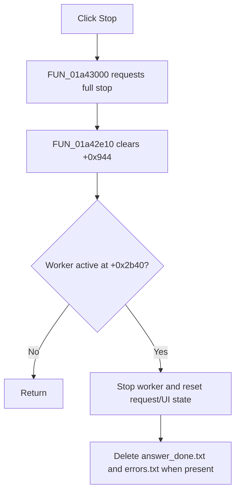

# Stop

> Analysis status: Complete. The recovered wrapper and stop routine establish the active-request guard, cleanup sequence, and no-op path.

## Control

| Property | Recovered value |
| --- | --- |
| Form | LocalLLMForm |
| Component path | LocalLLMForm.Panel1.sbStop |
| Control class | TSpeedButton |
| Caption | Not present in the recovered resource. |
| Hint | Stop |
| Text | Not present in the recovered resource. |
| Handler name | sbStopClick |
| Handler address | 01a43000 |
| Graph node | `resource:dfm:LocalLLMForm/LocalLLMForm.Panel1.sbStop` |
| Handler node | `function:01a43000` |
| Graph layer | UI |

## What happens when clicked

`FUN_01a43000` calls `FUN_01a42e10` with its full-stop flag set. The stop routine first clears state integer `+0x944`. If no local-LLM worker is active at byte `+0x2b40`, it returns after that state reset.

For an active worker, it disables request processing, asks the scheduler/process object to stop, resets request and UI state, clears two recovered lists, waits briefly, and performs final UI cleanup. It then deletes `answer_done.txt` and `errors.txt` from the local-LLM temporary folder when those files exist. Delete return values are not checked. The handler has no success message and no local exception handler.

## Click flow

## Handler evidence

- Source: [DecompiledSources/Tina16/functions/0000000001A43000__FUN_01a43000.c](../../../DecompiledSources/Tina16/functions/0000000001A43000__FUN_01a43000.c)
- Recovered role: Stops the active local-LLM request and removes completion/error markers.
- Current graph summary: Handles 1 Delphi UI event: LocalLLMForm.Panel1.sbStop.OnClick.
- Current graph behavior: Not present in the recovered resource.
- Current graph evidence: Not present in the recovered resource.
- Complexity: simple
- Distinct outgoing calls: 1

## Direct calls

- `function:01a42e10` — FUN_01a42e10

## Resource evidence

- Kind: Not present in the recovered resource.
- Modal result: Not present in the recovered resource.
- Checked state: Not present in the recovered resource.
- List items: Not present in the recovered resource.
- Image reference: Not present in the recovered resource.
- Extracted glyph: [`0237_LocalLLMForm_LocalLLMForm_Panel1_sbStop_Glyph_Data.png`](../../../glyph/0237_LocalLLMForm_LocalLLMForm_Panel1_sbStop_Glyph_Data.png)

## Nearby label candidates

Nearby labels are layout candidates only. They are not proof of behavior.

- Rank 1: Model: at distance 118.

## Analysis limits

- The red-square glyph supports the stop intent, but the handler and callee establish the behavior.
- The recovered names of several internal reset routines and the exact worker termination API are unknown.
