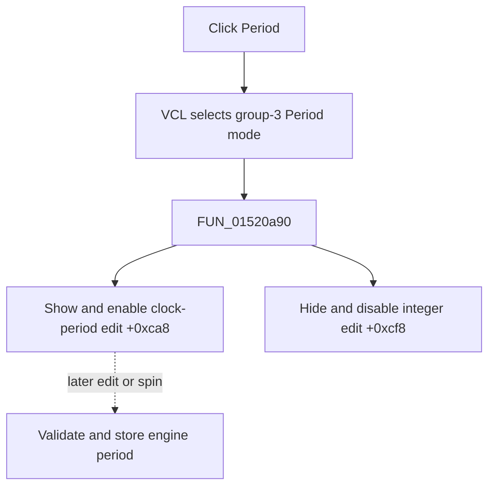

# Period

> Analysis status: Evidence-backed source review complete.

## Control

| Property | Recovered value |
| --- | --- |
| Form | LogicAnalyzerWin |
| Component path | LogicAnalyzerWin.MeasurementGroupBox.ClockPeriodBtn |
| Control class | TSpeedButton |
| Caption | Period |
| Hint | Not present in the recovered resource. |
| Text | Not present in the recovered resource. |
| Handler name | ClockPeriodBtnClick |
| Handler address | 01520a90 |
| Graph node | `resource:dfm:LogicAnalyzerWin/LogicAnalyzerWin.MeasurementGroupBox.ClockPeriodBtn` |
| Handler node | `function:01520a90` |
| Graph layer | UI |

## What happens when clicked

VCL selects **Period** in measurement group `3`. `FUN_01520a90` shows and enables the floating-point clock-period edit at `+0xca8`. It hides and disables the shared integer edit at `+0xcf8`, which the Length and Timeout modes use.

The click only selects the input control. It does not read or change the analyzer engine's period. Later edit or spin events use `FUN_0151f9b0` to validate and store a period, update the graph's X scale, and recalculate horizontal bounds.

Repeated clicks request the same control states. There is no validation message, file write, local exception handler, or rollback in this direct path.

## Click flow

## Handler evidence

- Source: [DecompiledSources/Tina16/functions/0000000001520A90__FUN_01520a90.c](../../../DecompiledSources/Tina16/functions/0000000001520A90__FUN_01520a90.c)
- Recovered role: Select the clock-period editor in the Logic Analyzer measurement panel.
- Current graph summary: Handles 1 Delphi UI event: LogicAnalyzerWin.MeasurementGroupBox.ClockPeriodBtn.OnClick.
- Current graph behavior: The handler switches from the shared integer edit to the floating-point period edit.
- Current graph evidence: The two paired control-state calls and the later period edit path establish the mode.
- Complexity: simple
- Distinct outgoing calls: 1

## Direct calls

- `function:0064dbe0` — FUN_0064dbe0

## Resource evidence

- Kind: Not present in the recovered resource.
- Modal result: Not present in the recovered resource.
- Checked state: Not present in the recovered resource.
- List items: Not present in the recovered resource.
- Image reference: Not present in the recovered resource.
- Extracted glyph: None.

## Nearby label candidates

Nearby labels are layout candidates only. They are not proof of behavior.

- No same-parent label candidate is available.

## Analysis limits

- Original Delphi field names for `+0xca8` and `+0xcf8` are not recovered. Their control classes, initial values, and later event paths establish their roles.
- The direct click does not prove persistence of a later period change.
