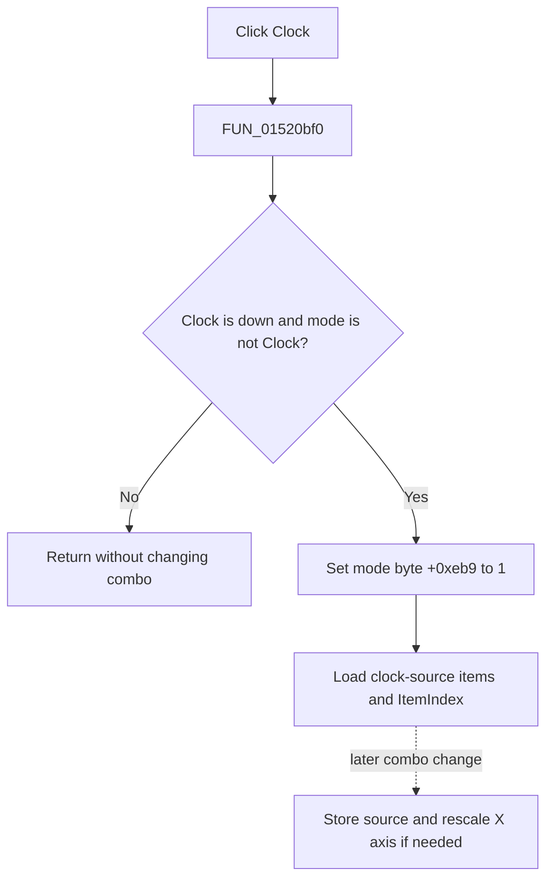

# Clock

> Analysis status: Evidence-backed source review complete.

## Control

| Property | Recovered value |
| --- | --- |
| Form | LogicAnalyzerWin |
| Component path | LogicAnalyzerWin.MeasurementGroupBox.ClockSourceBtn |
| Control class | TSpeedButton |
| Caption | Clock |
| Hint | Not present in the recovered resource. |
| Text | Not present in the recovered resource. |
| Handler name | ClockSourceBtnClick |
| Handler address | 01520bf0 |
| Graph node | `resource:dfm:LogicAnalyzerWin/LogicAnalyzerWin.MeasurementGroupBox.ClockSourceBtn` |
| Handler node | `function:01520bf0` |
| Graph layer | UI |

## What happens when clicked

The **Clock** and **Thres** buttons share measurement group `2`. When Clock is down and form mode byte `+0xeb9` is not already set, `FUN_01520bf0` sets that byte to `1`. It then loads the clock-source item list and selected index from analyzer engine virtual getters `+0xe0` and `+0xe8` into the shared combo at `+0xce8`.

The direct click changes the selected mode and combo contents. It does not set a new engine clock source. A later combo change compares the selected item with the engine value, stores a change through slot `+0xf0`, and can rescale the X axis when the source changes.

If Clock is not down or clock mode is already active, the handler is a silent no-op. It has no message, file write, local exception handler, or rollback.

## Click flow

## Handler evidence

- Source: [DecompiledSources/Tina16/functions/0000000001520BF0__FUN_01520bf0.c](../../../DecompiledSources/Tina16/functions/0000000001520BF0__FUN_01520bf0.c)
- Recovered role: Select and display the Logic Analyzer clock-source setting.
- Current graph summary: Handles 1 Delphi UI event: LogicAnalyzerWin.MeasurementGroupBox.ClockSourceBtn.OnClick.
- Current graph behavior: The handler selects clock mode and loads its engine-backed combo state.
- Current graph evidence: The Down-state guard, mode byte, paired engine getters, and shared combo setters establish the behavior.
- Complexity: simple
- Distinct outgoing calls: 0

## Direct calls

- No direct call edge is present in the recovered graph.

## Resource evidence

- Kind: Not present in the recovered resource.
- Modal result: Not present in the recovered resource.
- Checked state: Not present in the recovered resource.
- List items: Not present in the recovered resource.
- Image reference: Not present in the recovered resource.
- Extracted glyph: None.

## Nearby label candidates

Nearby labels are layout candidates only. They are not proof of behavior.

- No same-parent label candidate is available.

## Analysis limits

- Engine methods are indirect VMT calls. Their clock-source roles are established by paired mode and change-handler data flow.
- The direct click does not identify hardware I/O or persistence.
