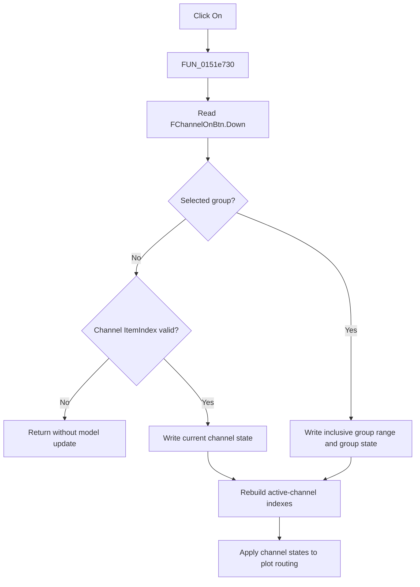

# On

> Analysis status: Evidence-backed source review complete.

## Control

| Property | Recovered value |
| --- | --- |
| Form | LogicAnalyzerWin |
| Component path | LogicAnalyzerWin.ChannelGroupBox.FChannelOnBtn |
| Control class | TSpeedButton |
| Caption | On |
| Hint | Not present in the recovered resource. |
| Text | Not present in the recovered resource. |
| Handler name | ChannelOnBtnClick |
| Handler address | 0151e730 |
| Graph node | `resource:dfm:LogicAnalyzerWin/LogicAnalyzerWin.ChannelGroupBox.FChannelOnBtn` |
| Handler node | `function:0151e730` |
| Graph layer | UI |

## What happens when clicked

`FUN_0151e730` delegates to the shared channel-state helper `FUN_01506d00`. The resource sets `GroupIndex` to `1` and `AllowAllUp` to true, so VCL changes the speed button's `Down` state before the event. The helper uses that state as the requested channel state.

If no group is selected, the helper applies the state to the current channel. An item index of `-1` is a silent model no-op. If a group is selected, it writes the state to each channel in the group's inclusive From-to-To range and to the group object. It then rebuilds compact active-channel indexes and applies the new states to the plot-routing attachments.

The click does not start or stop acquisition. It has no confirmation, file write, undo record, local exception handler, or rollback. Repeated calls with the same `Down` state reapply and propagate that state.

## Click flow

## Handler evidence

- Source: [DecompiledSources/Tina16/functions/000000000151E730__FUN_0151e730.c](../../../DecompiledSources/Tina16/functions/000000000151E730__FUN_0151e730.c)
- Recovered role: Apply the On speed-button state to the selected Logic Analyzer channel or group.
- Current graph summary: Handles 1 Delphi UI event: LogicAnalyzerWin.ChannelGroupBox.FChannelOnBtn.OnClick.
- Current graph behavior: The wrapper delegates all state, range, reindex, and routing work to `FUN_01506d00`.
- Current graph evidence: The handler source and shared helper establish the state branches. The caption alone does not.
- Complexity: simple
- Distinct outgoing calls: 1

## Direct calls

- `function:01506d00` — FUN_01506d00

## Resource evidence

- Kind: Not present in the recovered resource.
- Modal result: Not present in the recovered resource.
- Checked state: Not present in the recovered resource.
- List items: Not present in the recovered resource.
- Image reference: Not present in the recovered resource.
- Extracted glyph: None.

## Nearby label candidates

Nearby labels are layout candidates only. They are not proof of behavior.

- Rank 1: Group Label at distance 44.
- Rank 2: From: at distance 82.
- Rank 3: To: at distance 126.

## Analysis limits

- The activation side uses an unresolved virtual method. The article does not name its concrete implementation.
- The recovered path changes runtime channel and group objects. It does not prove persistence beyond the current model.
