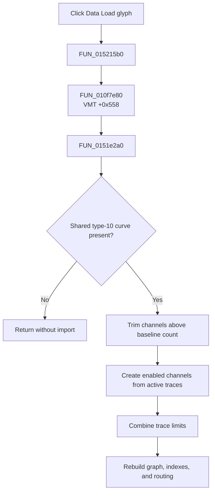

# FDataLoadBtn

> Analysis status: Evidence-backed source review complete.

## Control

| Property | Recovered value |
| --- | --- |
| Form | LogicAnalyzerWin |
| Component path | LogicAnalyzerWin.DataBox.FDataLoadBtn |
| Control class | TSpeedButton |
| Caption | Not present in the recovered resource. |
| Hint | Not present in the recovered resource. |
| Text | Not present in the recovered resource. |
| Handler name | DataLoadBtnClick |
| Handler address | 015215b0 |
| Graph node | `resource:dfm:LogicAnalyzerWin/LogicAnalyzerWin.DataBox.FDataLoadBtn` |
| Handler node | `function:015215b0` |
| Graph layer | UI |

## What happens when clicked

`FUN_015215b0` calls the common data-load dispatcher `FUN_010f7e80`. The recovered `TLogicAnalyzerWin` VMT is based at `01519768`; slot `+0x558` resolves to [`FUN_0151e2a0`](../../../DecompiledSources/Tina16/functions/000000000151E2A0__FUN_0151e2a0.c).

The form-specific target imports only when the shared input curve exists and has recovered type value `10`. It keeps a reference to that curve, trims channels above the form's baseline count, and enumerates its active traces. For each active trace, it creates an enabled channel object, copies its curve and label, assigns a display color, and adds it to the channel list. It also combines trace limits into the form's horizontal bounds and then rebuilds graph, channel-index, and routing state.

The click does not open a file dialog. It consumes a curve that another application path already placed in the shared input slot. A null input, a different curve type, or no active traces produces no new imported channel. The recovered path has no confirmation, local exception handler, transaction, or rollback.

## Click flow

## Handler evidence

- Source: [DecompiledSources/Tina16/functions/00000000015215B0__FUN_015215b0.c](../../../DecompiledSources/Tina16/functions/00000000015215B0__FUN_015215b0.c)
- Recovered role: Import a staged digital transient curve into Logic Analyzer channels.
- Current graph summary: Handles 1 Delphi UI event: LogicAnalyzerWin.DataBox.FDataLoadBtn.OnClick.
- Current graph behavior: The wrapper dispatches through the form's data-load virtual method.
- Current graph evidence: The VMT entry and `FUN_0151e2a0` establish the type gate, channel creation, bounds, and refresh work.
- Complexity: simple
- Distinct outgoing calls: 1

## Direct calls

- `function:010f7e80` — FUN_010f7e80

## Resource evidence

- Kind: Not present in the recovered resource.
- Modal result: Not present in the recovered resource.
- Checked state: Not present in the recovered resource.
- List items: Not present in the recovered resource.
- Image reference: Not present in the recovered resource.
- Extracted glyph: [`0253_LogicAnalyzerWin_LogicAnalyzerWin_DataBox_FDataLoadBtn_Glyph_Data.png`](../../../glyph/0253_LogicAnalyzerWin_LogicAnalyzerWin_DataBox_FDataLoadBtn_Glyph_Data.png)

## Nearby label candidates

Nearby labels are layout candidates only. They are not proof of behavior.

- No same-parent label candidate is available.

## Analysis limits

- The input slot's original Delphi name and the exact curve type name are not recovered. The article uses the proven type value `10`.
- The inspected glyph supports an import direction, but it does not prove a disk format or file-dialog workflow.
