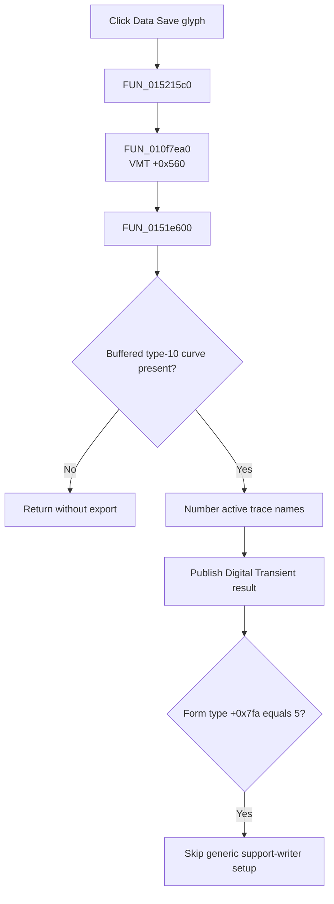

# FDataSaveBtn

> Analysis status: Evidence-backed source review complete.

## Control

| Property | Recovered value |
| --- | --- |
| Form | LogicAnalyzerWin |
| Component path | LogicAnalyzerWin.DataBox.FDataSaveBtn |
| Control class | TSpeedButton |
| Caption | Not present in the recovered resource. |
| Hint | Not present in the recovered resource. |
| Text | Not present in the recovered resource. |
| Handler name | DataSaveBtnClick |
| Handler address | 015215c0 |
| Graph node | `resource:dfm:LogicAnalyzerWin/LogicAnalyzerWin.DataBox.FDataSaveBtn` |
| Handler node | `function:015215c0` |
| Graph layer | UI |

## What happens when clicked

`FUN_015215c0` calls the common curve-export dispatcher `FUN_010f7ea0`. The recovered `TLogicAnalyzerWin` VMT is based at `01519768`; slot `+0x560` resolves to [`FUN_0151e600`](../../../DecompiledSources/Tina16/functions/000000000151E600__FUN_0151e600.c).

When the form has a buffered curve at `+0x880` with recovered type value `10`, the form-specific method enumerates its active traces and assigns sequential display names. It then calls `FUN_013d39a0`, which publishes the curve as a **Digital Transient** result in the application analysis workspace. The method also returns the same curve to the common dispatcher.

The Logic Analyzer constructor sets form type byte `+0x7fa` to `5`. Therefore, the common dispatcher's later generic current-curve installation and support-writer creation block is skipped for this form. The export has no save dialog, path, disk format, encoding, overwrite prompt, or cancel branch. A null curve is a silent no-op. The recovered path has no local exception handler or rollback.

## Click flow

## Handler evidence

- Source: [DecompiledSources/Tina16/functions/00000000015215C0__FUN_015215c0.c](../../../DecompiledSources/Tina16/functions/00000000015215C0__FUN_015215c0.c)
- Recovered role: Export the Logic Analyzer's buffered curve to the Digital Transient analysis workspace.
- Current graph summary: Handles 1 Delphi UI event: LogicAnalyzerWin.DataBox.FDataSaveBtn.OnClick.
- Current graph behavior: The wrapper dispatches through the form's curve-export virtual method.
- Current graph evidence: The VMT entry, `FUN_0151e600`, `FUN_013d39a0`, and the constructor's type byte establish the in-memory analysis export.
- Complexity: simple
- Distinct outgoing calls: 1

## Direct calls

- `function:010f7ea0` — FUN_010f7ea0

## Resource evidence

- Kind: Not present in the recovered resource.
- Modal result: Not present in the recovered resource.
- Checked state: Not present in the recovered resource.
- List items: Not present in the recovered resource.
- Image reference: Not present in the recovered resource.
- Extracted glyph: [`0252_LogicAnalyzerWin_LogicAnalyzerWin_DataBox_FDataSaveBtn_Glyph_Data.png`](../../../glyph/0252_LogicAnalyzerWin_LogicAnalyzerWin_DataBox_FDataSaveBtn_Glyph_Data.png)

## Nearby label candidates

Nearby labels are layout candidates only. They are not proof of behavior.

- No same-parent label candidate is available.

## Analysis limits

- The exact trace-name separator is not recovered from the decompiled constant label.
- The inspected glyph supports an export direction, but it does not prove a disk file operation.
