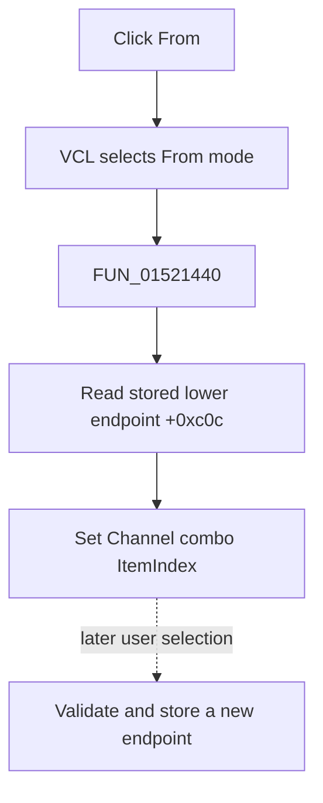

# From

> Analysis status: Evidence-backed source review complete.

## Control

| Property | Recovered value |
| --- | --- |
| Form | LogicAnalyzerWin |
| Component path | LogicAnalyzerWin.ChannelGroupBox.FFromChnSpBtn |
| Control class | TSpeedButton |
| Caption | From |
| Hint | Not present in the recovered resource. |
| Text | Not present in the recovered resource. |
| Handler name | FromChnSpBtnClick |
| Handler address | 01521440 |
| Graph node | `resource:dfm:LogicAnalyzerWin/LogicAnalyzerWin.ChannelGroupBox.FFromChnSpBtn` |
| Handler node | `function:01521440` |
| Graph layer | UI |

## What happens when clicked

VCL selects **From** in the From/To speed-button group. `FUN_01521440` then calls `FUN_01508e80`, which reads the saved lower endpoint at form offset `+0xc0c` and sets the Channel combo's `ItemIndex` to that value.

The click restores an existing endpoint for display and later editing. It does not calculate or store a new endpoint. A later Channel combo change performs range validation and model updates. The direct helper has no bounds guard, message, retry, file write, or local exception handler. Repeated clicks set the same item index again.

## Click flow

## Handler evidence

- Source: [DecompiledSources/Tina16/functions/0000000001521440__FUN_01521440.c](../../../DecompiledSources/Tina16/functions/0000000001521440__FUN_01521440.c)
- Recovered role: Select the stored lower channel endpoint for editing.
- Current graph summary: Handles 1 Delphi UI event: LogicAnalyzerWin.ChannelGroupBox.FFromChnSpBtn.OnClick.
- Current graph behavior: The handler restores the saved From index to the Channel combo.
- Current graph evidence: The handler and `FUN_01508e80` map `+0xc0c` to the combo `ItemIndex` setter.
- Complexity: simple
- Distinct outgoing calls: 1

## Direct calls

- `function:01508e80` — FUN_01508e80

## Resource evidence

- Kind: Not present in the recovered resource.
- Modal result: Not present in the recovered resource.
- Checked state: Not present in the recovered resource.
- List items: Not present in the recovered resource.
- Image reference: Not present in the recovered resource.
- Extracted glyph: None.

## Nearby label candidates

Nearby labels are layout candidates only. They are not proof of behavior.

- Rank 1: From: at distance 2.
- Rank 2: Group Label at distance 40.
- Rank 3: To: at distance 46.

## Analysis limits

- The original Delphi field name for `+0xc0c` is not recovered. Paired From/To and group-copy paths establish its lower-endpoint role.
- Behavior for a stale out-of-range value remains inside the unresolved virtual combo setter.
