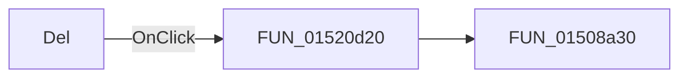

# Del

> Analysis status: Pending individual source review.

## Control

| Property | Recovered value |
| --- | --- |
| Form | LogicAnalyzerWin |
| Component path | LogicAnalyzerWin.ChannelGroupBox.FGroupDeleteBtn |
| Control class | TSpeedButton |
| Caption | Del |
| Hint | Not present in the recovered resource. |
| Text | Not present in the recovered resource. |
| Handler name | GroupDeleteBtnClick |
| Handler address | 01520d20 |
| Graph node | `resource:dfm:LogicAnalyzerWin/LogicAnalyzerWin.ChannelGroupBox.FGroupDeleteBtn` |
| Handler node | `function:01520d20` |
| Graph layer | UI |

## What happens when clicked

Pending individual analysis. An agent must read the recovered handler source and its relevant callees before it replaces this text.

## Click flow

## Handler evidence

- Source: [DecompiledSources/Tina16/functions/0000000001520D20__FUN_01520d20.c](../../../DecompiledSources/Tina16/functions/0000000001520D20__FUN_01520d20.c)
- Recovered role: Not present in the recovered resource.
- Current graph summary: Handles 1 Delphi UI event: LogicAnalyzerWin.ChannelGroupBox.FGroupDeleteBtn.OnClick.
- Current graph behavior: Not present in the recovered resource.
- Current graph evidence: Not present in the recovered resource.
- Complexity: simple
- Distinct outgoing calls: 1

## Direct calls

- `function:01508a30` — FUN_01508a30

## Resource evidence

- Kind: Not present in the recovered resource.
- Modal result: Not present in the recovered resource.
- Checked state: Not present in the recovered resource.
- List items: Not present in the recovered resource.
- Image reference: Not present in the recovered resource.
- Extracted glyph: None.

## Nearby label candidates

Nearby labels are layout candidates only. They are not proof of behavior.

- Rank 1: To: at distance 83.
- Rank 2: Group Label at distance 89.
- Rank 3: From: at distance 127.

## Analysis limits

- Do not infer behavior from the control class, caption, hint, glyph, or nearby label alone.
- Do not replace the pending status until the handler source and relevant call path provide enough evidence.
