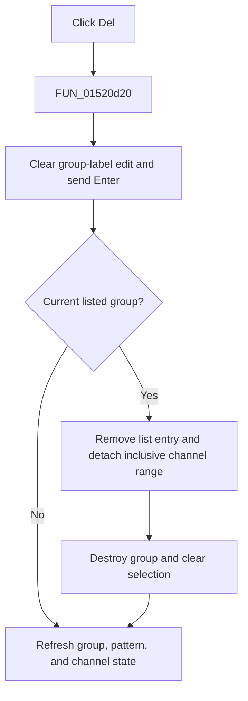

# Del

> Analysis status: Evidence-backed source review complete.

## Control

| Property | Recovered value |
| --- | --- |
| Form | LogicAnalyzerWin |
| Component path | LogicAnalyzerWin.ChannelGroupBox.FGroupDeleteBtn |
| Control class | TSpeedButton |
| Caption | Del |
| Hint | Not present in the recovered resource. |
| Text | Not present in the recovered resource. |
| Handler name | GroupDeleteBtnClick |
| Handler address | 01520d20 |
| Graph node | `resource:dfm:LogicAnalyzerWin/LogicAnalyzerWin.ChannelGroupBox.FGroupDeleteBtn` |
| Handler node | `function:01520d20` |
| Graph layer | UI |

## What happens when clicked

`FUN_01520d20` calls `FUN_01508a30`. The helper clears the group-label edit and sends a synthetic Enter key to the Logic Analyzer's group-label handler. Empty text selects the deletion branch in the shared group editor.

Deletion occurs only when a current group exists and is still present in the group list. The common path removes the list entry, clears the group back-reference on each channel in the group's inclusive range, destroys the group object, clears the current-group pointer, and deselects the group combo. The Logic Analyzer override then refreshes the pattern-group list, active-channel indexes, and channel routing state.

If either guard fails, object deletion is a silent no-op, but the refresh path still runs. There is no confirmation, undo, persistence call, local exception handler, or rollback.

## Click flow

## Handler evidence

- Source: [DecompiledSources/Tina16/functions/0000000001520D20__FUN_01520d20.c](../../../DecompiledSources/Tina16/functions/0000000001520D20__FUN_01520d20.c)
- Recovered role: Delete the selected Logic Analyzer channel group through the shared group-label path.
- Current graph summary: Handles 1 Delphi UI event: LogicAnalyzerWin.ChannelGroupBox.FGroupDeleteBtn.OnClick.
- Current graph behavior: The wrapper turns the Del click into an empty-label Enter action.
- Current graph evidence: `FUN_01508a30`, the Logic Analyzer keypress override, and the shared group editor establish the guarded deletion and refresh sequence.
- Complexity: simple
- Distinct outgoing calls: 1

## Direct calls

- `function:01508a30` — FUN_01508a30

## Resource evidence

- Kind: Not present in the recovered resource.
- Modal result: Not present in the recovered resource.
- Checked state: Not present in the recovered resource.
- List items: Not present in the recovered resource.
- Image reference: Not present in the recovered resource.
- Extracted glyph: None.

## Nearby label candidates

Nearby labels are layout candidates only. They are not proof of behavior.

- Rank 1: To: at distance 83.
- Rank 2: Group Label at distance 89.
- Rank 3: From: at distance 127.

## Analysis limits

- Original group and channel field names are not recovered. Paired group creation and deletion paths establish their roles.
- A malformed saved range can cause partial state because the recovered path has no transaction or rollback.
