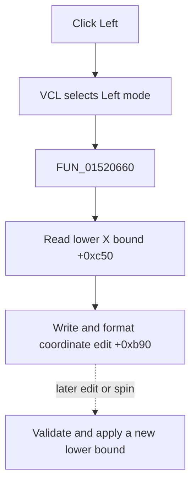

# Left

> Analysis status: Evidence-backed source review complete.

## Control

| Property | Recovered value |
| --- | --- |
| Form | LogicAnalyzerWin |
| Component path | LogicAnalyzerWin.DisplayGroupBox.FLeftCoordBtn |
| Control class | TSpeedButton |
| Caption | Left |
| Hint | Not present in the recovered resource. |
| Text | Not present in the recovered resource. |
| Handler name | LeftCoordBtnClick |
| Handler address | 01520660 |
| Graph node | `resource:dfm:LogicAnalyzerWin/LogicAnalyzerWin.DisplayGroupBox.FLeftCoordBtn` |
| Handler node | `function:01520660` |
| Graph layer | UI |

## What happens when clicked

VCL selects **Left** in the Left/Right speed-button group. `FUN_01520660` then calls `FUN_01506fb0`. The helper reads the stored lower X bound at `+0xc50` and writes it to the shared floating-point coordinate edit at `+0xb90`, which stores and formats the value.

The click selects and displays an existing bound. It does not change either bound, move the graph, move a cursor, or select a channel. Later edit and spin handlers enforce `left < right`, store an accepted value, clamp cursors, and update the graph. Those later actions are not direct calls from this click.

Repeated clicks reload the same value. The direct path has no message, file write, local exception handler, or rollback.

## Click flow

## Handler evidence

- Source: [DecompiledSources/Tina16/functions/0000000001520660__FUN_01520660.c](../../../DecompiledSources/Tina16/functions/0000000001520660__FUN_01520660.c)
- Recovered role: Select and display the Logic Analyzer's lower X-axis bound.
- Current graph summary: Handles 1 Delphi UI event: LogicAnalyzerWin.DisplayGroupBox.FLeftCoordBtn.OnClick.
- Current graph behavior: The handler copies the stored left bound into the shared coordinate editor.
- Current graph evidence: The handler, `FUN_01506fb0`, and paired bound-update path establish the field roles.
- Complexity: simple
- Distinct outgoing calls: 1

## Direct calls

- `function:01506fb0` — FUN_01506fb0

## Resource evidence

- Kind: Not present in the recovered resource.
- Modal result: Not present in the recovered resource.
- Checked state: Not present in the recovered resource.
- List items: Not present in the recovered resource.
- Image reference: Not present in the recovered resource.
- Extracted glyph: None.

## Nearby label candidates

Nearby labels are layout candidates only. They are not proof of behavior.

- No same-parent label candidate is available.

## Analysis limits

- Original Delphi field names for the bounds and edit pointer are not recovered.
- The click does not expose the custom spin control's later callback order.
