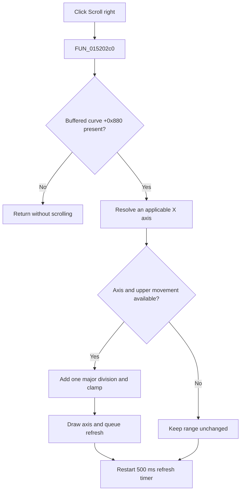

# Scroll right

> Analysis status: Evidence-backed source review complete.

## Control

| Property | Recovered value |
| --- | --- |
| Form | LogicAnalyzerWin |
| Component path | LogicAnalyzerWin.DisplayGroupBox.FRightScrollBtn |
| Control class | TSpeedButton |
| Caption | Not present in the recovered resource. |
| Hint | Scroll right |
| Text | Not present in the recovered resource. |
| Handler name | RightScrollBtnClick |
| Handler address | 015202c0 |
| Graph node | `resource:dfm:LogicAnalyzerWin/LogicAnalyzerWin.DisplayGroupBox.FRightScrollBtn` |
| Handler node | `function:015202c0` |
| Graph layer | UI |

## What happens when clicked

`FUN_015202c0` first requires a buffered Logic Analyzer curve at form offset `+0x880`. If that field is null, the click returns without a range change. Otherwise, it calls the shared right-scroll bridge `FUN_01506f70`, which reaches the diagram controller through the graph at `+0x9b0`.

The shared diagram path selects an applicable X axis from the current axis or curve selection, or from the only coordinate system when that choice is unambiguous. It moves the visible range right by one major division in the current linear or logarithmic scale, clamps at the allowed upper limit, draws the affected axis, and restarts a 500 ms deferred-refresh timer.

Invalid, mixed, or ambiguous selection and a range already at the upper limit produce no range movement. The click does not change samples, trigger settings, channels, or the stored coordinate-edit bounds. It has no file write, local exception handler, or rollback. The hint and inspected glyph confirm direction.

## Click flow

## Handler evidence

- Source: [DecompiledSources/Tina16/functions/00000000015202C0__FUN_015202c0.c](../../../DecompiledSources/Tina16/functions/00000000015202C0__FUN_015202c0.c)
- Recovered role: Scroll the Logic Analyzer X-axis view right when a buffered curve exists.
- Current graph summary: Starts the shared Logic Analyzer display right-scroll path when the required form object is present. Handles 1 Delphi UI event: LogicAnalyzerWin.DisplayGroupBox.FRightScrollBtn.OnClick.
- Current graph behavior: Starts the shared Logic Analyzer display right-scroll path when the buffered curve at `+0x880` is present.
- Current graph evidence: The handler guard, bridge chain, range arithmetic, hint, and 9-by-9 right-arrow glyph agree.
- Complexity: simple
- Distinct outgoing calls: 1

## Direct calls

- `function:01506f70` — Shared display right-scroll bridge

## Resource evidence

- Kind: Not present in the recovered resource.
- Modal result: Not present in the recovered resource.
- Checked state: Not present in the recovered resource.
- List items: Not present in the recovered resource.
- Image reference: Not present in the recovered resource.
- Extracted glyph: [`0243_LogicAnalyzerWin_LogicAnalyzerWin_DisplayGroupBox_FRightScrollBtn_Glyph_Data.png`](../../../glyph/0243_LogicAnalyzerWin_LogicAnalyzerWin_DisplayGroupBox_FRightScrollBtn_Glyph_Data.png)

## Nearby label candidates

Nearby labels are layout candidates only. They are not proof of behavior.

- No same-parent label candidate is available.

## Analysis limits

- The shared dispatcher can select an axis through indirect diagram relationships. Original Delphi type names are not recovered.
- The path changes live view endpoints. It does not prove that a later save persists them.
