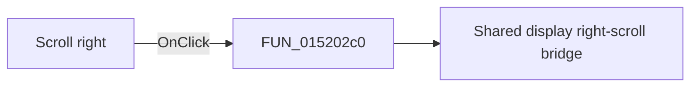

# Scroll right

> Analysis status: Pending individual source review.

## Control

| Property | Recovered value |
| --- | --- |
| Form | LogicAnalyzerWin |
| Component path | LogicAnalyzerWin.DisplayGroupBox.FRightScrollBtn |
| Control class | TSpeedButton |
| Caption | Not present in the recovered resource. |
| Hint | Scroll right |
| Text | Not present in the recovered resource. |
| Handler name | RightScrollBtnClick |
| Handler address | 015202c0 |
| Graph node | `resource:dfm:LogicAnalyzerWin/LogicAnalyzerWin.DisplayGroupBox.FRightScrollBtn` |
| Handler node | `function:015202c0` |
| Graph layer | UI |

## What happens when clicked

Pending individual analysis. An agent must read the recovered handler source and its relevant callees before it replaces this text.

## Click flow

## Handler evidence

- Source: [DecompiledSources/Tina16/functions/00000000015202C0__FUN_015202c0.c](../../../DecompiledSources/Tina16/functions/00000000015202C0__FUN_015202c0.c)
- Recovered role: Logic Analyzer right-scroll button handler
- Current graph summary: Starts the shared Logic Analyzer display right-scroll path when the required form object is present. Handles 1 Delphi UI event: LogicAnalyzerWin.DisplayGroupBox.FRightScrollBtn.OnClick.
- Current graph behavior: Starts the shared Logic Analyzer display right-scroll path when the required form object is present.
- Current graph evidence: FRightScrollBtn has the hint Scroll right and a 9 by 9 right-arrow glyph. The handler checks form offset 0x880 before it calls FUN_01506f70.
- Complexity: simple
- Distinct outgoing calls: 1

## Direct calls

- `function:01506f70` — Shared display right-scroll bridge

## Resource evidence

- Kind: Not present in the recovered resource.
- Modal result: Not present in the recovered resource.
- Checked state: Not present in the recovered resource.
- List items: Not present in the recovered resource.
- Image reference: Not present in the recovered resource.
- Extracted glyph: [`0243_LogicAnalyzerWin_LogicAnalyzerWin_DisplayGroupBox_FRightScrollBtn_Glyph_Data.png`](../../../glyph/0243_LogicAnalyzerWin_LogicAnalyzerWin_DisplayGroupBox_FRightScrollBtn_Glyph_Data.png)

## Nearby label candidates

Nearby labels are layout candidates only. They are not proof of behavior.

- No same-parent label candidate is available.

## Analysis limits

- Do not infer behavior from the control class, caption, hint, glyph, or nearby label alone.
- Do not replace the pending status until the handler source and relevant call path provide enough evidence.
