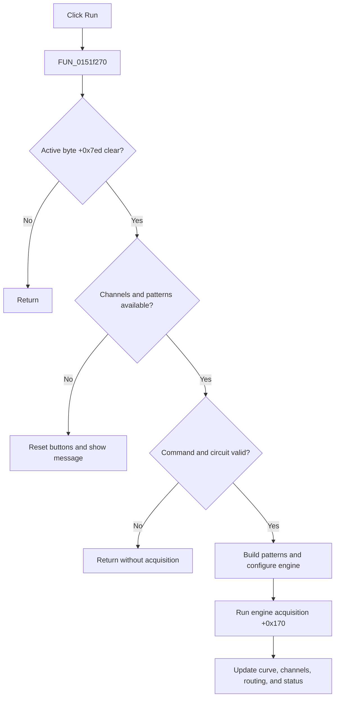

# Run

> Analysis status: Evidence-backed source review complete.

## Control

| Property | Recovered value |
| --- | --- |
| Form | LogicAnalyzerWin |
| Component path | LogicAnalyzerWin.MeasurementGroupBox.FStartBtn |
| Control class | TSpeedButton |
| Caption | Run |
| Hint | Not present in the recovered resource. |
| Text | Not present in the recovered resource. |
| Handler name | StartBtnClick |
| Handler address | 0151f270 |
| Graph node | `resource:dfm:LogicAnalyzerWin/LogicAnalyzerWin.MeasurementGroupBox.FStartBtn` |
| Handler node | `function:0151f270` |
| Graph layer | UI |

## What happens when clicked

`FUN_0151f270` starts only when active-operation byte `+0x7ed` is clear. It prepares the recovered command record and calls `FUN_0151f2b0`.

The start core requires both a channel list and a trigger-pattern list. Missing input resets the Run/Stop button state and shows a recovered application message. It also returns when an operation is already active, command validation is rejected, or the circuit check fails. A valid path sets the active and stop-request bytes, builds the pattern matrix from the current groups, configures the analyzer engine, starts acquisition through engine slot `+0x170`, creates or updates the buffered curve at `+0x880`, rebuilds channel indexes and routing, maps the engine result to form status, and restores the final Run/Stop state.

The operation can pump the UI while the engine call is active, which gives the Stop handler a path to set the stop-request state. The recovered start path has no transaction or rollback. An exception after partial setup can leave earlier runtime changes.

## Click flow

## Handler evidence

- Source: [DecompiledSources/Tina16/functions/000000000151F270__FUN_0151f270.c](../../../DecompiledSources/Tina16/functions/000000000151F270__FUN_0151f270.c)
- Recovered role: Start a Logic Analyzer acquisition with the current channel and trigger configuration.
- Current graph summary: Handles 1 Delphi UI event: LogicAnalyzerWin.MeasurementGroupBox.FStartBtn.OnClick.
- Current graph behavior: The wrapper enters the guarded form-specific acquisition core.
- Current graph evidence: `FUN_0151f2b0`, pattern preparation, engine dispatch, curve creation, and channel-refresh calls establish the start sequence.
- Complexity: simple
- Distinct outgoing calls: 1

## Direct calls

- `function:0151f2b0` — FUN_0151f2b0

## Resource evidence

- Kind: Not present in the recovered resource.
- Modal result: Not present in the recovered resource.
- Checked state: Not present in the recovered resource.
- List items: Not present in the recovered resource.
- Image reference: Not present in the recovered resource.
- Extracted glyph: None.

## Nearby label candidates

Nearby labels are layout candidates only. They are not proof of behavior.

- No same-parent label candidate is available.

## Analysis limits

- Several engine, validation, and UI calls are indirect. The article states only effects established by their surrounding data flow.
- The exact recovered message text and every engine status value are not decoded here.
