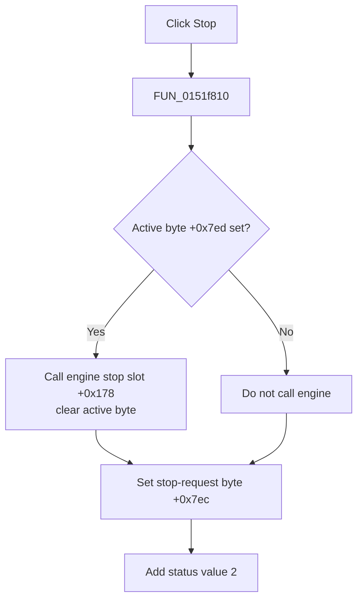

# Stop

> Analysis status: Evidence-backed source review complete.

## Control

| Property | Recovered value |
| --- | --- |
| Form | LogicAnalyzerWin |
| Component path | LogicAnalyzerWin.MeasurementGroupBox.FStopBtn |
| Control class | TSpeedButton |
| Caption | Stop |
| Hint | Not present in the recovered resource. |
| Text | Not present in the recovered resource. |
| Handler name | StopBtnClick |
| Handler address | 0151f810 |
| Graph node | `resource:dfm:LogicAnalyzerWin/LogicAnalyzerWin.MeasurementGroupBox.FStopBtn` |
| Handler node | `function:0151f810` |
| Graph layer | UI |

## What happens when clicked

`FUN_0151f810` checks active-operation byte `+0x7ed`. If it is set, the handler calls analyzer engine virtual slot `+0x178` to request a stop and then clears the active byte.

The handler always sets stop-request byte `+0x7ec` to `1` and adds status value `2` through `FUN_010e4520`. Thus, a click while no operation is active does not call the engine, but it still records the stop request and status. The start core clears this request before a later acquisition.

The click does not clear channels, patterns, or the buffered curve. It has no confirmation, result check, file write, local exception handler, retry, or rollback.

## Click flow

## Handler evidence

- Source: [DecompiledSources/Tina16/functions/000000000151F810__FUN_0151f810.c](../../../DecompiledSources/Tina16/functions/000000000151F810__FUN_0151f810.c)
- Recovered role: Request that the active Logic Analyzer acquisition stop.
- Current graph summary: Handles 1 Delphi UI event: LogicAnalyzerWin.MeasurementGroupBox.FStopBtn.OnClick.
- Current graph behavior: The handler conditionally calls the engine stop method, then records stop-request and status state.
- Current graph evidence: The active-byte branch, engine VMT call, stop-request write, and status helper establish the effect.
- Complexity: simple
- Distinct outgoing calls: 1

## Direct calls

- `function:010e4520` — FUN_010e4520

## Resource evidence

- Kind: Not present in the recovered resource.
- Modal result: Not present in the recovered resource.
- Checked state: Not present in the recovered resource.
- List items: Not present in the recovered resource.
- Image reference: Not present in the recovered resource.
- Extracted glyph: None.

## Nearby label candidates

Nearby labels are layout candidates only. They are not proof of behavior.

- No same-parent label candidate is available.

## Analysis limits

- The concrete engine method name at slot `+0x178` is not recovered.
- The handler does not read a stop result, so completion timing and engine-side error reporting remain outside this source.
