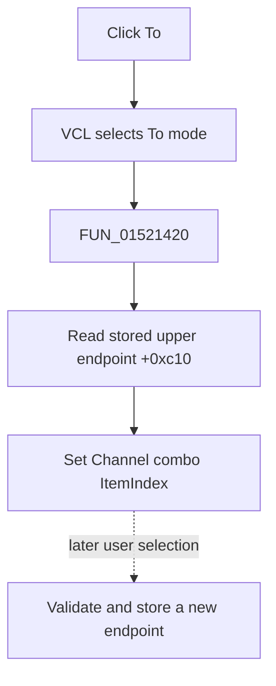

# To

> Analysis status: Evidence-backed source review complete.

## Control

| Property | Recovered value |
| --- | --- |
| Form | LogicAnalyzerWin |
| Component path | LogicAnalyzerWin.ChannelGroupBox.FToChnSpBtn |
| Control class | TSpeedButton |
| Caption | To |
| Hint | Not present in the recovered resource. |
| Text | Not present in the recovered resource. |
| Handler name | ToChnSpBtnClick |
| Handler address | 01521420 |
| Graph node | `resource:dfm:LogicAnalyzerWin/LogicAnalyzerWin.ChannelGroupBox.FToChnSpBtn` |
| Handler node | `function:01521420` |
| Graph layer | UI |

## What happens when clicked

VCL selects **To** in the From/To speed-button group. `FUN_01521420` then calls `FUN_01508eb0`, which reads the saved upper endpoint at form offset `+0xc10` and sets the Channel combo's `ItemIndex` to that value.

The click restores an existing endpoint for display and later editing. It does not calculate, normalize, or store a new endpoint. A later Channel combo change enforces the normal `From <= To` rule and updates the model. The direct helper has no bounds guard, message, retry, file write, or local exception handler. Repeated clicks set the same item index again.

## Click flow

## Handler evidence

- Source: [DecompiledSources/Tina16/functions/0000000001521420__FUN_01521420.c](../../../DecompiledSources/Tina16/functions/0000000001521420__FUN_01521420.c)
- Recovered role: Select the stored upper channel endpoint for editing.
- Current graph summary: Handles 1 Delphi UI event: LogicAnalyzerWin.ChannelGroupBox.FToChnSpBtn.OnClick.
- Current graph behavior: The handler restores the saved To index to the Channel combo.
- Current graph evidence: The handler and `FUN_01508eb0` map `+0xc10` to the combo `ItemIndex` setter.
- Complexity: simple
- Distinct outgoing calls: 1

## Direct calls

- `function:01508eb0` — FUN_01508eb0

## Resource evidence

- Kind: Not present in the recovered resource.
- Modal result: Not present in the recovered resource.
- Checked state: Not present in the recovered resource.
- List items: Not present in the recovered resource.
- Image reference: Not present in the recovered resource.
- Extracted glyph: None.

## Nearby label candidates

Nearby labels are layout candidates only. They are not proof of behavior.

- Rank 1: To: at distance 3.
- Rank 2: From: at distance 47.
- Rank 3: Group Label at distance 85.

## Analysis limits

- The original Delphi field name for `+0xc10` is not recovered. Paired From/To and group-copy paths establish its upper-endpoint role.
- Behavior for a stale out-of-range value remains inside the unresolved virtual combo setter.
