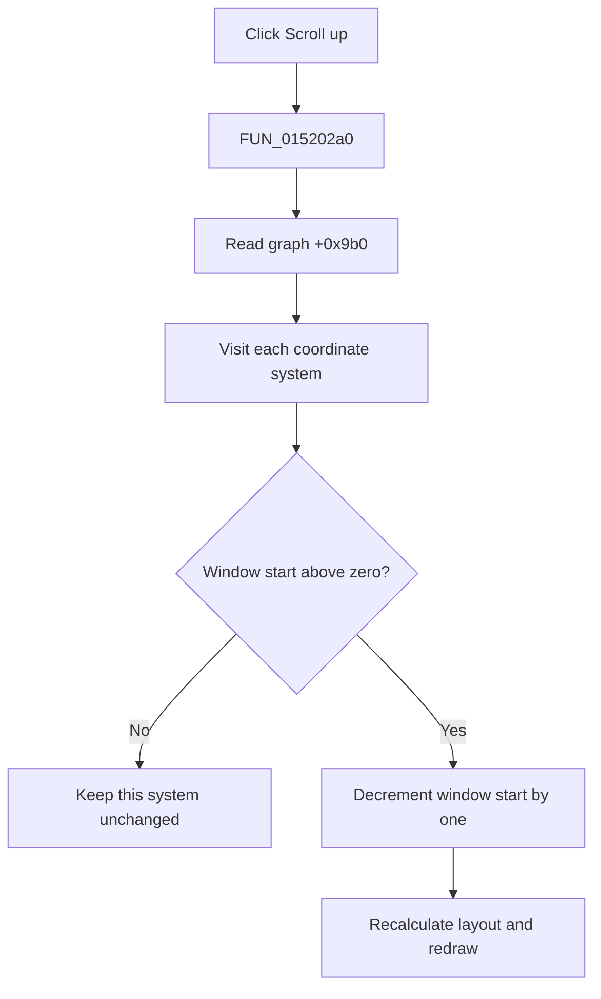

# Scroll up

> Analysis status: Evidence-backed source review complete.

## Control

| Property | Recovered value |
| --- | --- |
| Form | LogicAnalyzerWin |
| Component path | LogicAnalyzerWin.DisplayGroupBox.FUpScrollBtn |
| Control class | TSpeedButton |
| Caption | Not present in the recovered resource. |
| Hint | Scroll up |
| Text | Not present in the recovered resource. |
| Handler name | UpScrollBtnClick |
| Handler address | 015202a0 |
| Graph node | `resource:dfm:LogicAnalyzerWin/LogicAnalyzerWin.DisplayGroupBox.FUpScrollBtn` |
| Handler node | `function:015202a0` |
| Graph layer | UI |

## What happens when clicked

`FUN_015202a0` calls `FUN_01506f30`, which reads the graph at form offset `+0x9b0`. The graph proxy `FUN_010eb680` then calls the all-coordinate-system up dispatcher `FUN_01ad1480`.

For each coordinate system, the shared path decrements the displayed active-Y-axis window start by one only while it is above zero. A changed system recalculates layout and redraws its owned objects. If any system changed, the graph also redraws its optional cursor objects. If all systems are at zero, the click is a silent no-op with no redraw.

The click does not select, enable, or edit channels. It has no modifier branch, wrap, file write, local exception handler, or rollback. The hint and inspected 9-by-9 up-arrow glyph confirm direction; the source proves the one-position display change.

## Click flow

## Handler evidence

- Source: [DecompiledSources/Tina16/functions/00000000015202A0__FUN_015202a0.c](../../../DecompiledSources/Tina16/functions/00000000015202A0__FUN_015202a0.c)
- Recovered role: Scroll the Logic Analyzer's displayed channel-axis window up by one position.
- Current graph summary: Handles 1 Delphi UI event: LogicAnalyzerWin.DisplayGroupBox.FUpScrollBtn.OnClick.
- Current graph behavior: The handler enters the shared all-coordinate-system up-scroll path.
- Current graph evidence: The handler, graph wrappers, bounded step, hint, and glyph agree on the direction and scope.
- Complexity: simple
- Distinct outgoing calls: 1

## Direct calls

- `function:01506f30` — FUN_01506f30

## Resource evidence

- Kind: Not present in the recovered resource.
- Modal result: Not present in the recovered resource.
- Checked state: Not present in the recovered resource.
- List items: Not present in the recovered resource.
- Image reference: Not present in the recovered resource.
- Extracted glyph: [`0242_LogicAnalyzerWin_LogicAnalyzerWin_DisplayGroupBox_FUpScrollBtn_Glyph_Data.png`](../../../glyph/0242_LogicAnalyzerWin_LogicAnalyzerWin_DisplayGroupBox_FUpScrollBtn_Glyph_Data.png)

## Nearby label candidates

Nearby labels are layout candidates only. They are not proof of behavior.

- No same-parent label candidate is available.

## Analysis limits

- Original coordinate-system field names are not recovered. Their layout and bounded-step use establish the window roles.
- The click changes live display state. It does not prove immediate persistence.
