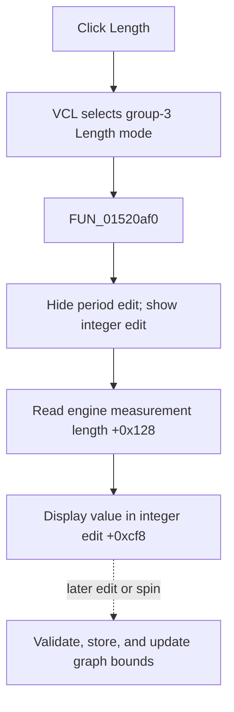

# Length

> Analysis status: Evidence-backed source review complete.

## Control

| Property | Recovered value |
| --- | --- |
| Form | LogicAnalyzerWin |
| Component path | LogicAnalyzerWin.MeasurementGroupBox.MeasLengthBtn |
| Control class | TSpeedButton |
| Caption | Length |
| Hint | Not present in the recovered resource. |
| Text | Not present in the recovered resource. |
| Handler name | MeasLengthBtnClick |
| Handler address | 01520af0 |
| Graph node | `resource:dfm:LogicAnalyzerWin/LogicAnalyzerWin.MeasurementGroupBox.MeasLengthBtn` |
| Handler node | `function:01520af0` |
| Graph layer | UI |

## What happens when clicked

VCL selects **Length** in measurement group `3`. `FUN_01520af0` hides and disables the floating-point period edit at `+0xca8`, shows and enables the shared integer edit at `+0xcf8`, reads the current measurement length from analyzer engine getter `+0x128`, and displays it in that edit.

The click selects and displays an existing value. It does not store a new length. Later integer-edit and spin events use `FUN_0151f860` when the Length button is down. That path validates the proposed value through engine slot `+0x120`, stores it through `+0x130`, updates the edit, and recalculates the horizontal graph bounds.

Repeated clicks reload the current engine value. The direct path has no message, file write, local exception handler, or rollback.

## Click flow

## Handler evidence

- Source: [DecompiledSources/Tina16/functions/0000000001520AF0__FUN_01520af0.c](../../../DecompiledSources/Tina16/functions/0000000001520AF0__FUN_01520af0.c)
- Recovered role: Select and display the Logic Analyzer measurement length.
- Current graph summary: Handles 1 Delphi UI event: LogicAnalyzerWin.MeasurementGroupBox.MeasLengthBtn.OnClick.
- Current graph behavior: The handler shows the shared integer editor and fills it with the engine's length value.
- Current graph evidence: The paired control-state calls, engine getter, integer setter, and later length-edit path establish the behavior.
- Complexity: moderate
- Distinct outgoing calls: 2

## Direct calls

- `function:0064dbe0` — FUN_0064dbe0
- `function:00f04fa0` — FUN_00f04fa0

## Resource evidence

- Kind: Not present in the recovered resource.
- Modal result: Not present in the recovered resource.
- Checked state: Not present in the recovered resource.
- List items: Not present in the recovered resource.
- Image reference: Not present in the recovered resource.
- Extracted glyph: None.

## Nearby label candidates

Nearby labels are layout candidates only. They are not proof of behavior.

- No same-parent label candidate is available.

## Analysis limits

- The engine method names are not recovered. Their length roles are established by paired read, validate, store, and bound-update data flow.
- The direct click does not prove persistence of a later length change.
