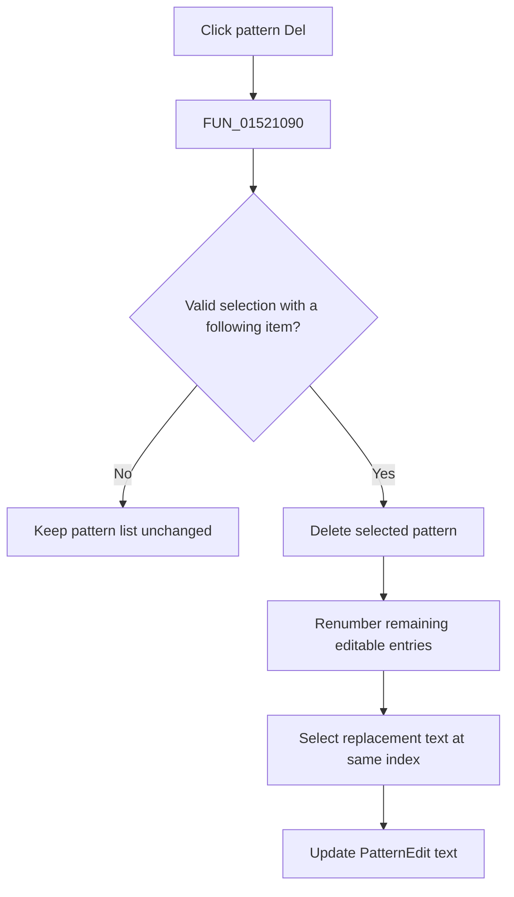

# Del

> Analysis status: Evidence-backed source review complete.

## Control

| Property | Recovered value |
| --- | --- |
| Form | LogicAnalyzerWin |
| Component path | LogicAnalyzerWin.TriggerBox.PatternDeleteBtn |
| Control class | TSpeedButton |
| Caption | Del |
| Hint | Not present in the recovered resource. |
| Text | Not present in the recovered resource. |
| Handler name | PatternDeleteBtnClick |
| Handler address | 01521090 |
| Graph node | `resource:dfm:LogicAnalyzerWin/LogicAnalyzerWin.TriggerBox.PatternDeleteBtn` |
| Handler node | `function:01521090` |
| Graph layer | UI |

## What happens when clicked

`FUN_01521090` reads the selected pattern index from `PatternEditBox` at `+0xd70`. It deletes only when the index is valid and another entry follows the selected entry. This protects the last list item, so a one-item list is a silent no-op.

After deletion, the handler renumbers the remaining editable entries, reads the replacement item at the same index, and copies its text to `PatternEdit` at `+0xe38`. The combo's item list is the selected pattern group's list assigned by the group-change path, so the mutation affects that runtime group collection.

The click does not delete a channel or the selected channel group. It has no confirmation, undo record, file write, local exception handler, or rollback. A stale selected index is passed to list operations without an extra local range check beyond the initial conditions.

## Click flow

## Handler evidence

- Source: [DecompiledSources/Tina16/functions/0000000001521090__FUN_01521090.c](../../../DecompiledSources/Tina16/functions/0000000001521090__FUN_01521090.c)
- Recovered role: Delete the selected nonfinal Logic Analyzer trigger pattern.
- Current graph summary: Handles 1 Delphi UI event: LogicAnalyzerWin.TriggerBox.PatternDeleteBtn.OnClick.
- Current graph behavior: The handler deletes a guarded pattern-list entry, renumbers the list, and refreshes the edit text.
- Current graph evidence: The list count, selected-index branch, deletion call, renumber loop, and text update establish the behavior.
- Complexity: complex
- Distinct outgoing calls: 6

## Direct calls

- `function:0040e840` — FUN_0040e840
- `function:00414480` — Delphi UnicodeString clear and finalization helper
- `function:00414560` — Delphi UnicodeString array finalization helper
- `function:00414de0` — FUN_00414de0
- `function:004169a0` — FUN_004169a0
- `function:0064de00` — VCL control text setter with change suppression

## Resource evidence

- Kind: Not present in the recovered resource.
- Modal result: Not present in the recovered resource.
- Checked state: Not present in the recovered resource.
- List items: Not present in the recovered resource.
- Image reference: Not present in the recovered resource.
- Extracted glyph: None.

## Nearby label candidates

Nearby labels are layout candidates only. They are not proof of behavior.

- Rank 1: Pattern at distance 90.
- Rank 2: Group at distance 166.

## Analysis limits

- The protected final item's application meaning is not named in the recovered source.
- The nearby Pattern label supports control context only. It does not establish deletion semantics by itself.
