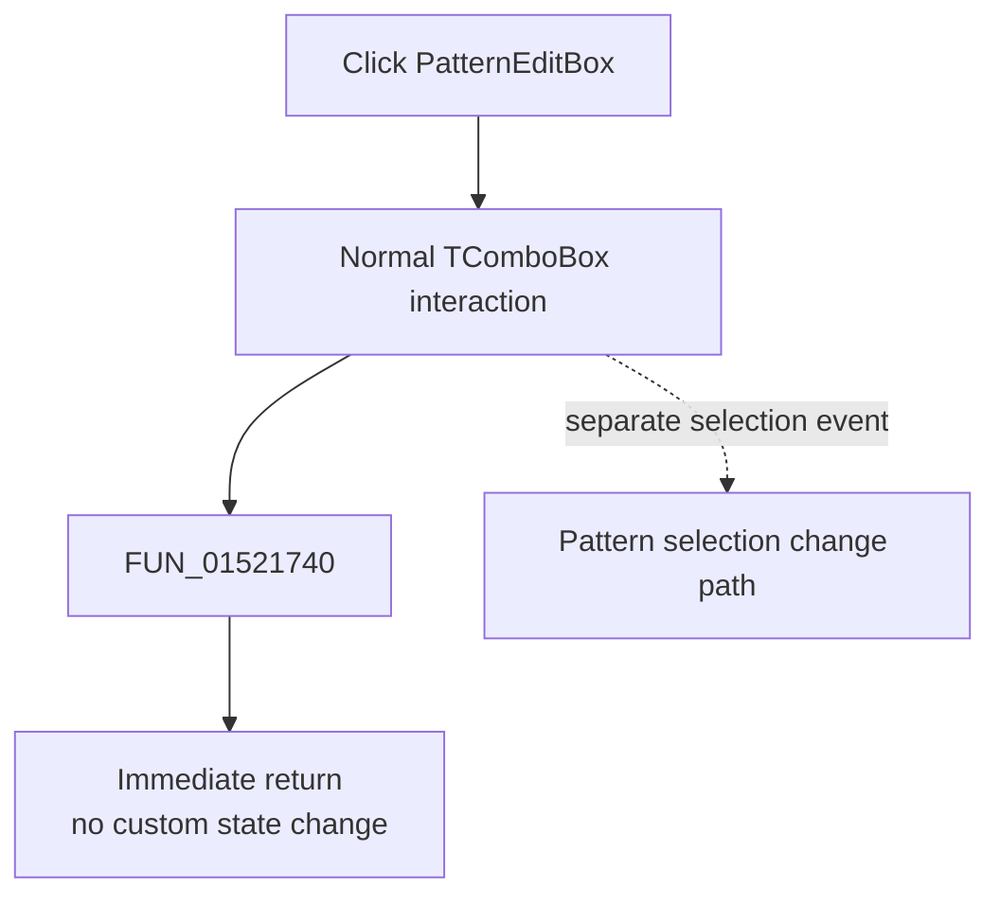

# PatternEditBox

> Analysis status: Evidence-backed source review complete; the custom OnClick handler is a no-op.

## Control

| Property | Recovered value |
| --- | --- |
| Form | LogicAnalyzerWin |
| Component path | LogicAnalyzerWin.TriggerBox.PatternEditBox |
| Control class | TComboBox |
| Caption | Not present in the recovered resource. |
| Hint | Not present in the recovered resource. |
| Text | Not present in the recovered resource. |
| Handler name | PatternEditBoxClick |
| Handler address | 01521740 |
| Graph node | `resource:dfm:LogicAnalyzerWin/LogicAnalyzerWin.TriggerBox.PatternEditBox` |
| Handler node | `function:01521740` |
| Graph layer | UI |

## What happens when clicked

`FUN_01521740` contains only `RET`. It reads no input, calls no function, and writes no application state. The custom Delphi `OnClick` binding therefore adds no behavior.

Normal `TComboBox` behavior remains outside this empty handler. VCL can still open the drop-down and change its selection. The separate combo-change and pattern-edit paths can then show or edit the selected pattern. This article does not assign those later events to the no-op click method.

There is no custom validation, message, error branch, persistence call, or rollback. Repeated handler calls return immediately.

## Click flow

## Handler evidence

- Source: [DecompiledSources/Tina16/functions/0000000001521740__FUN_01521740.c](../../../DecompiledSources/Tina16/functions/0000000001521740__FUN_01521740.c)
- Recovered role: No-op Logic Analyzer pattern-combo click handler.
- Current graph summary: Handles 1 Delphi UI event: LogicAnalyzerWin.TriggerBox.PatternEditBox.OnClick.
- Current graph behavior: Returns immediately without application-level work.
- Current graph evidence: The recovered function has one return instruction and no calls or writes.
- Complexity: simple
- Distinct outgoing calls: 0

## Direct calls

- No direct call edge is present in the recovered graph.

## Resource evidence

- Kind: Not present in the recovered resource.
- Modal result: Not present in the recovered resource.
- Checked state: Not present in the recovered resource.
- List items: ("1.[ XXXXXXXX]")
- Image reference: Not present in the recovered resource.
- Extracted glyph: None.

## Nearby label candidates

Nearby labels are layout candidates only. They are not proof of behavior.

- Rank 1: Pattern at distance 16.
- Rank 2: Group at distance 92.

## Analysis limits

- The empty handler does not make the combo inert. Standard VCL interaction and other bound events remain active.
- The nearby Pattern label identifies context only; it does not add behavior to this handler.
