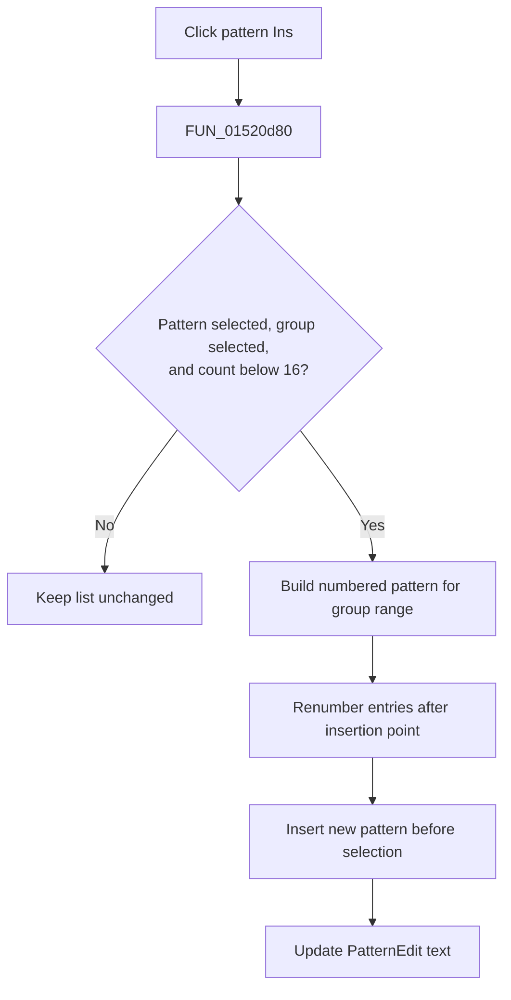

# Ins

> Analysis status: Evidence-backed source review complete.

## Control

| Property | Recovered value |
| --- | --- |
| Form | LogicAnalyzerWin |
| Component path | LogicAnalyzerWin.TriggerBox.PatternInsertBtn |
| Control class | TSpeedButton |
| Caption | Ins |
| Hint | Not present in the recovered resource. |
| Text | Not present in the recovered resource. |
| Handler name | PatternInsertBtnClick |
| Handler address | 01520d80 |
| Graph node | `resource:dfm:LogicAnalyzerWin/LogicAnalyzerWin.TriggerBox.PatternInsertBtn` |
| Handler node | `function:01520d80` |
| Graph layer | UI |

## What happens when clicked

`FUN_01520d80` requires a selected pattern, fewer than `16` pattern items, and a selected pattern group. If any guard fails, the click is a silent no-op.

For a valid request, the handler builds a numbered pattern string at the selected index. It adds one default marker for every channel in the selected group's inclusive From-to-To range. It then renumbers existing entries at and after the insertion point, inserts the new string before the selected item, and copies the new item text to `PatternEdit` at `+0xe38`.

The combo item list belongs to the selected runtime pattern group. The click does not add a channel or channel group and does not start acquisition. It has no confirmation, undo record, file write, local exception handler, or rollback. An invalid saved group range can produce a pattern with no appended channel markers.

## Click flow

## Handler evidence

- Source: [DecompiledSources/Tina16/functions/0000000001520D80__FUN_01520d80.c](../../../DecompiledSources/Tina16/functions/0000000001520D80__FUN_01520d80.c)
- Recovered role: Insert a new Logic Analyzer trigger pattern for the selected channel group.
- Current graph summary: Handles 1 Delphi UI event: LogicAnalyzerWin.TriggerBox.PatternInsertBtn.OnClick.
- Current graph behavior: The handler applies selection and count guards, builds a group-width pattern, inserts it, and refreshes the edit text.
- Current graph evidence: The source's count limit, group range, string construction, renumber loop, insertion, and text update establish the behavior.
- Complexity: complex
- Distinct outgoing calls: 10

## Direct calls

- `function:0040e840` — FUN_0040e840
- `function:004113f0` — FUN_004113f0
- `function:00414560` — Delphi UnicodeString array finalization helper
- `function:00414de0` — FUN_00414de0
- `function:00416780` — FUN_00416780
- `function:004169a0` — FUN_004169a0
- `function:00416ad0` — FUN_00416ad0
- `function:00416ea0` — FUN_00416ea0
- `function:004170c0` — FUN_004170c0
- `function:0064de00` — VCL control text setter with change suppression

## Resource evidence

- Kind: Not present in the recovered resource.
- Modal result: Not present in the recovered resource.
- Checked state: Not present in the recovered resource.
- List items: Not present in the recovered resource.
- Image reference: Not present in the recovered resource.
- Extracted glyph: None.

## Nearby label candidates

Nearby labels are layout candidates only. They are not proof of behavior.

- Rank 1: Pattern at distance 62.
- Rank 2: Group at distance 138.

## Analysis limits

- The exact default marker character comes from a recovered global table whose Delphi name is unknown.
- The nearby Pattern and Group labels support context only. The source establishes insertion semantics.
