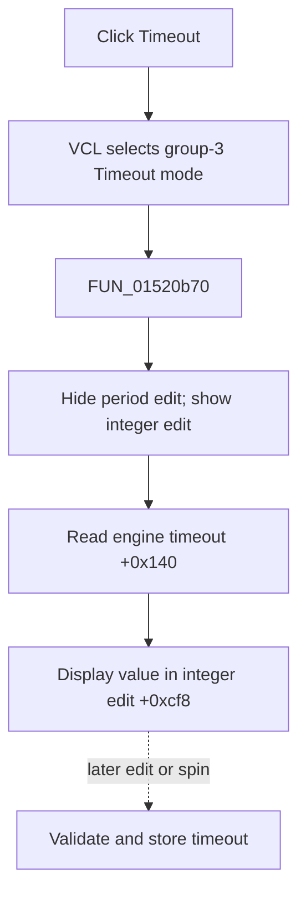

# Timeout

> Analysis status: Evidence-backed source review complete.

## Control

| Property | Recovered value |
| --- | --- |
| Form | LogicAnalyzerWin |
| Component path | LogicAnalyzerWin.MeasurementGroupBox.TimeoutBtn |
| Control class | TSpeedButton |
| Caption | Timeout |
| Hint | Not present in the recovered resource. |
| Text | Not present in the recovered resource. |
| Handler name | TimeoutBtnClick |
| Handler address | 01520b70 |
| Graph node | `resource:dfm:LogicAnalyzerWin/LogicAnalyzerWin.MeasurementGroupBox.TimeoutBtn` |
| Handler node | `function:01520b70` |
| Graph layer | UI |

## What happens when clicked

VCL selects **Timeout** in measurement group `3`. `FUN_01520b70` hides and disables the floating-point period edit at `+0xca8`, shows and enables the shared integer edit at `+0xcf8`, reads the current timeout from analyzer engine getter `+0x140`, and displays it in that edit.

The click selects and displays an existing value. It does not store a new timeout. Later integer-edit and spin events use `FUN_0151f8f0` when the Timeout button is down. That path validates the proposed value through engine slot `+0x138`, stores it through `+0x148`, and updates the edit.

Repeated clicks reload the current engine value. The direct path has no message, file write, local exception handler, or rollback.

## Click flow

## Handler evidence

- Source: [DecompiledSources/Tina16/functions/0000000001520B70__FUN_01520b70.c](../../../DecompiledSources/Tina16/functions/0000000001520B70__FUN_01520b70.c)
- Recovered role: Select and display the Logic Analyzer timeout.
- Current graph summary: Handles 1 Delphi UI event: LogicAnalyzerWin.MeasurementGroupBox.TimeoutBtn.OnClick.
- Current graph behavior: The handler shows the shared integer editor and fills it with the engine's timeout value.
- Current graph evidence: The paired control-state calls, engine getter, integer setter, and later timeout-edit path establish the behavior.
- Complexity: moderate
- Distinct outgoing calls: 2

## Direct calls

- `function:0064dbe0` — FUN_0064dbe0
- `function:00f04fa0` — FUN_00f04fa0

## Resource evidence

- Kind: Not present in the recovered resource.
- Modal result: Not present in the recovered resource.
- Checked state: Not present in the recovered resource.
- List items: Not present in the recovered resource.
- Image reference: Not present in the recovered resource.
- Extracted glyph: None.

## Nearby label candidates

Nearby labels are layout candidates only. They are not proof of behavior.

- No same-parent label candidate is available.

## Analysis limits

- The engine method names and timeout units are not recovered. Their roles are established by paired read, validate, and store data flow.
- The direct click does not prove persistence of a later timeout change.
