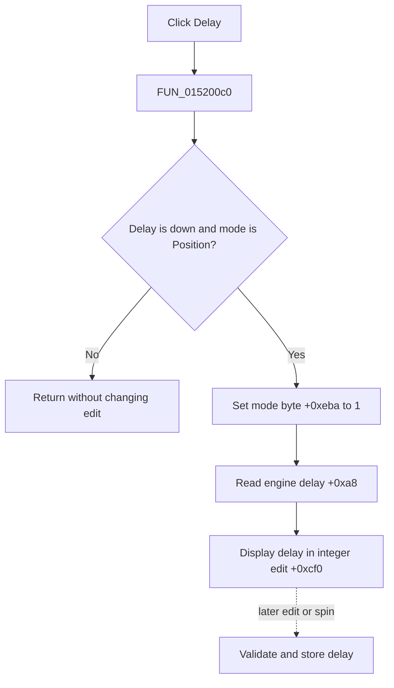

# Delay

> Analysis status: Evidence-backed source review complete.

## Control

| Property | Recovered value |
| --- | --- |
| Form | LogicAnalyzerWin |
| Component path | LogicAnalyzerWin.TriggerBox.TriggerDelayBtn |
| Control class | TSpeedButton |
| Caption | Delay |
| Hint | Not present in the recovered resource. |
| Text | Not present in the recovered resource. |
| Handler name | TriggerDelayBtnClick |
| Handler address | 015200c0 |
| Graph node | `resource:dfm:LogicAnalyzerWin/LogicAnalyzerWin.TriggerBox.TriggerDelayBtn` |
| Handler node | `function:015200c0` |
| Graph layer | UI |

## What happens when clicked

The **Delay** and **Position** buttons share trigger group `3`. When Delay is down and form mode byte `+0xeba` still selects Position, `FUN_015200c0` sets the byte to `1`, reads the current trigger delay from analyzer engine getter `+0xa8`, and displays it in the shared integer edit at `+0xcf0`.

The direct click selects and displays an existing value. It does not store a new delay. Later edit or spin events use engine slots `+0xa0` and `+0xb0` to validate and store the delay when this mode byte is `1`.

If Delay is not down or delay mode is already active, the handler is a silent no-op. It has no message, file write, local exception handler, or rollback.

## Click flow

## Handler evidence

- Source: [DecompiledSources/Tina16/functions/00000000015200C0__FUN_015200c0.c](../../../DecompiledSources/Tina16/functions/00000000015200C0__FUN_015200c0.c)
- Recovered role: Select and display the Logic Analyzer trigger delay.
- Current graph summary: Handles 1 Delphi UI event: LogicAnalyzerWin.TriggerBox.TriggerDelayBtn.OnClick.
- Current graph behavior: The handler selects delay mode and fills the shared trigger integer editor.
- Current graph evidence: The Down-state guard, mode byte, engine getter, and paired later setter establish the role.
- Complexity: simple
- Distinct outgoing calls: 1

## Direct calls

- `function:00f04fa0` — FUN_00f04fa0

## Resource evidence

- Kind: Not present in the recovered resource.
- Modal result: Not present in the recovered resource.
- Checked state: Not present in the recovered resource.
- List items: Not present in the recovered resource.
- Image reference: Not present in the recovered resource.
- Extracted glyph: None.

## Nearby label candidates

Nearby labels are layout candidates only. They are not proof of behavior.

- Rank 1: Pattern at distance 68.
- Rank 2: Group at distance 144.

## Analysis limits

- The engine method names and delay units are not recovered.
- Nearby Pattern and Group labels are layout candidates only and are not used as trigger-delay proof.
