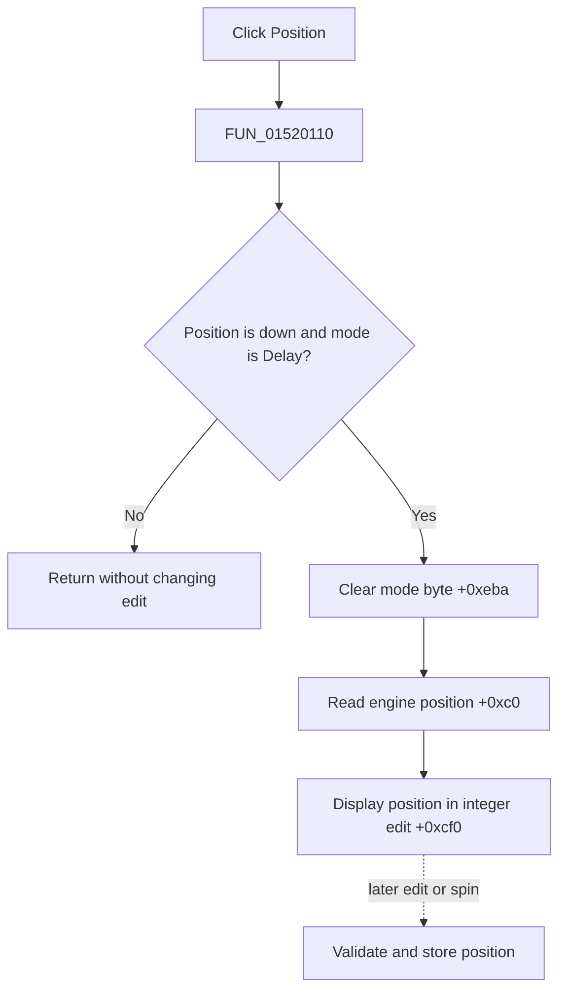

# Position

> Analysis status: Evidence-backed source review complete.

## Control

| Property | Recovered value |
| --- | --- |
| Form | LogicAnalyzerWin |
| Component path | LogicAnalyzerWin.TriggerBox.TriggerPositionBtn |
| Control class | TSpeedButton |
| Caption | Position |
| Hint | Not present in the recovered resource. |
| Text | Not present in the recovered resource. |
| Handler name | TriggerPositionBtnClick |
| Handler address | 01520110 |
| Graph node | `resource:dfm:LogicAnalyzerWin/LogicAnalyzerWin.TriggerBox.TriggerPositionBtn` |
| Handler node | `function:01520110` |
| Graph layer | UI |

## What happens when clicked

The **Position** and **Delay** buttons share trigger group `3`. When Position is down and form mode byte `+0xeba` still selects Delay, `FUN_01520110` clears the byte, reads the current trigger position from analyzer engine getter `+0xc0`, and displays it in the shared integer edit at `+0xcf0`.

The direct click selects and displays an existing value. It does not store a new position. Later edit or spin events use engine slots `+0xb8` and `+0xc8` to validate and store the position when this mode byte is `0`.

If Position is not down or position mode is already active, the handler is a silent no-op. It has no message, file write, local exception handler, or rollback.

## Click flow

## Handler evidence

- Source: [DecompiledSources/Tina16/functions/0000000001520110__FUN_01520110.c](../../../DecompiledSources/Tina16/functions/0000000001520110__FUN_01520110.c)
- Recovered role: Select and display the Logic Analyzer trigger position.
- Current graph summary: Handles 1 Delphi UI event: LogicAnalyzerWin.TriggerBox.TriggerPositionBtn.OnClick.
- Current graph behavior: The handler selects position mode and fills the shared trigger integer editor.
- Current graph evidence: The Down-state guard, mode byte, engine getter, and paired later setter establish the role.
- Complexity: simple
- Distinct outgoing calls: 1

## Direct calls

- `function:00f04fa0` — FUN_00f04fa0

## Resource evidence

- Kind: Not present in the recovered resource.
- Modal result: Not present in the recovered resource.
- Checked state: Not present in the recovered resource.
- List items: Not present in the recovered resource.
- Image reference: Not present in the recovered resource.
- Extracted glyph: None.

## Nearby label candidates

Nearby labels are layout candidates only. They are not proof of behavior.

- Rank 1: Pattern at distance 114.
- Rank 2: Group at distance 190.

## Analysis limits

- The engine method names and position units are not recovered.
- Nearby Pattern and Group labels are layout candidates only and are not used as trigger-position proof.
