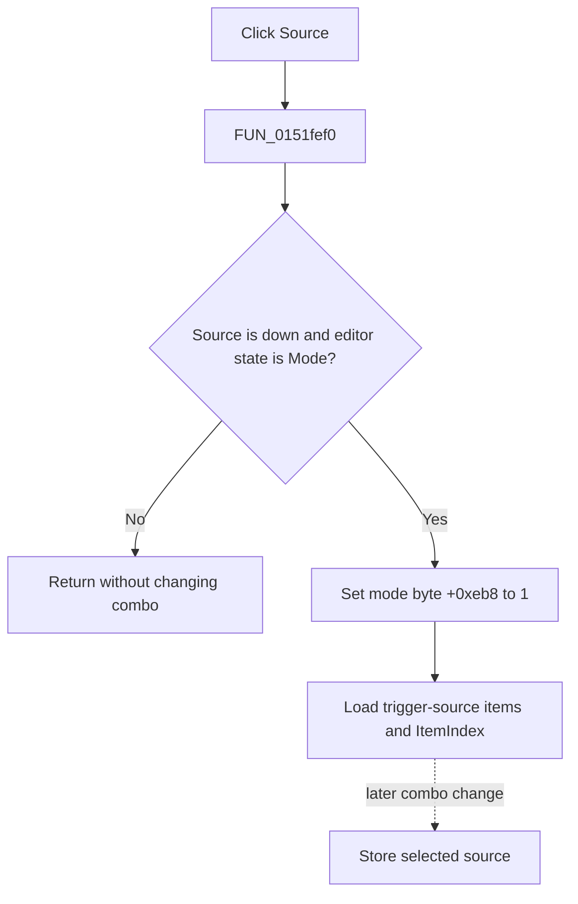

# Source

> Analysis status: Evidence-backed source review complete.

## Control

| Property | Recovered value |
| --- | --- |
| Form | LogicAnalyzerWin |
| Component path | LogicAnalyzerWin.TriggerBox.TriggerSourceBtn |
| Control class | TSpeedButton |
| Caption | Source |
| Hint | Not present in the recovered resource. |
| Text | Not present in the recovered resource. |
| Handler name | TriggerSourceBtnClick |
| Handler address | 0151fef0 |
| Graph node | `resource:dfm:LogicAnalyzerWin/LogicAnalyzerWin.TriggerBox.TriggerSourceBtn` |
| Handler node | `function:0151fef0` |
| Graph layer | UI |

## What happens when clicked

The **Source** and **Mode** buttons share trigger group `2`. When Source is down and form mode byte `+0xeb8` still selects Mode, `FUN_0151fef0` sets the byte to `1`. It then loads the trigger-source item list and selected index from analyzer engine virtual getters `+0x88` and `+0x90` into the shared combo at `+0xcb8`.

The direct click changes the selected editor mode and combo contents. It does not store a new trigger source. A later combo change in Source state stores the selected item through engine slot `+0x98`.

If Source is not down or source state is already active, the handler is a silent no-op. It has no message, file write, local exception handler, or rollback.

## Click flow

## Handler evidence

- Source: [DecompiledSources/Tina16/functions/000000000151FEF0__FUN_0151fef0.c](../../../DecompiledSources/Tina16/functions/000000000151FEF0__FUN_0151fef0.c)
- Recovered role: Select and display the Logic Analyzer trigger source.
- Current graph summary: Handles 1 Delphi UI event: LogicAnalyzerWin.TriggerBox.TriggerSourceBtn.OnClick.
- Current graph behavior: The handler selects trigger-source editing and loads its engine-backed combo state.
- Current graph evidence: The Down-state guard, mode byte, paired engine getters, and shared combo setters establish the behavior.
- Complexity: simple
- Distinct outgoing calls: 0

## Direct calls

- No direct call edge is present in the recovered graph.

## Resource evidence

- Kind: Not present in the recovered resource.
- Modal result: Not present in the recovered resource.
- Checked state: Not present in the recovered resource.
- List items: Not present in the recovered resource.
- Image reference: Not present in the recovered resource.
- Extracted glyph: None.

## Nearby label candidates

Nearby labels are layout candidates only. They are not proof of behavior.

- Rank 1: Group at distance 52.
- Rank 2: Pattern at distance 128.

## Analysis limits

- Engine methods are indirect VMT calls. Their trigger-source roles are established by paired read and change-handler data flow.
- Nearby Group and Pattern labels are not used as evidence for this control.
