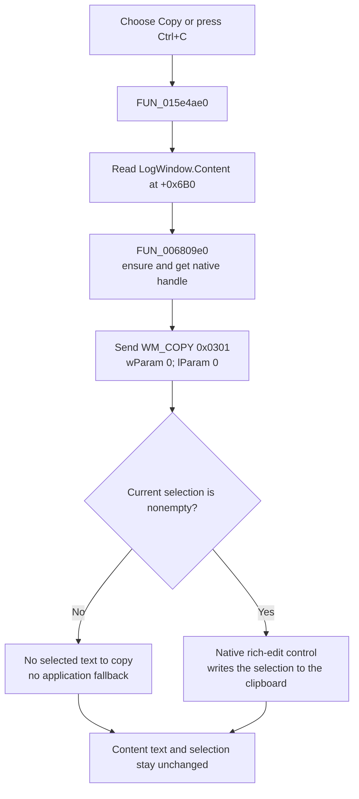

# Copy selected LogWindow text

> Analysis status: Complete. The recovered handler, VCL edit helper, native message, and LogWindow resource establish the behavior.

## Control

| Property | Recovered value |
| --- | --- |
| Form | LogWindow |
| Form caption | Log Window |
| Component path | LogWindow.PopupMenu.mnCopy |
| Parent menu | PopupMenu |
| Control class | TMenuItem |
| Caption | Copy |
| Shortcut | Ctrl+C (`16451`) |
| Hint | Not present in the recovered resource. |
| Handler name | mnCopyClick |
| Handler address | 015e4ae0 |
| Target control | LogWindow.Content (`TRichEdit`, form field `+0x6B0`) |
| Graph node | `resource:dfm:LogWindow/LogWindow.PopupMenu.mnCopy` |
| Handler node | `function:015e4ae0` |
| Graph layer | UI |

## What happens when clicked

The command asks `LogWindow.Content` to copy its current selection to the Windows clipboard. It does not select text first. It copies the complete log only when the complete content is already selected.

`FUN_015e4ae0` reads the object at form field `+0x6B0` and passes it to `FUN_006809e0`. The resource identifies `Content` as the client-aligned `TRichEdit` and the form's only text control. The neighboring `ContentMouseDown` handler uses the next form field, `+0x6B8`, for the recovered `PopupMenu`. This component order supports the `+0x6B0` mapping to `Content`.

`FUN_006809e0` uses `FUN_0065b870` to ensure and get the native edit-control handle. It then sends `WM_COPY` (`0x0301`) with both message parameters set to zero. The native rich-edit control handles the clipboard write.

## Selection and state effects

- A nonempty current selection is sent to the clipboard. The handler does not expand or replace the selection.
- An empty selection gives the native control no selected text to copy. There is no application-side fallback that copies the current line or complete log.
- The command does not delete or replace text. It does not change the selection, caret, form fields, or a saved file.
- A repeated click sends `WM_COPY` again for the selection that exists at that time. There is no unchanged-state check.
- The helper and handler do not inspect a result. They do not show a success or error message, retry, or restore earlier clipboard data.
- The handler has no local exception block. A handle-creation or message-dispatch exception has no recovery in this click path.

The recovered application code does not choose a clipboard format. Because `Content` is a `TRichEdit`, the native control can publish formats that match its text and formatting support. The recovered source does not prove the exact set of formats for this runtime.

## Click flow

## Handler and call-path evidence

- [mnCopyClick source](../../../DecompiledSources/Tina16/functions/00000000015E4AE0__FUN_015e4ae0.c) passes form field `+0x6B0` to one helper.
- [VCL copy helper](../../../DecompiledSources/Tina16/functions/00000000006809E0__FUN_006809e0.c) gets the control handle and dispatches message `0x0301` with zero parameters.
- [Native-handle getter](../../../DecompiledSources/Tina16/functions/000000000065B870__FUN_0065b870.c) ensures the handle and returns the native handle field at `+0x468`.
- [ContentMouseDown source](../../../DecompiledSources/Tina16/functions/00000000015E4A70__FUN_015e4a70.c) uses the adjacent form field `+0x6B8` for the popup-menu path.
- [Recovered UI evidence](../../../DecompiledSources/Tina16/resources/dfm/ui-evidence.json) identifies the form, the client-aligned `Content` rich edit, the popup menu, the Ctrl+C shortcut, and the event binding.
- The read-only graph has a `triggers` edge from this menu item to `FUN_015e4ae0`, a call from the handler to `FUN_006809e0`, and a call from that helper to `FUN_0065b870`.
- Complexity: simple; one distinct outgoing call.

## Direct calls

- `function:006809e0` - recovered `TCustomEdit.CopyToClipboard`; sends `WM_COPY` to the current native edit control.

## Relationship to Select All

The separate [Select All command](mnselectall-dbf52ab772.md) sends `EM_SETSEL(0, -1)` to the same `Content` control. It changes the selection but does not copy it. A user can select all and then run Copy to copy the complete log. Copy alone uses only the selection that already exists.

## Resource evidence

- `mnCopy` is a `TMenuItem` under `PopupMenu`, with caption `Copy` and shortcut Ctrl+C.
- Its `OnClick` event resolves to `mnCopyClick` at `015e4ae0`.
- `Content` is a `TRichEdit` aligned to the full client area of the Log Window.
- The menu item has no recovered hint, action, image reference, or glyph.

## Analysis limits

- The application delegates the final clipboard write to the native rich-edit control. The source does not read the clipboard back or prove the exact published formats.
- The handler does not read the current selection. Empty-selection and clipboard-failure results remain native-control behavior, and this handler cannot distinguish them.
