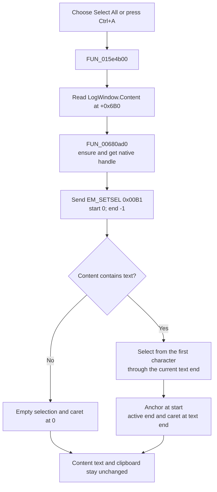

# Select all LogWindow text

> Analysis status: Complete. The recovered handler, VCL edit helper, native message, and LogWindow resource establish the behavior.

## Control

| Property | Recovered value |
| --- | --- |
| Form | LogWindow |
| Form caption | Log Window |
| Component path | LogWindow.PopupMenu.mnSelectAll |
| Parent menu | PopupMenu |
| Control class | TMenuItem |
| Caption | Select All |
| Shortcut | Ctrl+A (`16449`) |
| Hint | Not present in the recovered resource. |
| Handler name | mnSelectAllClick |
| Handler address | 015e4b00 |
| Target control | LogWindow.Content (`TRichEdit`, form field `+0x6B0`) |
| Graph node | `resource:dfm:LogWindow/LogWindow.PopupMenu.mnSelectAll` |
| Handler node | `function:015e4b00` |
| Graph layer | UI |

## What happens when clicked

The command replaces the current selection in `LogWindow.Content` with a selection that spans all current log text.

`FUN_015e4b00` reads the object at form field `+0x6B0` and passes it to `FUN_00680ad0`. The resource identifies `Content` as the client-aligned `TRichEdit` and the form's only text control. The neighboring `ContentMouseDown` handler uses the next form field, `+0x6B8`, for the recovered `PopupMenu`. This component order supports the `+0x6B0` mapping to `Content`.

`FUN_00680ad0` uses `FUN_0065b870` to ensure and get the native edit-control handle. It then sends `EM_SETSEL` (`0x00B1`) with start `0` and end `-1`. This range selects the complete native edit text. The selection anchor is at the start. The active end and caret are at the text end.

## Selection and state effects

| Content state | Result |
| --- | --- |
| Empty | The resulting selection is empty and collapsed at position `0`. |
| Nonempty | The selection spans from the first character through the current text end. |
| Already fully selected | The same native message runs again. The final selection remains the complete text. |

- The command replaces any earlier partial selection. It does not extend that selection.
- It changes only native selection and caret state. It does not change the log text or write to the clipboard.
- It does not set focus or send a scroll-to-caret message. The source does not prove a viewport change or visible selection highlight after the popup closes.
- The helper and handler do not inspect a result. They do not show a success or error message, retry, or use a fallback range.
- The handler has no local exception block. A handle-creation or message-dispatch exception has no recovery in this click path.

## Click flow

## Handler and call-path evidence

- [mnSelectAllClick source](../../../DecompiledSources/Tina16/functions/00000000015E4B00__FUN_015e4b00.c) passes form field `+0x6B0` to one helper.
- [VCL select-all helper](../../../DecompiledSources/Tina16/functions/0000000000680AD0__FUN_00680ad0.c) gets the control handle and dispatches message `0x00B1` with start `0` and end `-1`.
- [Native-handle getter](../../../DecompiledSources/Tina16/functions/000000000065B870__FUN_0065b870.c) ensures the handle and returns the native handle field at `+0x468`.
- [ContentMouseDown source](../../../DecompiledSources/Tina16/functions/00000000015E4A70__FUN_015e4a70.c) uses the adjacent form field `+0x6B8` for the popup-menu path.
- [Recovered UI evidence](../../../DecompiledSources/Tina16/resources/dfm/ui-evidence.json) identifies the form, the client-aligned `Content` rich edit, the popup menu, the Ctrl+A shortcut, and the event binding.
- The read-only graph has a `triggers` edge from this menu item to `FUN_015e4b00`, a call from the handler to `FUN_00680ad0`, and a call from that helper to `FUN_0065b870`.
- Complexity: simple; one distinct outgoing call.

## Direct calls

- `function:00680ad0` - recovered `TCustomEdit.SelectAll`; sends `EM_SETSEL(0, -1)` to the current native edit control.

## Relationship to Copy

The separate [Copy command](mncopy-d04506fff3.md) sends `WM_COPY` to the same `Content` control. Select All does not call that helper and does not access the clipboard. It only prepares the complete selection. A later Copy operation uses the selection that exists when Copy runs.

## Resource evidence

- `mnSelectAll` is a `TMenuItem` under `PopupMenu`, with caption `Select All` and shortcut Ctrl+A.
- Its `OnClick` event resolves to `mnSelectAllClick` at `015e4b00`.
- `Content` is a `TRichEdit` aligned to the full client area of the Log Window.
- The menu item has no recovered hint, action, image reference, or glyph.

## Analysis limits

- The source proves the native selection bounds. It does not read the selection back, so it does not prove a text-length value for a specific log instance.
- The handler makes no explicit focus or scroll call. Selection visibility and final viewport position remain native-control behavior.
