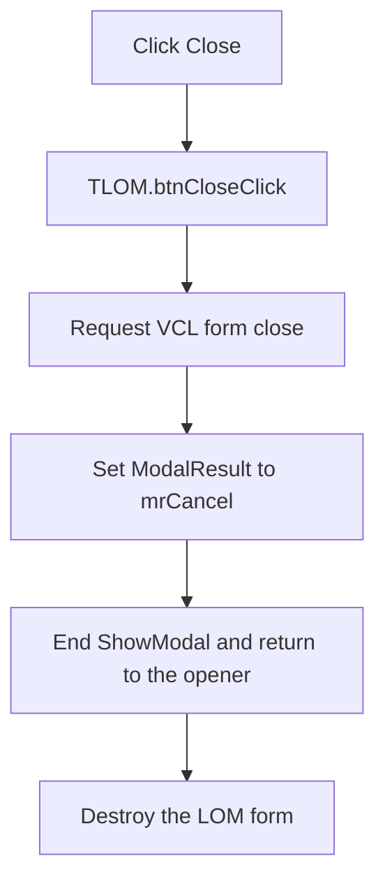

# Close the Bill of Materials dialog

> Analysis status: Complete from the recovered handler, modal caller, and shared VCL close path.

## Control

| Property | Recovered value |
| --- | --- |
| Form | LOM |
| Form caption | Bill of Materials |
| Component path | LOM.GroupBox1.btnClose |
| Control class | TButton |
| Caption | Close |
| Handler name | btnCloseClick |
| Handler address | 01983570 |
| Graph node | `resource:dfm:LOM/LOM.GroupBox1.btnClose` |
| Handler node | `function:01983570` |
| Graph layer | UI |

## What happens when clicked

`FUN_01983570` performs one operation. It calls the shared VCL form-close
routine `FUN_00805200` for the LOM form.

The recovered opener `FUN_01c93d20` creates the LOM form, calls the same Create
handler that builds the initial report, shows LOM with the virtual `ShowModal`
method, and destroys the form after the modal call returns. This proves the
presentation mode for the recovered Bill of Materials command.

On the modal branch, the VCL close routine writes modal result `2`, the Delphi
`mrCancel` value. This ends the modal session and returns control to the opener,
which destroys the LOM instance. The handler does not rebuild the report, save
the report, start printing, or ask for confirmation.

## State, no-op, and error behavior

- The input is the LOM form instance. The handler does not use `Sender` or read
  a report setting.
- The click ends the recovered modal session through `mrCancel`. It does not
  change the active circuit or its components.
- The common VCL routine also has a modeless close-query and close-action path.
  The recovered LOM opener does not use that path.
- The handler has no local error message, retry, or exception-recovery branch.

## Click flow

## Handler and call evidence

- [Close handler `FUN_01983570`](../../../DecompiledSources/Tina16/functions/0000000001983570__FUN_01983570.c)
  calls only the common VCL close routine.
- [Common close path `FUN_00805200`](../../../DecompiledSources/Tina16/functions/0000000000805200__FUN_00805200.c)
  writes `mrCancel` on its modal branch. Its modeless branch runs the virtual
  close query and applies the selected close action.
- [Bill of Materials opener `FUN_01c93d20`](../../../DecompiledSources/Tina16/functions/0000000001C93D20__FUN_01c93d20.c)
  constructs LOM, creates its initial report, calls `ShowModal`, and destroys
  the form after return.
- Recovered role: Ends the modal Bill of Materials session.
- Complexity: simple.
- Distinct outgoing calls: 1.

## Resource evidence

- LOM is a `TLOM` form with caption `Bill of Materials`.
- `btnClose` is a `TButton` in the `Settings` group. It has caption `Close`.
- The control has no recovered hint, text, action, image reference, embedded
  glyph, or same-parent label candidate.

## Analysis limits

- The shared VCL close routine supports other actions for modeless forms. This
  article does not assign those actions to the recovered modal LOM workflow.
- The application-wide exception handler is outside this click path.
