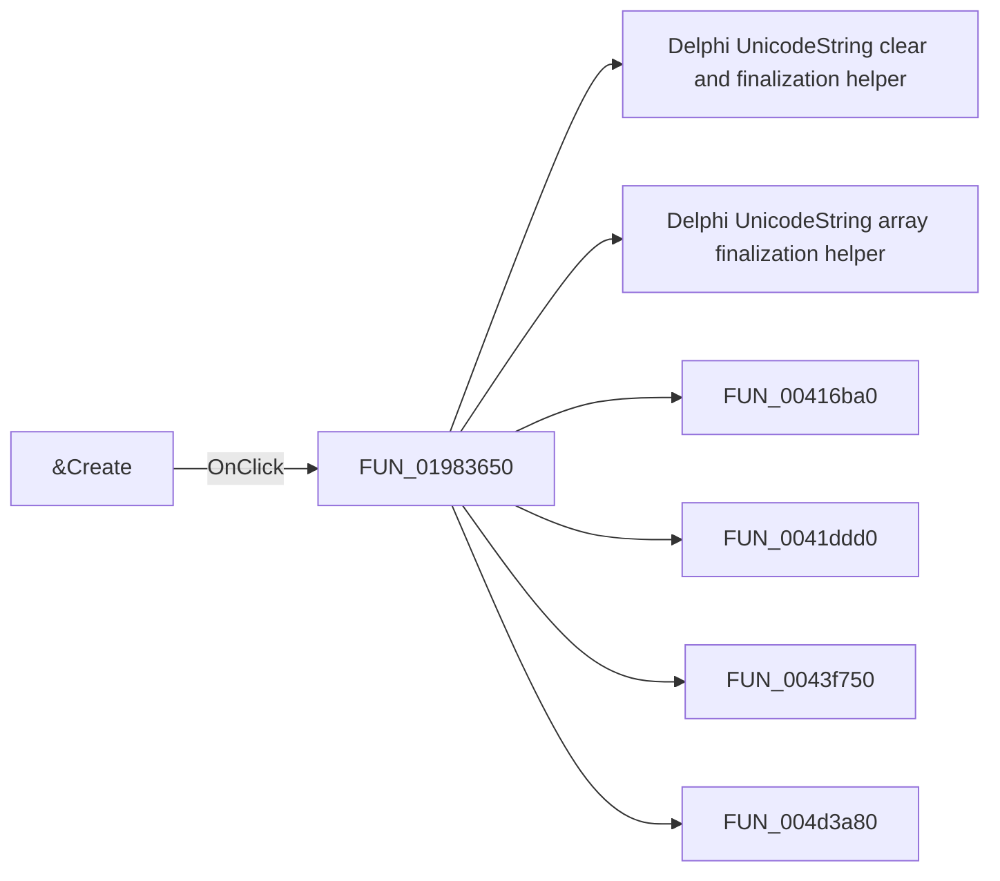

# &Create

> Analysis status: Pending individual source review.

## Control

| Property | Recovered value |
| --- | --- |
| Form | LOM |
| Component path | LOM.GroupBox1.btnCreate |
| Control class | TButton |
| Caption | &Create |
| Hint | Not present in the recovered resource. |
| Text | Not present in the recovered resource. |
| Handler name | btnCreateClick |
| Handler address | 01983650 |
| Graph node | `resource:dfm:LOM/LOM.GroupBox1.btnCreate` |
| Handler node | `function:01983650` |
| Graph layer | UI |

## What happens when clicked

Pending individual analysis. An agent must read the recovered handler source and its relevant callees before it replaces this text.

## Click flow

## Handler evidence

- Source: [DecompiledSources/Tina16/functions/0000000001983650__FUN_01983650.c](../../../DecompiledSources/Tina16/functions/0000000001983650__FUN_01983650.c)
- Recovered role: Not present in the recovered resource.
- Current graph summary: Handles 1 Delphi UI event: LOM.GroupBox1.btnCreate.OnClick.
- Current graph behavior: Not present in the recovered resource.
- Current graph evidence: Not present in the recovered resource.
- Complexity: complex
- Distinct outgoing calls: 15

## Direct calls

- `function:00414480` — Delphi UnicodeString clear and finalization helper
- `function:00414560` — Delphi UnicodeString array finalization helper
- `function:00416ba0` — FUN_00416ba0
- `function:0041ddd0` — FUN_0041ddd0
- `function:0043f750` — FUN_0043f750
- `function:004d3a80` — FUN_004d3a80
- `function:008483e0` — FUN_008483e0
- `function:00848a70` — FUN_00848a70
- `function:0084e3e0` — FUN_0084e3e0
- `function:00b89270` — FUN_00b89270
- `function:00b8e520` — FUN_00b8e520
- `function:00b8e650` — FUN_00b8e650
- `function:01983580` — FUN_01983580
- `function:019a63f0` — FUN_019a63f0
- `function:01d43710` — FUN_01d43710

## Resource evidence

- Kind: Not present in the recovered resource.
- Modal result: Not present in the recovered resource.
- Checked state: Not present in the recovered resource.
- List items: Not present in the recovered resource.
- Image reference: Not present in the recovered resource.
- Extracted glyph: None.

## Nearby label candidates

Nearby labels are layout candidates only. They are not proof of behavior.

- No same-parent label candidate is available.

## Analysis limits

- Do not infer behavior from the control class, caption, hint, glyph, or nearby label alone.
- Do not replace the pending status until the handler source and relevant call path provide enough evidence.
