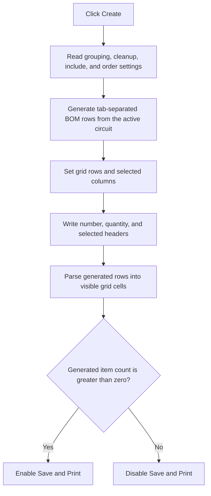

# Create the Bill of Materials report

> Analysis status: Complete from the recovered handler, report generator, grid helpers, LOM resources, and modal opener.

## Control

| Property | Recovered value |
| --- | --- |
| Form | LOM |
| Form caption | Bill of Materials |
| Component path | LOM.GroupBox1.btnCreate |
| Control class | TButton |
| Caption | &Create |
| Default button | true |
| Handler name | btnCreateClick |
| Handler address | 01983650 |
| Graph node | `resource:dfm:LOM/LOM.GroupBox1.btnCreate` |
| Handler node | `function:01983650` |
| Graph layer | UI |

## What happens when clicked

`FUN_01983650` rebuilds the Bill of Materials data from the active circuit and
the current settings. The recovered opener also calls this handler once before
it shows the modal LOM form. The report therefore has initial content when the
dialog opens. The user can change the settings and select **Create** to rebuild
it.

The handler reads these inputs:

- **Single component per line**;
- **Eliminate extra commas**;
- the seven **Include in Report** check boxes for Label, Value, Footprint, and
  Parameter 1 through Parameter 4;
- the selected **Group and Order By** item.

It passes those values, the active circuit object, and the form-owned report
string list to `FUN_019a63f0`. That helper scans eligible recovered component
records and builds tab-separated report rows. In single-component mode it emits
one row per accepted component and prefixes the row with quantity `1`. In the
grouped mode it combines matching rows and prefixes each group with its count.
The helper uses the order selection when it prepares and sorts the rows. When
**Eliminate extra commas** is selected, a selected field that contains only
spaces and commas becomes empty. The generator does not remove other text.

## Grid rebuild and button state

After report generation, the handler rebuilds `sgReport`:

1. It sets the row count to the generated-item count plus one for the header.
   It keeps at least two rows.
2. It sets the column count to two base columns plus one column for each
   selected Include check box.
3. It writes `#` and `Quantity` as the base headers. It then writes the selected
   Label, Value, Footprint, and Parameter headers in resource order.
4. For each generated item, it writes a one-based row number. It then removes
   tab-separated fields from the stored row and writes them to the visible
   columns.
5. It enables Save and Print only when the generated list contains at least one
   item. An empty result disables both buttons.

`FUN_01983580` implements one parse step. It returns the text before the first
tab and removes that field, including the tab, from the source string. If no
tab exists, it returns the remaining string and consumes it.

## Recovered Parameter 4 limitation

The header and column-count code reads all seven Include check boxes. The row
population loop is different. It finds components named `CheckBox1` through
`CheckBox6` and stops before `CheckBox7`. Therefore, the handler creates the
Parameter 4 header and column when Parameter 4 is selected, but this loop does
not write the Parameter 4 value to the grid row. The recovered source has no
later write that fills that cell.

The internal generated row can still contain the selected Parameter 4 field.
The Save handler writes that internal row instead of rebuilding its data from
the visible grid. This article does not infer whether a prior grid allocation
can leave a stale value in the unfilled visible cell.

## State, no-op, and error behavior

- The command replaces the form-owned generated list and the visible grid
  contents. It does not change circuit components.
- All report settings are read on each invocation. There is no unchanged-input
  shortcut.
- An empty generator result still leaves a header grid with at least two rows.
  Save and Print remain disabled.
- The handler has no progress UI, cancellation check, local error message,
  retry, or exception-recovery branch. A generator or grid exception
  propagates.

## Click flow

## Handler and call evidence

- [Create handler `FUN_01983650`](../../../DecompiledSources/Tina16/functions/0000000001983650__FUN_01983650.c)
  reads each setting, calls the report generator, rebuilds the grid, and updates
  Save and Print.
- [BOM generator `FUN_019a63f0`](../../../DecompiledSources/Tina16/functions/00000000019A63F0__FUN_019a63f0.c)
  collects, groups, orders, and publishes generated report rows.
- [Component collector `FUN_019a5b40`](../../../DecompiledSources/Tina16/functions/00000000019A5B40__FUN_019a5b40.c)
  scans eligible circuit objects and composes the source fields.
- [Field cleanup `FUN_019a61b0`](../../../DecompiledSources/Tina16/functions/00000000019A61B0__FUN_019a61b0.c)
  identifies fields that contain only spaces and commas.
- [Tab-field extractor `FUN_01983580`](../../../DecompiledSources/Tina16/functions/0000000001983580__FUN_01983580.c)
  returns and removes the first tab-separated field.
- [Grid column setter `FUN_008483e0`](../../../DecompiledSources/Tina16/functions/00000000008483E0__FUN_008483e0.c),
  [row setter `FUN_00848a70`](../../../DecompiledSources/Tina16/functions/0000000000848A70__FUN_00848a70.c), and
  [cell setter `FUN_0084e3e0`](../../../DecompiledSources/Tina16/functions/000000000084E3E0__FUN_0084e3e0.c)
  implement the grid update.
- [Modal opener `FUN_01c93d20`](../../../DecompiledSources/Tina16/functions/0000000001C93D20__FUN_01c93d20.c)
  calls this handler before `ShowModal`.
- Complexity: complex.
- Distinct direct outgoing calls recorded in the graph: 15. Calls through
  check-box, combo-box, button, grid, and string-list virtual methods are not
  separate direct graph edges.

## Resource evidence

- `btnCreate` is the default button in the `Settings` group.
- `chkSingle` and `chkKillCommas` start checked.
- All seven Include check boxes start checked.
- `cbxOrderBy` offers Label, Value, and Parameter 1 through Parameter 4.
- `sgReport` fills the remaining client area.
- Save and Print start disabled and have no glyphs.

## Analysis limits

- The recovered generator has deeper eligibility checks for circuit objects.
  This article does not assign business names to each opaque object flag.
- The localized runtime supplies some header text. The semantic grid mapping
  and the FastReport dataset fields establish Quantity, Label, Value,
  Footprint, and Parameter 1 through Parameter 4.
- The source proves the missing `CheckBox7` row-population step. It does not
  prove how every prior grid allocation initializes or retains that cell.
