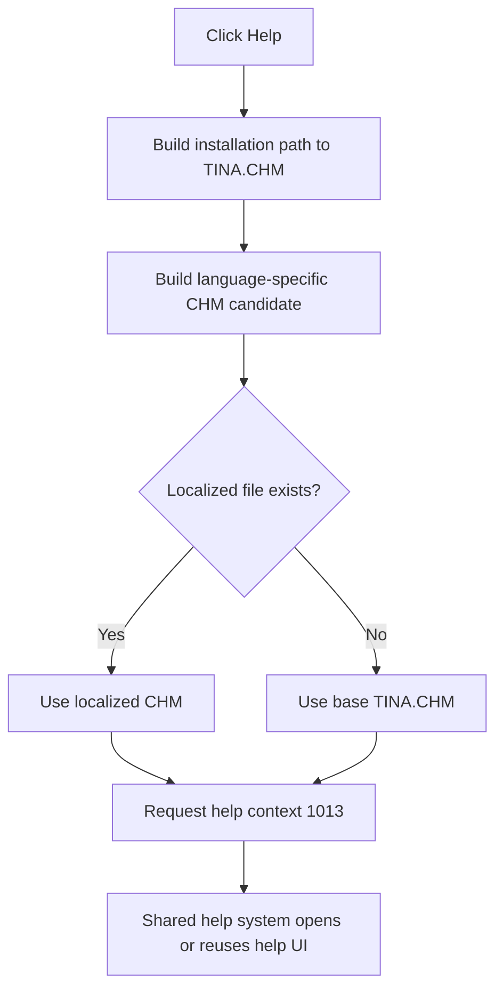

# Open Bill of Materials help

> Analysis status: Complete from the recovered handler, form help-context setup, localized CHM resolver, and shared help dispatcher.

## Control

| Property | Recovered value |
| --- | --- |
| Form | LOM |
| Form caption | Bill of Materials |
| Component path | LOM.GroupBox1.btnHelp |
| Control class | TButton |
| Caption | Help |
| Handler name | btnHelpClick |
| Handler address | 01984930 |
| Help file | TINA.CHM, with an existing language-specific variant preferred |
| Help context | 1013 (`0x3F5`) |
| Graph node | `resource:dfm:LOM/LOM.GroupBox1.btnHelp` |
| Handler node | `function:01984930` |
| Graph layer | UI |

## What happens when clicked

`FUN_01984930` requests the Bill of Materials topic from TINA's local compiled
HTML Help collection.

The handler performs these operations:

1. It concatenates the global TINA installation folder, a path separator, and
   `TINA.CHM`.
2. It passes the path to `FUN_01b1def0`.
3. The resolver builds a candidate with the current language marker. It uses
   that file when it exists. Otherwise, it returns the original `TINA.CHM`
   path without an error.
4. The handler calls the global help interface with fixed context `1013` and
   the resolved CHM path.

The LOM creation handler also assigns help context `1013` to the form. This
confirms that the fixed request is the form-level Bill of Materials context.
The Help handler does not inspect the focused control or report selection.

The shared dispatcher can use Windows HTML Help or TINA's internal CHM viewer.
The handler does not open a web URL and does not store a help-window result.

## State, fallback, and error behavior

- A missing localized CHM is an expected fallback. The resolver uses the base
  `TINA.CHM` path.
- Each click issues the same context request. There is no report-state guard.
- The handler does not change the report, settings, active circuit, dialog
  result, or form visibility.
- The handler does not test the help result. It has no local message, retry, or
  exception handler. Shared help-system failures propagate or remain ignored,
  according to the selected dispatcher path.

## Click flow

## Handler and call evidence

- [Help handler `FUN_01984930`](../../../DecompiledSources/Tina16/functions/0000000001984930__FUN_01984930.c)
  builds the CHM path and sends context `0x3F5` through the global help
  interface.
- [Localized help resolver `FUN_01b1def0`](../../../DecompiledSources/Tina16/functions/0000000001B1DEF0__FUN_01b1def0.c)
  selects an existing language-specific file or returns the base path.
- [Shared help dispatcher `FUN_01d46890`](../../../DecompiledSources/Tina16/functions/0000000001D46890__FUN_01d46890.c)
  selects Windows HTML Help or the internal viewer.
- [LOM creation handler `FUN_01983fe0`](../../../DecompiledSources/Tina16/functions/0000000001983FE0__FUN_01983fe0.c)
  assigns context `0x3F5` to the form.
- Recovered role: Opens the Bill of Materials help context.
- Complexity: complex.
- Distinct direct outgoing calls: 3. The global help dispatch is virtual and
  is not a direct graph edge from this handler.

## Resource evidence

- `btnHelp` is a `TButton` with caption `Help` in the `Settings` group.
- The control has no recovered hint, text, action, image reference, embedded
  glyph, or same-parent label candidate.

## Analysis limits

- The recovered binary does not expose the final topic file that context 1013
  selects inside the CHM.
- The installation folder, language marker, installed CHM files, and global
  help mode are runtime values.
- Shared help-system ownership is documented by its canonical annotation. This
  article owns only the LOM wrapper.
