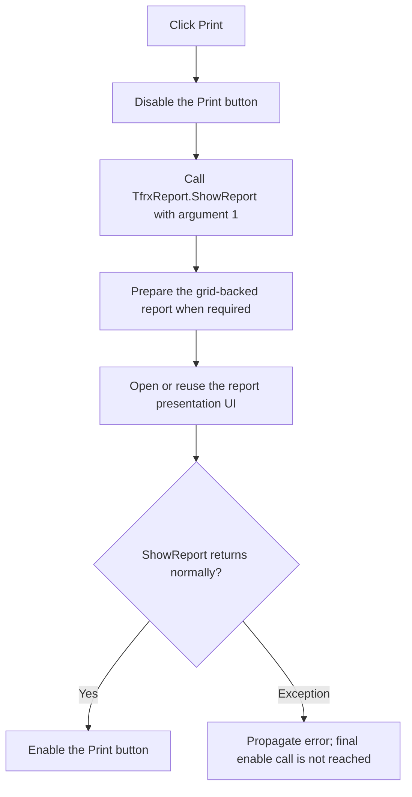

# Preview the Bill of Materials report

> Analysis status: Complete from the recovered handler, FastReport ShowReport path, QRListForm resource, and grid-backed dataset handlers.

## Control

| Property | Recovered value |
| --- | --- |
| Form | LOM |
| Form caption | Bill of Materials |
| Component path | LOM.GroupBox1.btnPrint |
| Control class | TButton |
| Caption | &Print... |
| Initial enabled state | false |
| Handler name | btnPrintClick |
| Handler address | 019848e0 |
| Graph node | `resource:dfm:LOM/LOM.GroupBox1.btnPrint` |
| Handler node | `function:019848e0` |
| Graph layer | UI |

## What happens when clicked

`FUN_019848e0` disables the Print button, calls the shared FastReport
`ShowReport` path with argument `1`, and enables the button again after a normal
return. The Create handler enables Print only when the generated Bill of
Materials list contains at least one item.

LOM creates one `TQRListForm` during form setup. `FUN_01982a50` connects
`LOM.sgReport` to that form. The recovered QRListForm resource contains a
`TfrxReport`, report page, report title, master-data band, page footer, and a
`TfrxUserDataSet`.

The dataset starts at grid row 1 and stops at the grid row count. Its value
handler maps report fields to these grid columns:

- row index;
- Quantity;
- Label;
- Value;
- Footprint;
- Parameter 1 through Parameter 4.

The click therefore opens the FastReport presentation path for the current
grid-backed report. It does not call the distinct FastReport `Print` method
directly. The report UI can provide later preview or print actions, but those
actions are outside this button handler.

## State, no-op, and error behavior

- The handler does not rebuild report data. It uses the current `sgReport`
  contents.
- The handler prevents another normal Print click while `ShowReport` is
  running by disabling the button.
- After a normal return, the handler enables Print without another item-count
  check.
- The handler has no local exception handler or `finally`-style re-enable path
  in the recovered source. If report preparation or presentation raises, the
  final enable call is not reached in this handler.
- The handler does not save a file, change the circuit, close LOM, or store a
  printer choice.

## Click flow

## Handler and call evidence

- [Print handler `FUN_019848e0`](../../../DecompiledSources/Tina16/functions/00000000019848E0__FUN_019848e0.c)
  brackets `FUN_01976a20` with button enabled-state writes.
- [FastReport ShowReport path `FUN_01976a20`](../../../DecompiledSources/Tina16/functions/0000000001976A20__FUN_01976a20.c)
  prepares and presents a report. The recovered script dispatcher maps
  `SHOWREPORT` to this function, `PREPAREREPORT` to `FUN_01976270`, and `PRINT`
  to a separate function.
- [Script dispatcher `FUN_018f74a0`](../../../DecompiledSources/Tina16/functions/00000000018F74A0__FUN_018f74a0.c)
  provides the method-name mapping.
- [QRListForm connector `FUN_01982a50`](../../../DecompiledSources/Tina16/functions/0000000001982A50__FUN_01982a50.c)
  stores the LOM string grid as the report data source.
- [Dataset value handler `FUN_01982360`](../../../DecompiledSources/Tina16/functions/0000000001982360__FUN_01982360.c)
  maps field names to grid columns.
- [Dataset first, next, and end handlers](../../../DecompiledSources/Tina16/functions/0000000001982350__FUN_01982350.c)
  use row 1 as the first data row, advance one row at a time, and stop at the
  grid row count. The corresponding sources are `FUN_01982350`,
  `FUN_01982950`, and `FUN_01982330`.
- Complexity: simple for the button wrapper.
- Distinct direct outgoing calls: 1. Enabled-state writes and the report object
  access are virtual or indirect.

## Resource evidence

- Print starts disabled. The Create handler controls its enabled state.
- `QRListForm` has caption `qrLOMPrintout` and owns `frxReport` of class
  `TfrxReport`.
- The report contains visible field resources for Index, Quantity, Label,
  Value, Footprint, Parameter 1 through Parameter 4, and their headers.
- `btnPrint` has no recovered hint, action, image reference, embedded glyph, or
  same-parent label candidate.

## Analysis limits

- The recovered source proves report presentation, not an immediate operating
  system print request.
- Printer selection, page setup, export, and final print actions belong to the
  FastReport UI and are outside this click path.
- The Create article documents the separate recovered Parameter 4 grid
  population limitation.
