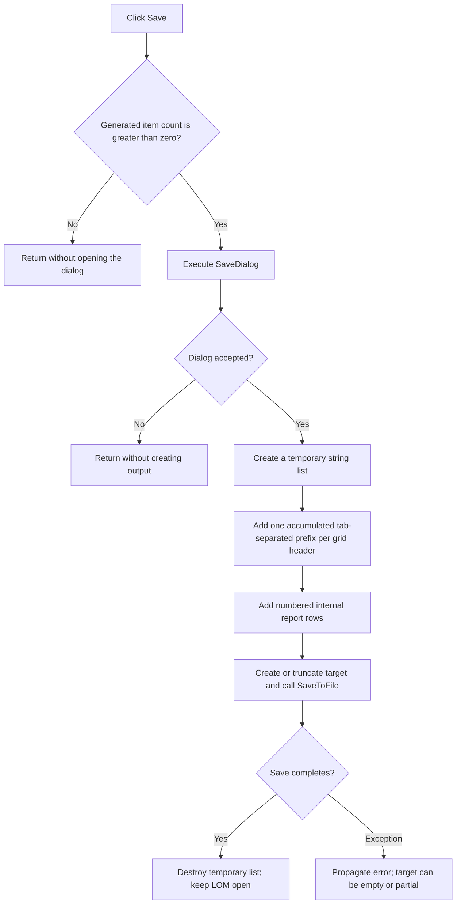

# Save the Bill of Materials as text

> Analysis status: Complete from the recovered handler, generated-row format, grid access, SaveDialog gate, and VCL string-list save path.

## Control

| Property | Recovered value |
| --- | --- |
| Form | LOM |
| Form caption | Bill of Materials |
| Component path | LOM.GroupBox1.btnSave |
| Control class | TButton |
| Caption | &Save... |
| Initial enabled state | false |
| Handler name | btnSaveClick |
| Handler address | 01984650 |
| Graph node | `resource:dfm:LOM/LOM.GroupBox1.btnSave` |
| Handler node | `function:01984650` |
| Graph layer | UI |

## What happens when clicked

`FUN_01984650` first checks the count of the form-owned generated report list.
If the count is zero, it returns without opening the save dialog. The Create
handler also keeps Save disabled for this state.

For a nonempty report, the handler executes the existing `TSaveDialog`. Cancel
returns without allocating the output list or writing a file. After acceptance,
the handler creates a temporary Delphi string list and prepares line-oriented
text.

The output has two parts:

1. For each visible grid column, the handler reads the header cell in row 0,
   appends that value and a tab to one accumulating string, and adds the current
   prefix as a line. The first line therefore contains the first header and a
   tab. Each next header line repeats the earlier prefix and adds one more
   header.
2. For each item in the generated report list, the handler creates a line from
   the one-based item number, a period, a tab, and the stored tab-separated
   report row. It adds that complete line to the output list.

The data lines use the internal generated rows. They do not reconstruct the
data from the visible grid. This distinction means that a field present in the
generated row can be saved even if the Create handler did not put that field
in a visible grid cell.

The handler reads the accepted `SaveDialog.FileName` and calls the temporary
list's one-argument `SaveToFile`. It destroys the temporary list after a normal
save.

## State, no-op, and error behavior

- Zero generated items is a proven no-op. The dialog does not open.
- SaveDialog cancellation is a second no-op. No output list or file is
  created.
- A normal save does not rebuild the report, modify circuit components, change
  the grid, clear the generated list, close LOM, or change the Save button.
- The recovered DFM and form setup do not provide a file filter, default
  extension, or default file name for this dialog.
- `SaveToFile` creates or truncates the accepted target. The handler does not
  select an encoding, use a temporary target, make a backup, or perform an
  atomic replacement.
- File creation, encoding, and write errors have no local message, retry, or
  rollback. An exception propagates. A failure after file creation can leave an
  empty or partial file.

## Click flow

## Handler and call evidence

- [Save handler `FUN_01984650`](../../../DecompiledSources/Tina16/functions/0000000001984650__FUN_01984650.c)
  implements the item-count guard, dialog gate, line construction, file-name
  read, virtual save call, and normal cleanup.
- [Grid cell getter `FUN_0084e320`](../../../DecompiledSources/Tina16/functions/000000000084E320__FUN_0084e320.c)
  reads each header cell.
- [Dialog file-name getter `FUN_00724270`](../../../DecompiledSources/Tina16/functions/0000000000724270__FUN_00724270.c)
  returns the selected file name after acceptance.
- [VCL one-argument SaveToFile `FUN_004b4900`](../../../DecompiledSources/Tina16/functions/00000000004B4900__FUN_004b4900.c),
  [file writer `FUN_004b4920`](../../../DecompiledSources/Tina16/functions/00000000004B4920__FUN_004b4920.c), and
  [text serializer `FUN_004b49c0`](../../../DecompiledSources/Tina16/functions/00000000004B49C0__FUN_004b49c0.c)
  provide the common create, truncate, encoding, and write path.
- Complexity: complex.
- Distinct direct outgoing calls recorded in the graph: 8. String-list Add,
  SaveDialog Execute, and SaveToFile are virtual and are not separate direct
  graph edges.

## Resource evidence

- Save starts disabled. The Create handler enables it only for a nonempty
  generated report.
- `SaveDialog` is a `TSaveDialog`. Its recovered DFM contains only layout
  coordinates.
- `btnSave` has no recovered hint, action, image reference, embedded glyph, or
  same-parent label candidate.

## Analysis limits

- The output uses the string list's current encoding or runtime default. The
  recovered handler does not establish one fixed encoding for all systems.
- The DFM does not prove the effective common-dialog overwrite-prompt options.
  The application write path still creates or truncates after acceptance.
- The exact application-wide exception presentation is outside this handler.
