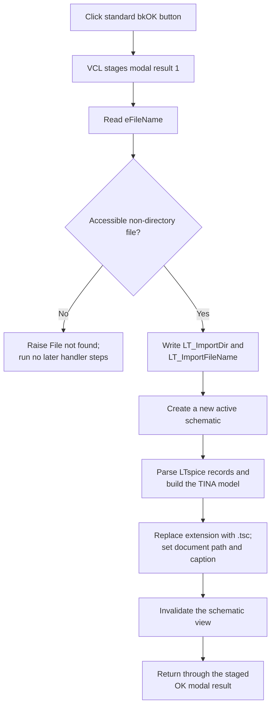

# bOK

> Analysis status: Source reviewed. The selected-path validation, settings writes, new-schematic boundary, LTspice conversion, document naming, refresh, and partial-failure limits are supported by recovered code.

## Control

| Property | Recovered value |
| --- | --- |
| Form | LTSpiceImportDlg |
| Component path | LTSpiceImportDlg.bOK |
| Control class | TBitBtn |
| Caption | Not present in the recovered resource. |
| Hint | Not present in the recovered resource. |
| Text | Not present in the recovered resource. |
| Handler name | bOKClick |
| Handler address | 01b90000 |
| Graph node | `resource:dfm:LTSpiceImportDlg/LTSpiceImportDlg.bOK` |
| Handler node | `function:01b90000` |
| Graph layer | UI |

## What happens when clicked

`FUN_01b90000` reads the current text from `eFileName` and checks it with the recovered file-test helper. The check accepts an accessible non-directory file and rejects a missing path or directory. If the check fails, the handler constructs and raises an exception with the text **File not found**. It has no local catch, retry, or alternate import path. None of the later settings, schematic, import, naming, or refresh operations run after that raise.

For a path that passes the check, the handler reads the edit again and persists two current-user string settings:

- `LT_ImportDir` receives the directory portion, including its final path separator when one exists.
- `LT_ImportFileName` receives the full edit text.

The registry writer silently does nothing when it cannot open the application's `SOFTWARE\\DesignSoft` branch. The handler does not test write success, so a settings failure does not stop the import.

## New schematic and LTspice conversion

After the settings writes, the handler invokes the same recovered coordinator as **Schematic Editor > New**. That call replaces the active schematic model and refreshes the editor's mode state before the LTspice parser starts.

The handler obtains the new active document, constructs the recovered LTspice importer with that document and the selected path, and runs `FUN_01b8c4a0`. The import path is not a file copy. Its recovered passes read LTspice text records such as `WIRE`, `SYMBOL`, `FLAG`, `TEXT`, and `SYMATTR`; create and connect model objects; process symbol attributes and probe information; and optionally read the sibling `.plt` plot file. The importer also uses the user's `LTspice\\lib` directory and a session-local library name while it resolves LTspice symbols.

Only after the importer returns does the handler replace the selected file's extension with `.tsc`. It passes that path to the current-document name and caption updater, assigns it to the active document field at `+0x360`, and invalidates the main schematic view. These calls stage the TINA document identity and display. They do not serialize or save a `.tsc` file to disk.

The handler does not show a success message or read the form's **Messages** memo. A normal return reaches the standard `bkOK` modal-button path. The recovered VCL button code writes modal result `1` before it dispatches this custom event; the custom handler does not change that modal result.

## Error and rollback boundaries

The handler has no transaction, undo group, exception handler, or restore operation. The order creates distinct partial-result boundaries:

- A missing or rejected path raises before settings or model changes.
- A settings-open failure can leave old preferences while import continues.
- An exception after the New coordinator can leave a new or partly converted active schematic even though the `.tsc` naming and final refresh did not run.
- An exception after one settings write does not restore the previous value.
- Parser, symbol-library, plot-file, allocation, model-construction, document-title, or refresh exceptions can propagate. The handler does not reopen the prior schematic or remove objects already inserted by the importer.

The recovered code does not prove that every valid LTspice construct is supported. It does prove the record types and conversion calls above. Unknown or unsupported input behavior remains inside the importer and is not converted into a handler-local warning.

## Click flow

## Handler evidence

- [OK handler `FUN_01b90000`](../../../DecompiledSources/Tina16/functions/0000000001B90000__FUN_01b90000.c) proves the validation, settings, New, importer, `.tsc` naming, active-document assignment, and refresh order.
- [File test `FUN_00440a20`](../../../DecompiledSources/Tina16/functions/0000000000440A20__FUN_00440a20.c) tests the edit text as a non-directory file and includes reparse-point and sharing-violation handling.
- [Exception constructor `FUN_0044d490`](../../../DecompiledSources/Tina16/functions/000000000044D490__FUN_0044d490.c) and [raise helper `FUN_004134c0`](../../../DecompiledSources/Tina16/functions/00000000004134C0__FUN_004134c0.c) implement the **File not found** failure path.
- [Directory extractor `FUN_00441710`](../../../DecompiledSources/Tina16/functions/0000000000441710__FUN_00441710.c) returns the portion through the last path separator.
- [Current-user string-setting writer `FUN_01b258f0`](../../../DecompiledSources/Tina16/functions/0000000001B258F0__FUN_01b258f0.c) writes the two `LT_Import...` values when the application registry branch opens.
- [New-schematic coordinator `FUN_01c75530`](../../../DecompiledSources/Tina16/functions/0000000001C75530__FUN_01c75530.c) calls the model-reset and editor-mode coordinators before import.
- [Active-document getter `FUN_019a4600`](../../../DecompiledSources/Tina16/functions/00000000019A4600__FUN_019a4600.c) returns the current document from the main editor when it exists.
- [LTspice importer constructor `FUN_01b81ef0`](../../../DecompiledSources/Tina16/functions/0000000001B81EF0__FUN_01b81ef0.c) initializes the import object, source path, LTspice library path, model collections, and session state.
- [LTspice import coordinator `FUN_01b8c4a0`](../../../DecompiledSources/Tina16/functions/0000000001B8C4A0__FUN_01b8c4a0.c) runs the conversion passes and optional `.plt` path.
- [LTspice record parser `FUN_01b89640`](../../../DecompiledSources/Tina16/functions/0000000001B89640__FUN_01b89640.c) reads `WIRE`, `SYMBOL`, `FLAG`, `TEXT`, and `SYMATTR` records and builds their recovered model data.
- [Extension replacement helper `FUN_004414c0`](../../../DecompiledSources/Tina16/functions/00000000004414C0__FUN_004414c0.c) removes the final extension and appends `.tsc`.
- [Current-document path and caption updater `FUN_014a1260`](../../../DecompiledSources/Tina16/functions/00000000014A1260__FUN_014a1260.c) updates the global path, main-window text, and current document entry.
- [View invalidation wrapper `FUN_01ca2aa0`](../../../DecompiledSources/Tina16/functions/0000000001CA2AA0__FUN_01ca2aa0.c) dispatches to the main schematic view's invalidation method.
- [VCL `TBitBtn.Click` `FUN_0082b0e0`](../../../DecompiledSources/Tina16/functions/000000000082B0E0__FUN_0082b0e0.c) and [modal-button click `FUN_00687f30`](../../../DecompiledSources/Tina16/functions/0000000000687F30__FUN_00687f30.c) prove that `bkOK` stages the form modal result before the custom event.
- Recovered role: Validate and import the selected LTspice schematic into a new TINA schematic.
- Current graph summary: Handles 1 Delphi UI event: LTSpiceImportDlg.bOK.OnClick.
- Current graph behavior: Validate and persist the selected path, create a new schematic, run LTspice conversion, assign a `.tsc` document path, and refresh the editor.
- Current graph evidence: The DFM binds `bOKClick` to `01b90000`; its source orders the file test, registry writes, New coordinator, importer construction and execution, `.tsc` path update, active-document assignment, and view invalidation.
- Complexity: complex
- Distinct outgoing calls: 16

## Direct calls

- `function:004134c0` — Raise the constructed **File not found** exception.
- `function:00414480` — Delphi UnicodeString clear and finalization helper
- `function:00414560` — Delphi UnicodeString array finalization helper
- `function:00414ad0` — Delphi UnicodeString assignment helper
- `function:00440a20` — Test for an accessible non-directory file.
- `function:004414c0` — Replace the selected extension with `.tsc`.
- `function:00441710` — Extract the source directory for settings.
- `function:0044d490` — Construct the **File not found** exception.
- `function:0064dd90` — VCL control Unicode text reader
- `function:014a1260` — Update the current document path and main caption.
- `function:019a4600` — Get the new active document.
- `function:01b258f0` — Write `LT_ImportDir` and `LT_ImportFileName`.
- `function:01b81ef0` — Construct and initialize the LTspice importer.
- `function:01b8c4a0` — Run the LTspice conversion passes.
- `function:01c75530` — Create a new active schematic before import.
- `function:01ca2aa0` — Invalidate the main schematic view.

## Resource evidence

- Kind: bkOK
- Modal result: Not present in the recovered resource.
- Checked state: Not present in the recovered resource.
- List items: Not present in the recovered resource.
- Image reference: Not present in the recovered resource.
- Extracted glyph: None.

## Nearby label candidates

Nearby labels are layout candidates only. They are not proof of behavior.

- No same-parent label candidate is available.

## Analysis limits

- The handler uses the live `eFileName` text. The file chooser is optional because the edit is writable.
- The handler stages a `.tsc` path but does not call a recovered document serializer or save routine.
- The importer has many format-specific callees. This article describes only responsibilities established by their call-site data flow and explicit LTspice record strings.
- The recovered source does not establish a complete compatibility list for LTspice syntax or symbol libraries.
- The exact product-specific suffix after the current-user `SOFTWARE\\DesignSoft` registry prefix is not named here.
- The standard `bkOK` click stages modal result `1` before the handler. The recovered handler does not reset it on an exception; application-level exception presentation is outside this control source.
