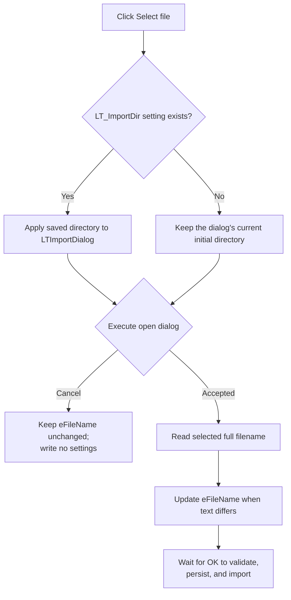

# Select file

> Analysis status: Source reviewed. The saved-directory restore, dialog result branch, accepted-path update, cancel behavior, and validation limits are supported by recovered code.

## Control

| Property | Recovered value |
| --- | --- |
| Form | LTSpiceImportDlg |
| Component path | LTSpiceImportDlg.Panel1.sbFileOpen |
| Control class | TSpeedButton |
| Caption | Not present in the recovered resource. |
| Hint | Select file |
| Text | Not present in the recovered resource. |
| Handler name | sbFileOpenClick |
| Handler address | 01b8fe70 |
| Graph node | `resource:dfm:LTSpiceImportDlg/LTSpiceImportDlg.Panel1.sbFileOpen` |
| Handler node | `function:01b8fe70` |
| Graph layer | UI |

## What happens when clicked

`FUN_01b8fe70` uses the form's shared `TOpenDialog` at field `+0x700`. Before it opens the dialog, it reads the current-user string setting named `LT_ImportDir`. If the value exists, it applies that directory to the dialog. If the setting or its registry branch is missing, the handler leaves the dialog's current initial directory in use.

The handler then executes the dialog and branches on its Boolean result:

- On acceptance, it reads the dialog's selected full filename and places it in the `eFileName` edit at form field `+0x6e8`. The VCL text setter sends the change path only when the selected text differs from the edit's current text.
- On Cancel, it does not read a filename and does not change `eFileName`.

The accepted branch does not write `LT_ImportDir` or `LT_ImportFileName`. Those settings are written later by the form's **OK** handler. Therefore, selecting a file and then cancelling the form leaves the edit changed only for that dialog instance and does not persist the newly selected path.

The button itself does not validate file existence, extension, contents, or read access. It relies on the dialog result. The recovered resource does not preserve a filter or default-extension property, so no extension restriction is established here. The folder glyph and **Select file** hint agree with the source-backed file-dialog behavior, but they are not the basis for it.

The handler has no local exception handler or rollback. An exception from the settings reader, dialog, filename getter, string allocation, or edit update can propagate. On the accepted branch, the only application-visible state change is the edit update, and it occurs after the dialog returns success.

## Click flow

## Handler evidence

- [Chooser handler `FUN_01b8fe70`](../../../DecompiledSources/Tina16/functions/0000000001B8FE70__FUN_01b8fe70.c) reads `LT_ImportDir`, conditionally initializes the dialog, executes it, and updates the edit only after acceptance.
- [Current-user string-setting reader `FUN_01b256f0`](../../../DecompiledSources/Tina16/functions/0000000001B256F0__FUN_01b256f0.c) reports whether the named value was found under the application's `SOFTWARE\\DesignSoft` registry branch.
- [Open-dialog initial-directory setter `FUN_00724420`](../../../DecompiledSources/Tina16/functions/0000000000724420__FUN_00724420.c) copies the recovered setting into the dialog property and removes one trailing path separator when applicable.
- [Open-dialog filename getter `FUN_00724270`](../../../DecompiledSources/Tina16/functions/0000000000724270__FUN_00724270.c) returns the selected full filename after the dialog succeeds.
- [VCL control text setter `FUN_0064de00`](../../../DecompiledSources/Tina16/functions/000000000064DE00__FUN_0064de00.c) compares the current and requested Unicode text before it sends the update path.
- [Form creation handler `FUN_01b8fda0`](../../../DecompiledSources/Tina16/functions/0000000001B8FDA0__FUN_01b8fda0.c) independently restores `LT_ImportFileName` into the same edit without validating it.
- Recovered role: Select an LTspice source file and copy its accepted full path into the import dialog.
- Current graph summary: Handles 1 Delphi UI event: LTSpiceImportDlg.Panel1.sbFileOpen.OnClick.
- Current graph behavior: Restore the saved import directory, execute the open dialog, and update `eFileName` only after acceptance.
- Current graph evidence: The DFM binds `sbFileOpenClick` to `01b8fe70`; the handler branches on the dialog result and calls the filename getter and edit setter only on the accepted branch.
- Complexity: complex
- Distinct outgoing calls: 6

## Direct calls

- `function:00414480` — Delphi UnicodeString clear and finalization helper
- `function:00414560` — Delphi UnicodeString array finalization helper
- `function:0064de00` — Update `eFileName` only when its text differs.
- `function:00724270` — Read the accepted full filename.
- `function:00724420` — Apply the saved initial directory.
- `function:01b256f0` — Read `LT_ImportDir` from current-user settings.

## Resource evidence

- Kind: Not present in the recovered resource.
- Modal result: Not present in the recovered resource.
- Checked state: Not present in the recovered resource.
- List items: Not present in the recovered resource.
- Image reference: Not present in the recovered resource.
- Extracted glyph: [`0254_LTSpiceImportDlg_LTSpiceImportDlg_Panel1_sbFileOpen_Glyph_Data.png`](../../../glyph/0254_LTSpiceImportDlg_LTSpiceImportDlg_Panel1_sbFileOpen_Glyph_Data.png)

## Nearby label candidates

Nearby labels are layout candidates only. They are not proof of behavior.

- Rank 1: File name:  at distance 494.
- Rank 2: Messages: at distance 525.

## Analysis limits

- The recovered DFM evidence does not include the open dialog's filter, options, or default extension.
- The standard dialog can perform its own operating-system checks, but the handler adds no explicit extension, content, or permission validation.
- The selected full path remains in `eFileName`; the handler does not reduce it to a file name.
- The current-user registry branch contains a product-specific suffix after `SOFTWARE\\DesignSoft`; this article does not invent that recovered global value.
- `TIARA-diz.6.7.715` owns the OK handler that validates, persists, imports, names the new document, and refreshes the view.
