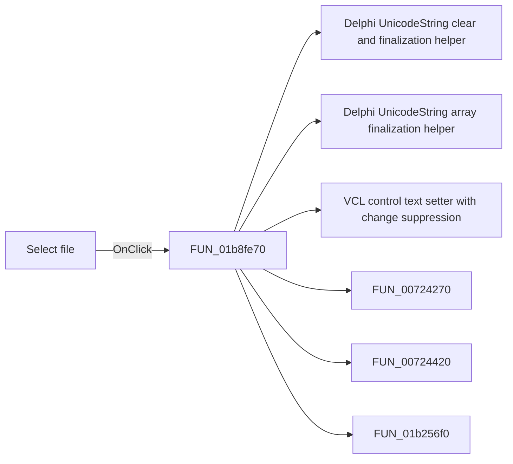

# Select file

> Analysis status: Pending individual source review.

## Control

| Property | Recovered value |
| --- | --- |
| Form | LTSpiceImportDlg |
| Component path | LTSpiceImportDlg.Panel1.sbFileOpen |
| Control class | TSpeedButton |
| Caption | Not present in the recovered resource. |
| Hint | Select file |
| Text | Not present in the recovered resource. |
| Handler name | sbFileOpenClick |
| Handler address | 01b8fe70 |
| Graph node | `resource:dfm:LTSpiceImportDlg/LTSpiceImportDlg.Panel1.sbFileOpen` |
| Handler node | `function:01b8fe70` |
| Graph layer | UI |

## What happens when clicked

Pending individual analysis. An agent must read the recovered handler source and its relevant callees before it replaces this text.

## Click flow

## Handler evidence

- Source: [DecompiledSources/Tina16/functions/0000000001B8FE70__FUN_01b8fe70.c](../../../DecompiledSources/Tina16/functions/0000000001B8FE70__FUN_01b8fe70.c)
- Recovered role: Not present in the recovered resource.
- Current graph summary: Handles 1 Delphi UI event: LTSpiceImportDlg.Panel1.sbFileOpen.OnClick.
- Current graph behavior: Not present in the recovered resource.
- Current graph evidence: Not present in the recovered resource.
- Complexity: complex
- Distinct outgoing calls: 6

## Direct calls

- `function:00414480` — Delphi UnicodeString clear and finalization helper
- `function:00414560` — Delphi UnicodeString array finalization helper
- `function:0064de00` — VCL control text setter with change suppression
- `function:00724270` — FUN_00724270
- `function:00724420` — FUN_00724420
- `function:01b256f0` — FUN_01b256f0

## Resource evidence

- Kind: Not present in the recovered resource.
- Modal result: Not present in the recovered resource.
- Checked state: Not present in the recovered resource.
- List items: Not present in the recovered resource.
- Image reference: Not present in the recovered resource.
- Extracted glyph: [`0254_LTSpiceImportDlg_LTSpiceImportDlg_Panel1_sbFileOpen_Glyph_Data.png`](../../../glyph/0254_LTSpiceImportDlg_LTSpiceImportDlg_Panel1_sbFileOpen_Glyph_Data.png)

## Nearby label candidates

Nearby labels are layout candidates only. They are not proof of behavior.

- Rank 1: File name:  at distance 494.
- Rank 2: Messages: at distance 525.

## Analysis limits

- Do not infer behavior from the control class, caption, hint, glyph, or nearby label alone.
- Do not replace the pending status until the handler source and relevant call path provide enough evidence.
