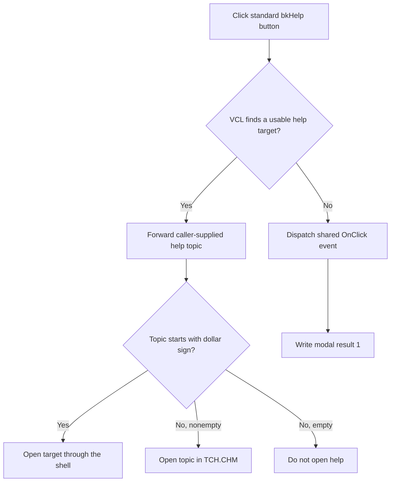

# btnHelp

> Analysis status: Source reviewed with an explicit VCL branch limit. The standard help path, form help-topic forwarding, and shared-event fallback are supported by recovered code.

## Control

| Property | Recovered value |
| --- | --- |
| Form | MacroPicker |
| Component path | MacroPicker.pnlControls.btnHelp |
| Control class | TBitBtn |
| Caption | Not present in the recovered resource. |
| Hint | Not present in the recovered resource. |
| Text | Not present in the recovered resource. |
| Handler name | btnOKClick |
| Handler address | 01702e40 |
| Graph node | `resource:dfm:MacroPicker/MacroPicker.pnlControls.btnHelp` |
| Handler node | `function:01702e40` |
| Graph layer | UI |

## What happens when clicked

`btnHelp` has `Kind = bkHelp`, so its recovered VCL click path is different from a normal modal button. VCL searches the button and its parents for a usable help context or help keyword. When it finds one, it calls the application help service and does not dispatch the inherited `OnClick` event.

MacroPicker also has a recovered `OnHelp` handler. Each modal caller stores a context-specific help string in form field `+0x768` before `ShowModal`. `FUN_01703d10` forwards that string to the application help opener and marks the help request as handled. A string that starts with `$` is opened through the shell. Another nonempty string is opened as a topic in `TCH.CHM`. An empty string causes the help opener to do nothing.

The DFM also binds this button's `OnClick` to `FUN_01702e40`, the same event as OK. That event writes modal result `1`. The recovered VCL `bkHelp` path calls the inherited click only when it cannot find a usable help target. Therefore:

- In the standard help branch, the button opens help and leaves the MacroPicker modal result unchanged.
- In the no-help-target fallback, VCL dispatches the shared event, which accepts the dialog with modal result `1`.

The extracted resource evidence does not preserve the runtime HelpType, HelpContext, or HelpKeyword values. The source proves both branches but does not prove from the extracted DFM alone which parent target VCL finds. The caller-supplied help string and form `OnHelp` binding establish the context-specific help operation without just relying on the button kind.

There is no local error message, retry, or rollback. Shell or CHM help-service failures are handled outside this control source.

## Click flow

## Handler evidence

- [Shared modal-result handler `FUN_01702e40`](../../../DecompiledSources/Tina16/functions/0000000001702E40__FUN_01702e40.c) writes value `1` if VCL reaches the DFM-bound fallback event.
- [VCL `TBitBtn.Click` `FUN_0082b0e0`](../../../DecompiledSources/Tina16/functions/000000000082B0E0__FUN_0082b0e0.c) proves the `bkHelp` parent-target search, application-help calls, and inherited-click fallback.
- [MacroPicker form-help handler `FUN_01703d10`](../../../DecompiledSources/Tina16/functions/0000000001703D10__FUN_01703d10.c) forwards the form string at `+0x768` and marks the request as handled.
- [Application help opener `FUN_01b1e020`](../../../DecompiledSources/Tina16/functions/0000000001B1E020__FUN_01b1e020.c) implements the shell-target and `TCH.CHM` topic branches.
- [Representative MacroPicker caller `FUN_01708040`](../../../DecompiledSources/Tina16/functions/0000000001708040__FUN_01708040.c) fills form field `+0x768` before the modal call.
- Recovered role: Set the MacroPicker modal result to OK when the shared event runs.
- Current graph summary: Handles 2 Delphi UI events: MacroPicker.pnlControls.btnOK.OnClick, MacroPicker.pnlControls.btnHelp.OnClick.
- Current graph behavior: The shared event writes modal result `1`; the standard `bkHelp` VCL path normally handles help before that fallback event.
- Current graph evidence: The DFM sets `Kind = bkHelp`, binds `OnClick` to `01702e40`, and binds the form `OnHelp` to `01703d10`; recovered VCL code dispatches application help when a parent help target exists and calls the shared event only when no target exists.
- Complexity: simple
- Distinct outgoing calls: 0

## Direct calls

- No direct call edge is present in the recovered graph.

## Resource evidence

- Kind: bkHelp
- Modal result: Not present in the recovered resource.
- Checked state: Not present in the recovered resource.
- List items: Not present in the recovered resource.
- Image reference: Not present in the recovered resource.
- Extracted glyph: None.

## Nearby label candidates

Nearby labels are layout candidates only. They are not proof of behavior.

- Rank 1: 0000/0000 at distance 113.
- Rank 2: Subcategory: at distance 265.
- Rank 3: &Manufacturer: at distance 291.

## Analysis limits

- The extracted resource fields omit HelpType, HelpContext, and HelpKeyword. This article keeps the VCL branch condition explicit.
- The caller-supplied help string can be empty. In that case, `FUN_01b1e020` opens nothing.
- The shared handler has the recovered Delphi name `btnOKClick` and serves both DFM bindings. Its annotation must describe its one modal-result write, not assign it a help-specific role.
