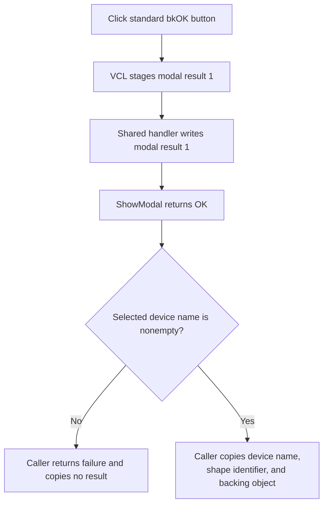

# btnOK

> Analysis status: Source reviewed. The modal-result write, absence of validation, caller copy-back, and empty-selection boundary are supported by recovered code.

## Control

| Property | Recovered value |
| --- | --- |
| Form | MacroPicker |
| Component path | MacroPicker.pnlControls.btnOK |
| Control class | TBitBtn |
| Caption | Not present in the recovered resource. |
| Hint | Not present in the recovered resource. |
| Text | Not present in the recovered resource. |
| Handler name | btnOKClick |
| Handler address | 01702e40 |
| Graph node | `resource:dfm:MacroPicker/MacroPicker.pnlControls.btnOK` |
| Handler node | `function:01702e40` |
| Graph layer | UI |

## What happens when clicked

`btnOK` is a standard `bkOK` button. The recovered VCL button path stages modal result `1` on the MacroPicker form and then dispatches the shared `btnOKClick` event. `FUN_01702e40` writes the same value `1` directly to the form's modal-result field at `+0x508`. It performs no other operation.

The click handler does not validate the selected device, shape text, manufacturer, subgroup, or filter. The separate control-update path normally enables OK only when the device collection is nonempty and the Shape edit is nonempty. That enable test checks collection count, not a selected row or node.

After `ShowModal` returns `1`, each recovered caller asks MacroPicker for the selected device name. A nonempty name causes the caller to copy the device name, composed shape identifier, and backing device object into caller-owned fields. If the selected name is empty, the caller returns its failure value and copies no accepted selection. The click handler itself does not perform this copy-back or create a schematic component.

The standard Cancel button has no custom event and returns a non-OK modal result. List-view and tree-view double-click handlers also call `FUN_01702e40`, so they use the same accepted-result boundary.

There is no local exception handler. The handler's only write is modal result `1`; exceptions in later caller copy-back are outside this event.

## Click flow

## Handler evidence

- [Shared modal-result handler `FUN_01702e40`](../../../DecompiledSources/Tina16/functions/0000000001702E40__FUN_01702e40.c) writes value `1` to the MacroPicker modal-result field.
- [VCL `TBitBtn.Click` `FUN_0082b0e0`](../../../DecompiledSources/Tina16/functions/000000000082B0E0__FUN_0082b0e0.c) and [modal-button click `FUN_00687f30`](../../../DecompiledSources/Tina16/functions/0000000000687F30__FUN_00687f30.c) prove the standard `bkOK` modal-result staging and event dispatch.
- [OK-enable coordinator `FUN_01703530`](../../../DecompiledSources/Tina16/functions/0000000001703530__FUN_01703530.c) enables the button from nonempty shape text and a nonempty visible device collection.
- [List and tree result helper `FUN_01703ac0`](../../../DecompiledSources/Tina16/functions/0000000001703AC0__FUN_01703ac0.c) returns the selected device name after the modal call.
- [Backing-object result helper `FUN_01703c50`](../../../DecompiledSources/Tina16/functions/0000000001703C50__FUN_01703c50.c) returns the selected device object.
- [Representative mode-0 caller `FUN_01708040`](../../../DecompiledSources/Tina16/functions/0000000001708040__FUN_01708040.c) proves the nonempty-name guard and device, shape, and object copy-back.
- Recovered role: Set the MacroPicker modal result to OK when the shared event runs.
- Current graph summary: Handles 2 Delphi UI events: MacroPicker.pnlControls.btnOK.OnClick, MacroPicker.pnlControls.btnHelp.OnClick.
- Current graph behavior: Write modal result `1`; the modal caller later accepts only a nonempty selected device name.
- Current graph evidence: The DFM binds `btnOK.OnClick` to `01702e40`; the handler contains one write of value `1` to form offset `+0x508`, while the recovered callers copy results only after `ShowModal` returns `1` and `FUN_01703ac0` returns a nonempty string.
- Complexity: simple
- Distinct outgoing calls: 0

## Direct calls

- No direct call edge is present in the recovered graph.

## Resource evidence

- Kind: bkOK
- Modal result: Not present in the recovered resource.
- Checked state: Not present in the recovered resource.
- List items: Not present in the recovered resource.
- Image reference: Not present in the recovered resource.
- Extracted glyph: None.

## Nearby label candidates

Nearby labels are layout candidates only. They are not proof of behavior.

- Rank 1: Subcategory: at distance 91.
- Rank 2: &Manufacturer: at distance 117.
- Rank 3: &Shape: at distance 145.

## Analysis limits

- This event does not own the selected device or shape data. It only accepts the modal form.
- The OK-enable path checks item count and shape text. The caller still guards against an empty selected device name.
- Four recovered callers use mode values `0`, `2`, `3`, and `4`. Their wider placement semantics are outside this control article.
