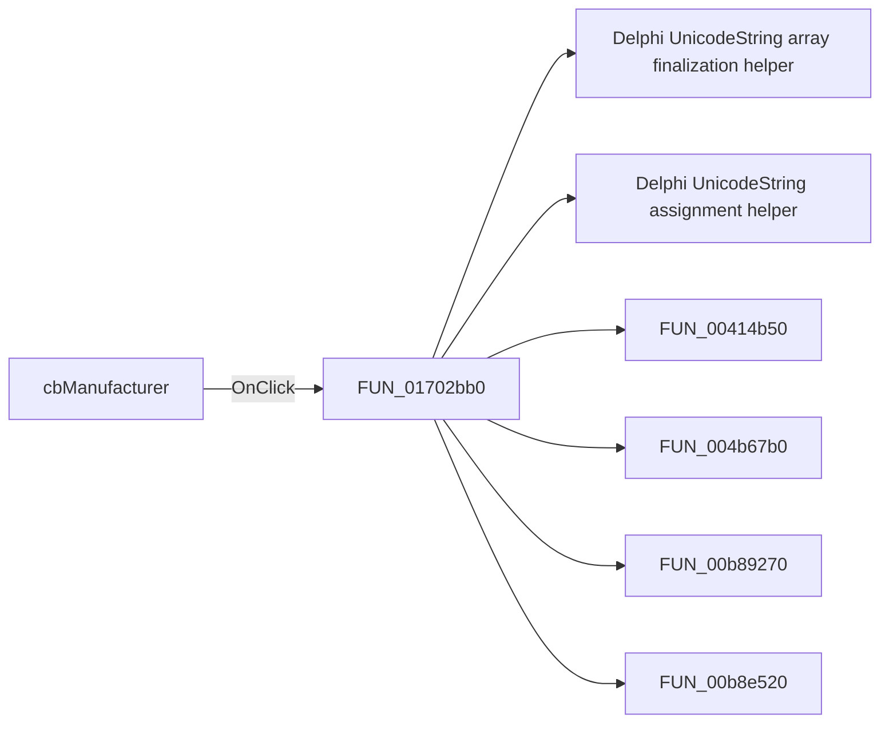

# cbManufacturer

> Analysis status: Pending individual source review.

## Control

| Property | Recovered value |
| --- | --- |
| Form | MacroPicker |
| Component path | MacroPicker.pnlControls.cbManufacturer |
| Control class | TComboBox |
| Caption | Not present in the recovered resource. |
| Hint | Not present in the recovered resource. |
| Text | Not present in the recovered resource. |
| Handler name | cbManufacturerClick |
| Handler address | 01702bb0 |
| Graph node | `resource:dfm:MacroPicker/MacroPicker.pnlControls.cbManufacturer` |
| Handler node | `function:01702bb0` |
| Graph layer | UI |

## What happens when clicked

Pending individual analysis. An agent must read the recovered handler source and its relevant callees before it replaces this text.

## Click flow

## Handler evidence

- Source: [DecompiledSources/Tina16/functions/0000000001702BB0__FUN_01702bb0.c](../../../DecompiledSources/Tina16/functions/0000000001702BB0__FUN_01702bb0.c)
- Recovered role: Not present in the recovered resource.
- Current graph summary: Handles 1 Delphi UI event: MacroPicker.pnlControls.cbManufacturer.OnClick.
- Current graph behavior: Not present in the recovered resource.
- Current graph evidence: Not present in the recovered resource.
- Complexity: complex
- Distinct outgoing calls: 8

## Direct calls

- `function:00414560` — Delphi UnicodeString array finalization helper
- `function:00414ad0` — Delphi UnicodeString assignment helper
- `function:00414b50` — FUN_00414b50
- `function:004b67b0` — FUN_004b67b0
- `function:00b89270` — FUN_00b89270
- `function:00b8e520` — FUN_00b8e520
- `function:01703980` — FUN_01703980
- `function:01716e60` — FUN_01716e60

## Resource evidence

- Kind: Not present in the recovered resource.
- Modal result: Not present in the recovered resource.
- Checked state: Not present in the recovered resource.
- List items: ("All")
- Image reference: Not present in the recovered resource.
- Extracted glyph: None.

## Nearby label candidates

Nearby labels are layout candidates only. They are not proof of behavior.

- Rank 1: &Manufacturer: at distance 90.
- Rank 2: &Shape: at distance 112.
- Rank 3: Subcategory: at distance 116.

## Analysis limits

- Do not infer behavior from the control class, caption, hint, glyph, or nearby label alone.
- Do not replace the pending status until the handler source and relevant call path provide enough evidence.
