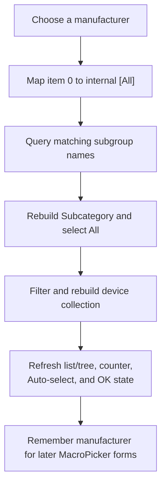

# cbManufacturer

> Analysis status: Source reviewed. The All sentinel, subgroup rebuild, device filtering, selection refresh, and process-local manufacturer memory are supported by recovered code.

## Control

| Property | Recovered value |
| --- | --- |
| Form | MacroPicker |
| Component path | MacroPicker.pnlControls.cbManufacturer |
| Control class | TComboBox |
| Caption | Not present in the recovered resource. |
| Hint | Not present in the recovered resource. |
| Text | Not present in the recovered resource. |
| Handler name | cbManufacturerClick |
| Handler address | 01702bb0 |
| Graph node | `resource:dfm:MacroPicker/MacroPicker.pnlControls.cbManufacturer` |
| Handler node | `function:01702bb0` |
| Graph layer | UI |

## What happens when clicked

`FUN_01702bb0` reads the selected manufacturer from this read-only drop-down list. Display item 0 is **All**; the handler converts index 0 to the internal filter sentinel `[All]`.

It then rebuilds dependent controls in this order:

1. It asks the MacroPicker catalog for subgroups that match the selected manufacturer and the active component filter. This subgroup lookup is available in recovered mode 0. Other modes return no catalog subgroup names.
2. It clears the Subcategory combo, adds its localized **All** item, appends the returned subgroup names, and selects item 0.
3. It converts the selected subcategory to `[All]` and calls `FUN_01703980` to rebuild the device collection with the active component filter, selected manufacturer, mode, and subgroup.

The rebuild clears the previous device collection. It filters out `[Internal]` entries, applies the active category, manufacturer, and subgroup tests, and then repopulates either the list view or tree view for the current mode. The refresh selects the first list row when list mode has results, updates the position counter, controls list/tree/header visibility, updates Auto-select state, and recomputes whether OK can be enabled.

At the end, the handler stores the selected manufacturer text in process-global `DAT_0210ff60`. `FormShow` uses this value to restore the manufacturer selection in a later MacroPicker instance. This is process-local memory; the handler does not write a file, registry setting, or document field.

The handler has no local catch or rollback. It clears and rebuilds the subgroup control before it rebuilds devices. An exception can therefore leave the new manufacturer visible with only part of the dependent UI refreshed.

## Click flow

## Handler evidence

- [Manufacturer handler `FUN_01702bb0`](../../../DecompiledSources/Tina16/functions/0000000001702BB0__FUN_01702bb0.c) proves selection reading, the `[All]` mapping, subgroup rebuild, device-refresh call, and remembered manufacturer assignment.
- [Subgroup query `FUN_01716e60`](../../../DecompiledSources/Tina16/functions/0000000001716E60__FUN_01716e60.c) clears its output and returns matching subgroup names for recovered mode 0.
- [Device refresh coordinator `FUN_01703980`](../../../DecompiledSources/Tina16/functions/0000000001703980__FUN_01703980.c) rebuilds filtered devices, repopulates the active view, updates status, and recomputes Auto-select and OK state.
- [Catalog device filter `FUN_01717260`](../../../DecompiledSources/Tina16/functions/0000000001717260__FUN_01717260.c) proves the `[Internal]`, category, subgroup, and manufacturer tests.
- [View population helper `FUN_017035f0`](../../../DecompiledSources/Tina16/functions/00000000017035F0__FUN_017035f0.c) proves the list/tree mode switch and first-list-row selection.
- [Form show handler `FUN_017024f0`](../../../DecompiledSources/Tina16/functions/00000000017024F0__FUN_017024f0.c) restores the remembered manufacturer and invokes this same filter path.
- Recovered role: Apply the selected manufacturer filter and rebuild subgroup and device choices.
- Current graph summary: Handles 1 Delphi UI event: MacroPicker.pnlControls.cbManufacturer.OnClick.
- Current graph behavior: Convert the selected manufacturer to a catalog filter, rebuild Subcategory and devices, refresh dependent controls, and remember the manufacturer for later form instances.
- Current graph evidence: The DFM binds `cbManufacturerClick` to `01702bb0`; the source reads the combo index and text, maps index 0 to `[All]`, rebuilds the subgroup item collection, calls the device-filter coordinator, and assigns the selected text to `DAT_0210ff60`.
- Complexity: complex
- Distinct outgoing calls: 8

## Direct calls

- `function:00414560` — Delphi UnicodeString array finalization helper
- `function:00414ad0` — Delphi UnicodeString assignment helper
- `function:00414b50` — Substitute the internal `[All]` sentinel.
- `function:004b67b0` — Bracket bulk updates to the temporary string collection.
- `function:00b89270` — Get the localization service.
- `function:00b8e520` — Load the localized **All** display text.
- `function:01703980` — Rebuild filtered devices and dependent controls.
- `function:01716e60` — Query matching subgroup names.

## Resource evidence

- Kind: Not present in the recovered resource.
- Modal result: Not present in the recovered resource.
- Checked state: Not present in the recovered resource.
- List items: ("All")
- Image reference: Not present in the recovered resource.
- Extracted glyph: None.

## Nearby label candidates

Nearby labels are layout candidates only. They are not proof of behavior.

- Rank 1: &Manufacturer: at distance 90.
- Rank 2: &Shape: at distance 112.
- Rank 3: Subcategory: at distance 116.

## Analysis limits

- Resource text uses `All`, while recovered filter helpers use `[All]` internally.
- The original names of catalog fields and recovered mode values are not available. This article describes only their source-proven filter use.
- The remembered manufacturer is process-local global state. No durable settings write is present.
