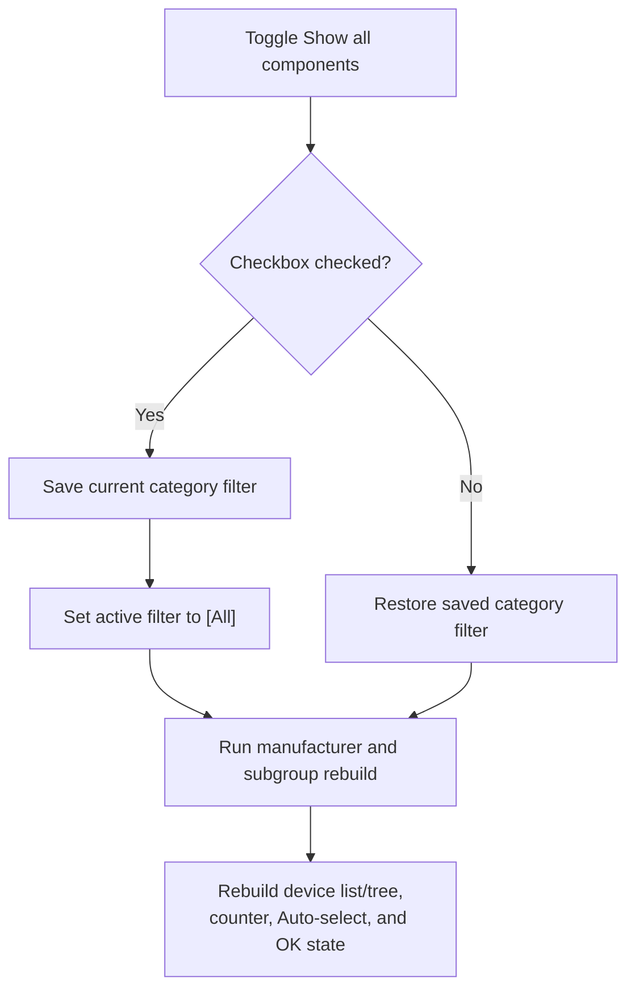

# Show &all components

> Analysis status: Source reviewed. The checked and unchecked filter swaps, preserved prior filter, full dependent rebuild, and form-local persistence boundary are supported by recovered code.

## Control

| Property | Recovered value |
| --- | --- |
| Form | MacroPicker |
| Component path | MacroPicker.pnlControls.cbShowAllComp |
| Control class | TCheckBox |
| Caption | Show &all components |
| Hint | Not present in the recovered resource. |
| Text | Not present in the recovered resource. |
| Handler name | cbShowAllCompClick |
| Handler address | 017034a0 |
| Graph node | `resource:dfm:MacroPicker/MacroPicker.pnlControls.cbShowAllComp` |
| Handler node | `function:017034a0` |
| Graph layer | UI |

## What happens when clicked

`FUN_017034a0` changes the active component-category filter that the manufacturer and subgroup paths use.

- When **Show all components** becomes checked, the handler copies the current filter from form string `+0x740` to backup string `+0x748`. It then replaces the active filter with `[All]`.
- When the checkbox becomes unchecked, it restores the saved value from `+0x748` to the active filter at `+0x740`.

After either branch, it invokes the Manufacturer handler. That path rebuilds the Subcategory list, resets Subcategory to All, rebuilds the filtered device collection, repopulates the current list or tree view, updates the position counter, refreshes Auto-select state, and recomputes OK availability. It also remembers the current manufacturer in the process-global last-manufacturer string.

The backup is form-local. This click does not write a settings store, document, or registry value. Rechecking the box overwrites the backup with the current active filter before it installs `[All]`.

There is no local catch or transaction. The active filter changes before the dependent controls rebuild. A later exception can therefore leave the checkbox and form strings changed while the subgroup or device controls still show old or partial content.

## Click flow

## Handler evidence

- [Show-all handler `FUN_017034a0`](../../../DecompiledSources/Tina16/functions/00000000017034A0__FUN_017034a0.c) proves the checked-state branch, active and backup filter assignments, `[All]` substitution, and dependent rebuild call.
- [Manufacturer handler `FUN_01702bb0`](../../../DecompiledSources/Tina16/functions/0000000001702BB0__FUN_01702bb0.c) rebuilds Subcategory and invokes the device-refresh coordinator.
- [Catalog device filter `FUN_01717260`](../../../DecompiledSources/Tina16/functions/0000000001717260__FUN_01717260.c) proves that `[All]` bypasses the active category filter.
- Recovered role: Toggle all-component filtering while preserving or restoring the prior category filter.
- Current graph summary: Handles 1 Delphi UI event: MacroPicker.pnlControls.cbShowAllComp.OnClick.
- Current graph behavior: On check, save the current category filter and install `[All]`; on uncheck, restore the saved filter; then rebuild subgroup and device controls.
- Current graph evidence: The DFM binds `cbShowAllCompClick` to `017034a0`; the source branches on the live checkbox state, copies between form strings `+0x740` and `+0x748`, and calls `FUN_01702bb0` after both branches.
- Complexity: moderate
- Distinct outgoing calls: 2

## Direct calls

- `function:00414ad0` — Delphi UnicodeString assignment helper
- `function:01702bb0` — Rebuild Subcategory, devices, and dependent controls.

## Resource evidence

- Kind: Not present in the recovered resource.
- Modal result: Not present in the recovered resource.
- Checked state: Not present in the recovered resource.
- List items: Not present in the recovered resource.
- Image reference: Not present in the recovered resource.
- Extracted glyph: None.

## Nearby label candidates

Nearby labels are layout candidates only. They are not proof of behavior.

- Rank 1: Subcategory: at distance 25.
- Rank 2: &Manufacturer: at distance 51.
- Rank 3: &Shape: at distance 79.

## Analysis limits

- The original category-filter field name is not recovered. Its role follows from all reads in the catalog filter.
- The saved filter exists only in the MacroPicker instance.
- The dependent Manufacturer path resets Subcategory to All on every toggle.
