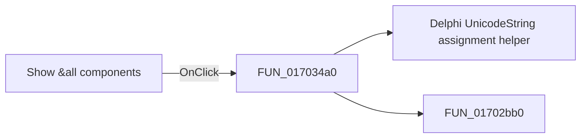

# Show &all components

> Analysis status: Pending individual source review.

## Control

| Property | Recovered value |
| --- | --- |
| Form | MacroPicker |
| Component path | MacroPicker.pnlControls.cbShowAllComp |
| Control class | TCheckBox |
| Caption | Show &all components |
| Hint | Not present in the recovered resource. |
| Text | Not present in the recovered resource. |
| Handler name | cbShowAllCompClick |
| Handler address | 017034a0 |
| Graph node | `resource:dfm:MacroPicker/MacroPicker.pnlControls.cbShowAllComp` |
| Handler node | `function:017034a0` |
| Graph layer | UI |

## What happens when clicked

Pending individual analysis. An agent must read the recovered handler source and its relevant callees before it replaces this text.

## Click flow

## Handler evidence

- Source: [DecompiledSources/Tina16/functions/00000000017034A0__FUN_017034a0.c](../../../DecompiledSources/Tina16/functions/00000000017034A0__FUN_017034a0.c)
- Recovered role: Not present in the recovered resource.
- Current graph summary: Handles 1 Delphi UI event: MacroPicker.pnlControls.cbShowAllComp.OnClick.
- Current graph behavior: Not present in the recovered resource.
- Current graph evidence: Not present in the recovered resource.
- Complexity: moderate
- Distinct outgoing calls: 2

## Direct calls

- `function:00414ad0` — Delphi UnicodeString assignment helper
- `function:01702bb0` — Handles 1 Delphi UI event: MacroPicker.pnlControls.cbManufacturer.OnClick.

## Resource evidence

- Kind: Not present in the recovered resource.
- Modal result: Not present in the recovered resource.
- Checked state: Not present in the recovered resource.
- List items: Not present in the recovered resource.
- Image reference: Not present in the recovered resource.
- Extracted glyph: None.

## Nearby label candidates

Nearby labels are layout candidates only. They are not proof of behavior.

- Rank 1: Subcategory: at distance 25.
- Rank 2: &Manufacturer: at distance 51.
- Rank 3: &Shape: at distance 79.

## Analysis limits

- Do not infer behavior from the control class, caption, hint, glyph, or nearby label alone.
- Do not replace the pending status until the handler source and relevant call path provide enough evidence.
