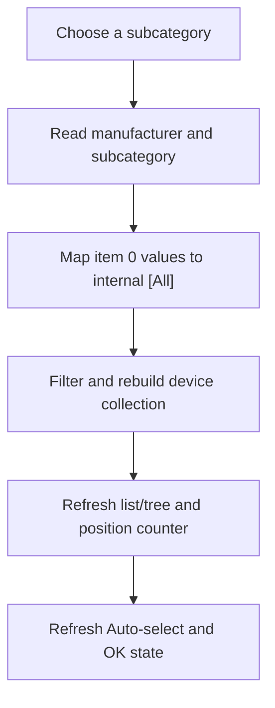

# cbSubGroup

> Analysis status: Source reviewed. The manufacturer and subgroup selection reads, All sentinels, device rebuild, and dependent UI refresh are supported by recovered code.

## Control

| Property | Recovered value |
| --- | --- |
| Form | MacroPicker |
| Component path | MacroPicker.pnlControls.cbSubGroup |
| Control class | TComboBox |
| Caption | Not present in the recovered resource. |
| Hint | Not present in the recovered resource. |
| Text | Not present in the recovered resource. |
| Handler name | cbSubGroupClick |
| Handler address | 01703350 |
| Graph node | `resource:dfm:MacroPicker/MacroPicker.pnlControls.cbSubGroup` |
| Handler node | `function:01703350` |
| Graph layer | UI |

## What happens when clicked

`FUN_01703350` reads the current Manufacturer and Subcategory selections. For either combo, selected index 0 becomes the internal sentinel `[All]`; another index uses the displayed item text.

The handler passes both values to the shared device-refresh coordinator. That path clears the prior device collection and scans the catalog collection for the current mode. It excludes `[Internal]` entries and applies the active component filter, selected manufacturer, and selected subgroup. It then repopulates the current list or tree view, updates their visibility, selects the first list row when applicable, updates the position counter, refreshes Auto-select state, and recomputes OK availability.

This click does not rebuild the Manufacturer or Subcategory item collections. It does not remember the selected subgroup in a global or durable setting. A later Manufacturer change resets Subcategory to item 0 before it rebuilds devices.

There is no local exception handler or rollback. The shared refresh clears the device collection before it repopulates the controls, so a failure can leave the selected filters visible with an empty or partly refreshed device view.

## Click flow

## Handler evidence

- [Subcategory handler `FUN_01703350`](../../../DecompiledSources/Tina16/functions/0000000001703350__FUN_01703350.c) proves both combo-selection reads, `[All]` mappings, and the shared refresh call.
- [Device refresh coordinator `FUN_01703980`](../../../DecompiledSources/Tina16/functions/0000000001703980__FUN_01703980.c) rebuilds filtered devices and dependent controls.
- [Catalog device filter `FUN_01717260`](../../../DecompiledSources/Tina16/functions/0000000001717260__FUN_01717260.c) proves the category, subgroup, and manufacturer tests.
- [View population helper `FUN_017035f0`](../../../DecompiledSources/Tina16/functions/00000000017035F0__FUN_017035f0.c) repopulates the active list or tree view.
- Recovered role: Apply the selected manufacturer and subgroup filters to the MacroPicker device collection.
- Current graph summary: Handles 1 Delphi UI event: MacroPicker.pnlControls.cbSubGroup.OnClick.
- Current graph behavior: Read Manufacturer and Subcategory, convert their item-0 values to `[All]`, and rebuild the filtered device views and dependent state.
- Current graph evidence: The DFM binds `cbSubGroupClick` to `01703350`; the source reads both combo indexes and strings, substitutes `[All]` for index 0, and calls `FUN_01703980` with both filter values.
- Complexity: complex
- Distinct outgoing calls: 3

## Direct calls

- `function:00414560` — Delphi UnicodeString array finalization helper
- `function:00414b50` — Substitute the internal `[All]` sentinel.
- `function:01703980` — Rebuild filtered devices and dependent controls.

## Resource evidence

- Kind: Not present in the recovered resource.
- Modal result: Not present in the recovered resource.
- Checked state: Not present in the recovered resource.
- List items: Not present in the recovered resource.
- Image reference: Not present in the recovered resource.
- Extracted glyph: None.

## Nearby label candidates

Nearby labels are layout candidates only. They are not proof of behavior.

- Rank 1: Subcategory: at distance 90.
- Rank 2: &Manufacturer: at distance 110.
- Rank 3: &Shape: at distance 138.

## Analysis limits

- The original names of catalog fields and recovered mode values are not available.
- The handler does not store the subgroup selection after this form instance.
- Manufacturer changes own subgroup-list rebuilding and reset Subcategory to All.
